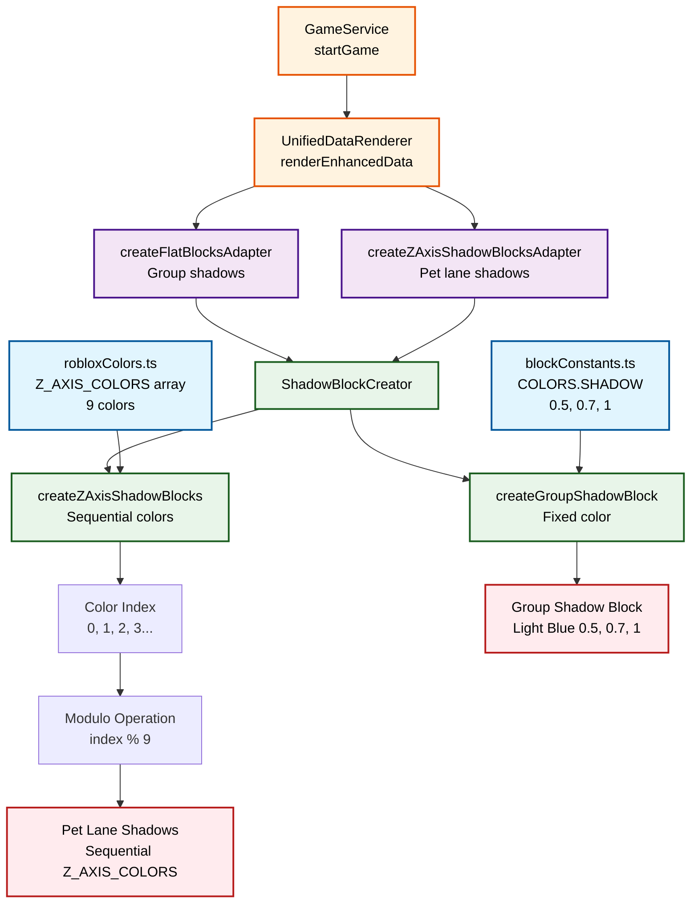

# Shadow Block Colors Flow

This document traces how shadow blocks in the Roblox visualization get their colors.

## Overview

There are two types of shadow blocks:
1. **Group Shadow Blocks** - Always use a fixed light blue color
2. **Z-Axis Shadow Blocks (Pet Lanes)** - Use sequential colors from Z_AXIS_COLORS array

## Color Flow Diagram (Mermaid)



## Sequential Color Assignment

The Z-axis shadow blocks (pet lanes) get their colors through sequential assignment:

```
Property Values: ["dog", "cat", "bird", "fish", "none"]
Color Assignment:
  - dog  → Z_AXIS_COLORS[0] (Green)
  - cat  → Z_AXIS_COLORS[1] (Darker Green)
  - bird → Z_AXIS_COLORS[2] (Teal)
  - fish → Z_AXIS_COLORS[3] (Blue)
  - none → Z_AXIS_COLORS[4] (Navy)
```

## Color Arrays

### Z_AXIS_COLORS (from robloxColors.ts)
```typescript
[
  new Color3(0.0, 0.8, 0.2),  // 0: Green
  new Color3(0.0, 0.6, 0.3),  // 1: Darker Green
  new Color3(0.0, 0.4, 0.4),  // 2: Teal
  new Color3(0.0, 0.2, 0.6),  // 3: Blue
  new Color3(0.0, 0.0, 0.8),  // 4: Navy
  new Color3(0.2, 0.0, 0.8),  // 5: Purple-Blue
  new Color3(0.4, 0.0, 0.6),  // 6: Purple
  new Color3(0.6, 0.0, 0.4),  // 7: Magenta
  new Color3(0.8, 0.0, 0.2),  // 8: Red-Purple
]
```

### Group Shadow Color (from blockConstants.ts)
```typescript
SHADOW: new Color3(0.5, 0.7, 1) // Light Blue
```

## Key Points

1. **Two Color Sources**: Fixed color for group shadows, array for pet lane shadows
2. **Sequential Assignment**: Colors assigned in order, wrapping around with modulo
3. **No Semantic Mapping**: Colors not chosen based on property meaning
4. **X_AXIS_COLORS Unused**: Defined but never referenced in code
5. **Centralized Definition**: All colors defined in constants files

## DrawIO Source

See `000ColorsFlow.drawio` for an editable diagram version.