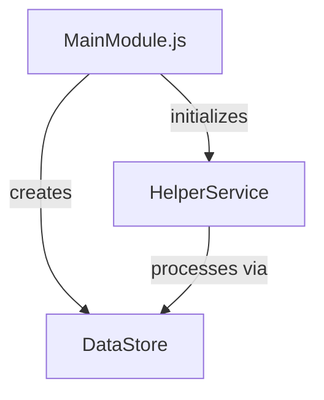

Just do a Code Audit?: false
|----------------------------------------------------------------------|
Summary:
Add swimlanes in the vertical direction

|----------------------------------------------------------------------|
Requirements:
-   currently we use 2 of the physical dimensions to position nodes according to 2 different object properties., x, z
- the y dimension is currently used to specify what heirarchical layer the node occupies in the node tree.
- we are going to change this, and instead use the y dimension to map a third property, similar to how we use the zparallel dimension to map different propeties.
and we
- after all the x,z positioning is done, create a y position for each node, based on the property in y group in the gui.
- for a shadow block, add a 70% transparent block that floats in the air at that level and has the same x,z footprint as the group shadow


|----------------------------------------------------------------------|

1. Note to AI Agent:
   1. If Just do a Code Audit? === true, skip the rest of this doc and execute 000-111-CodeAuditPlan.md in the xxx folder.
      1. "____000FeaturePlanningSystem/___internal docs/000-111 - Code Audit/Int-000-01-CodeQualityAudit"
      2. place the results in a new folder.  skip the rest of these instructions

2. This file is a set of instrctions that you will follow in order to help plan a feature.
3. Following the instructions will create a final product that is a folder containing a set of documents that will be used one of more AI agents.
4. Follow each Step.
   1. After you complete the Step, ask the user the User Question provided for that task.
   2. The user will possibly make some edits, and direct you to do the next Step.
   3. Do not perform any Step unless told to.
   4. When told to run this file, assume the Summary and Features above have been updated to reflect current needs.
   5. Output
      1. A sample of the final output folder can be found here.
         1. Sample Output:
         2. ./F000-TicTacToe (example)
   6. User Message
      1. Hyperlink all file and folder names when outputting the User Message
      2. Do not add your own extemporaneous commentary or fluff

|----------------------------------------------------------------------|

Step 1. - Create Single Spec Document

1. Inputs

   1. Summary and Requirements provided above

2. Actions for AI Agent

   1. Read Inputs
   2. Use the "Spec Building Instructions" below to create output
   3. The outputs should be concise and without meaningless filler content

3. Outputs
   1. folder that follows the naming conventions in Sample Output
   2. files that follow this naming convention
      1. 000-00a-TicTacToe-InitialSpec-001.md
      2. 000-00b-TicTacToe-InitialSpec-001.drawio
4. User Question:
   1. I have finished Step 1: <step name>
   2. I used these Inputs:
   3. <Inputs names>
   4. to create these Outputs:
   5. <output names>
   6. Make any changes, ask me to update it, and tell me when you are ready for
   7. Step 2 <step name>
   8. (or just type "Yes".)

|----------------------------------------------------------------------|
Step 2. - Break Spec into Smaller Files

1. Inputs

   1. Output docs from Step 1. Example: "F000-00-TicTacToe-InitialSpec-001"

2. Actions for AI Agent
   1. Read the Inputs and Create the Outputs
3. Outputs

   1. Create a folder called: "Revised Spec"
   2. Divide the information in the Input doc into the following 3 docs and place them in the new folder
      1. 000-01-Summary.md
         1. include ascii representation of gui here
      2. 000--02-Requirements.md
      3. 000-03-Tasks.md
   3. (The purpose is to isolate the tasks and make them easier to review and execute)
   4. The outputs should be concise and without meaningless filler content

4. User Question:
   1. I have finished Step 2: <step name>
   2. I used these Inputs:
   3. <Inputs names>
   4. to create these Outputs:
   5. <output names>
   6. Make any changes, ask me to update it, and tell me when you are ready for
   7. Step 3 <step name> (yes)

|----------------------------------------------------------------------|
Step 3. - Execution

1. Inputs

   1. Output docs from previous step.

2. Actions for AI Agent
   1. Read the Task List
   2. Execute the first task and its sub-tasks
   3. If a task fails or cannot be completed, stop and ask the user for next steps.
   4. When all subtasks are complete, mark them completed in the Task doc and ask the User Question
3. Outputs

   1. Any files created by doing the task

4. User Question:
   1. I have finished Step 3: <step name>
   2. I completed these tasks:
   3. <task list>
   4. The following files were created:
   5. <files list>
   6. Shall I commit the changes?

|----------------------------------------------------------------------|

Step 3. - Commit code

1. Inputs

   1. Files Changed by executing tasks

2. Actions for AI Agent
   1. Create a commit
      1. Include Feature name and task number in title
      2. Describe changes in body
      3. Do not state that an AI Agent made the commit
3. Outputs

   1. none

4. User Question:

   1. After each commit:
      1. I have committed the changes for <task name>
      2. Shall I execute <task name>?
   2. After final commit:
      1. All tasks are committed.  Shall I peform a Code Audit?

|----------------------------------------------------------------------|
Step 4. - Code Audit

1. Inputs

   1. None

2. Actions for AI Agent
   1. After all tasks are completed and commited, create a doc titled
      1. "F000-04-TicTacToe-CodeAudit-001.md", that contains the following sections
         1. Table of files involved in feature
             1. file name
             2. number of lines
             3. is New
         2. mermaid diagram showing relationships between all files
         3. Quality Audit that identifies any areas where the code can be improved
         4. Code Improvement Task List
          

3. Outputs

   1. none

4. User Question:

   1. I have committed the changes for <task name>
   2. Shall I execute <task name>? (yes)

|----------------------------------------------------------------------|

## Spec Building Instructions

Use these outline conventions when creating the doc

```
1. ⬛ Cat Breeds

   1. ✅ Long-haired Cats
      1. ⬛ Persian
      2. ⬛ Maine Coon
      3. ⬛ Ragdoll
   2. ⬛ Short-haired Cats
      1. ⬛ Siamese
      2. ⬛ Russian Blue
      3. ⬛ British Shorthair

2. ⬛ Cat Behavior
```

## Core Principles

1. The design should:
   1.1. Be as simple as possible
   1.2. Include only the features necessary to prove the concept
   1.3. No mock data
   1.4. Minimal error handling
   1.5. No tests

## Required Elements

Organize the doc into these sections, in this order:

1. Summary
2. Requirements
   1.1. Each should have a unique number (R1, R2, etc.)
   1.2. Include References section if needed
3. Task List. Each task described with:
   2.1. Line item
   2.2. Unique number
   2.3. Unchecked checkbox icon
   2.4. read this doc and follow the conventions: 001-outline-conventions.md
4. List of risks (if any)
5. List of decision points (if any)
6. ASCII representation of GUI
7. Text based file/function tree
8. A mermaid flowchart

## Example Format

# Feature Name Specification

## Requirements

1. ⬛ Requirements
   1. ⬛ The feature should accomplish X
   2. ⬛ The feature should integrate with Y
   3. ⬛ The feature should respond within Z milliseconds

## Risks

- Risk 1: Description of potential risk and mitigation strategy
- Risk 2: Description of another potential risk

## Decision Points

- Decision 1: Choice made between X and Y approaches because of Z
- Decision 2: Selected technology A over B because of C requirements

## ASCII representation of GUI

## File and Function Structure (ascii)

src/
├── featureName/
│ ├── featureName.js
│ │ └── function1()
│ │ └── function2()
│ ├── helperModule.js
│ │ └── helperFunction1()
│ │ └── helperFunction2()

## Flowchart


