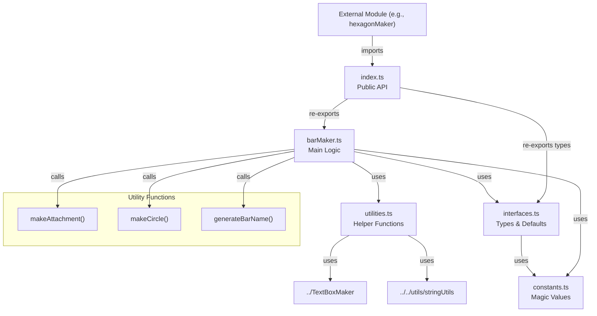

# BarMaker Module Restructure Specification

## Summary

This plan outlines the restructuring of the `barMaker.ts` module to match the organized folder structure of `labelBlockMaker`. The current barMaker is a single file with ~185 lines containing interfaces, constants, utility functions, and the main implementation. This restructure will improve maintainability, reusability, and consistency across the codebase.

## Requirements

1. ✅ R1: Match the folder structure pattern established by labelBlockMaker
2. ✅ R2: Maintain backward compatibility - external imports must continue to work
3. ✅ R3: Extract constants into a dedicated constants file
4. ✅ R4: Separate interfaces and type definitions into interfaces.ts
5. ✅ R5: Move utility functions to utilities.ts
6. ✅ R6: Keep main bar creation logic in barMaker.ts
7. ✅ R7: Create an index.ts for clean public API
8. ✅ R8: Ensure the main file is named barMaker.ts for searchability

## Task List

1. ✅ T1: Create folder structure
   1. ✅ T1.1: Create `src/shared/modules/barMaker/` directory
   2. ✅ T1.2: Move current `barMaker.ts` into the new folder temporarily

2. ✅ T2: Extract interfaces and types
   1. ✅ T2.1: Create `interfaces.ts` file
   2. ✅ T2.2: Move `BarProps` interface
   3. ✅ T2.3: Move `BarConfig` interface
   4. ✅ T2.4: Move `defaultProps` constant to interfaces.ts

3. ✅ T3: Create constants file
   1. ✅ T3.1: Create `constants.ts` file
   2. ✅ T3.2: Extract magic numbers and values:
      - `pointSize = 0.1`
      - Default sizes `[4, 2, 8]`
      - Default color `[0.2, 0.4, 0.8]`
      - Pad length (3)
      - Name prefixes ("bar", "att", "h", "st")
   3. ✅ T3.3: Update defaultProps in interfaces.ts to use constants

4. ✅ T4: Extract utility functions
   1. ✅ T4.1: Create `utilities.ts` file
   2. ✅ T4.2: Move `makeAttachment` function
   3. ✅ T4.3: Move `makeCircle` function
   4. ✅ T4.4: Move `generateBarName` function
   5. ✅ T4.5: Add necessary imports

5. ✅ T5: Clean up main barMaker.ts
   1. ✅ T5.1: Remove moved interfaces and types
   2. ✅ T5.2: Remove moved utility functions
   3. ✅ T5.3: Add imports from new files
   4. ✅ T5.4: Keep only the main `makeBar` function

6. ✅ T6: Create index.ts
   1. ✅ T6.1: Create `index.ts` file
   2. ✅ T6.2: Export `makeBar` from barMaker.ts
   3. ✅ T6.3: Export necessary types from interfaces.ts

7. ✅ T7: Update external imports
   1. ✅ T7.1: Find all files importing from barMaker
   2. ✅ T7.2: Verify imports still work (they should due to index.ts)
   3. ✅ T7.3: Run build to ensure no breaking changes

8. ✅ T8: Testing and validation
   1. ✅ T8.1: Run `npm run build`
   2. ✅ T8.2: Verify hexagonMaker still works (main consumer)
   3. ✅ T8.3: Check for any TypeScript errors

## Risks

- Risk 1: Breaking existing imports - Mitigated by creating index.ts that maintains the same export interface
- Risk 2: Circular dependencies - Mitigated by careful organization of imports
- Risk 3: Missing exports - Mitigated by thorough testing after restructure

## Decision Points

- Decision 1: Keep padNumber import from shared utils rather than duplicating
- Decision 2: Place defaultProps in interfaces.ts (with constants) rather than constants.ts
- Decision 3: Export only necessary types through index.ts rather than all types

## File and Function Structure

```
src/shared/modules/barMaker/
├── index.ts
│   └── export { makeBar }
│   └── export type { BarConfig, BarProps }
├── barMaker.ts
│   └── makeBar()
├── interfaces.ts
│   └── interface BarProps
│   └── interface BarConfig
│   └── const defaultProps
├── constants.ts
│   └── BAR_CONSTANTS object
└── utilities.ts
    └── makeAttachment()
    └── makeCircle()
    └── generateBarName()
```

## Flowchart



## Sample Objects

```typescript
// BAR_CONSTANTS structure
const BAR_CONSTANTS = {
  // Default dimensions
  DEFAULT_SIZE: [4, 2, 8] as [number, number, number],
  DEFAULT_COLOR: [0.2, 0.4, 0.8] as [number, number, number],
  
  // Formatting
  POINT_SIZE: 0.1,
  PAD_LENGTH: 3,
  
  // Naming prefixes
  NAME_PREFIXES: {
    BAR: "bar",
    ATTACHMENT: "att",
    HEX: "h",
    STACK: "st"
  }
};

// Example BarConfig
const barConfig: BarConfig = {
  id: "bar1",
  position: { x: 0, y: 5, z: 0 },
  rotation: { x: 0, y: 30, z: 0 },
  props: {
    Color: [1, 0, 0],
    Size: [6, 2, 10]
  },
  label: "Test Bar",
  stackIndex: 1,
  hexIndex: 2,
  barIndex: 3
};
```

## Example Code

```typescript
// index.ts
export { makeBar } from "./barMaker";
export type { BarConfig, BarProps } from "./interfaces";

// Usage remains the same:
import { makeBar } from "../../shared/modules/barMaker";

const bar = makeBar({
  id: "test-bar",
  position: { x: 10, y: 5, z: 0 },
  label: "My Bar"
});
```