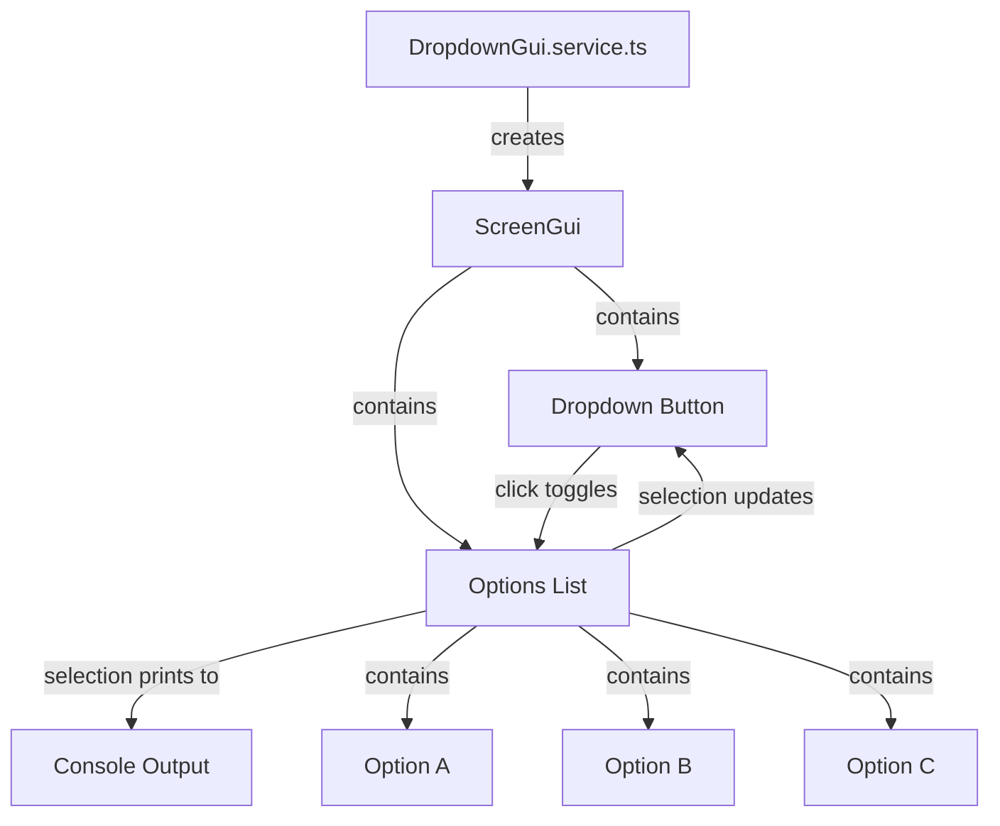

# GUI Dropdown Test Specification

## Summary

Create a simple GUI with a dropdown that allows selection from three options (a, b, c) and prints the selected value to the console.

## Requirements

1. ⬛ R1: Create a ScreenGui with a dropdown control
2. ⬛ R2: The dropdown should have three options: a, b, c
3. ⬛ R3: When an option is selected, it should print to the console
4. ⬛ R4: The GUI should be visible to the local player
5. ⬛ R5: The dropdown should have a clear visual indicator of the current selection

## Task List

1. ⬛ T1: Create GUI service structure
   1. ⬛ T1.1: Create dropdownGui.service.ts in client/services
   2. ⬛ T1.2: Implement service initialization and destruction
   3. ⬛ T1.3: Register service with client controller

2. ⬛ T2: Implement dropdown GUI
   1. ⬛ T2.1: Create ScreenGui instance
   2. ⬛ T2.2: Create main frame for dropdown
   3. ⬛ T2.3: Create dropdown button (shows current selection)
   4. ⬛ T2.4: Create dropdown list container (initially hidden)
   5. ⬛ T2.5: Create option buttons for a, b, c

3. ⬛ T3: Implement dropdown behavior
   1. ⬛ T3.1: Add click handler to toggle dropdown visibility
   2. ⬛ T3.2: Add click handlers to option buttons
   3. ⬛ T3.3: Update dropdown button text on selection
   4. ⬛ T3.4: Print selected value to console
   5. ⬛ T3.5: Hide dropdown list after selection

## Risks

- Risk 1: Dropdown might not be visible on all screen sizes - mitigate by using UDim2 scaling
- Risk 2: Multiple clicks might cause UI state issues - mitigate by proper state management

## Decision Points

- Decision 1: Use TextButton for dropdown trigger instead of custom control for simplicity
- Decision 2: Position dropdown list below button rather than overlay for clearer visual hierarchy
- Decision 3: Use print() for console output instead of complex logging system

## ASCII representation of GUI

```
┌─────────────────────────────────┐
│         Dropdown Test           │
│                                 │
│  ┌─────────────────┬──┐        │
│  │ Select Option   │▼ │        │ ← Dropdown Button
│  └─────────────────┴──┘        │
│  ┌─────────────────────┐       │
│  │   a                 │       │ ← Option List (hidden initially)
│  ├─────────────────────┤       │
│  │   b                 │       │
│  ├─────────────────────┤       │
│  │   c                 │       │
│  └─────────────────────┘       │
│                                 │
└─────────────────────────────────┘
```

## File and Function Structure (ascii)

```
src/
├── client/
│   ├── services/
│   │   └── dropdownGui/
│   │       ├── dropdownGui.service.ts
│   │       │   ├── constructor()
│   │       │   ├── initialize()
│   │       │   ├── createGUI()
│   │       │   ├── createDropdownButton()
│   │       │   ├── createOptionsList()
│   │       │   ├── toggleDropdown()
│   │       │   ├── selectOption()
│   │       │   └── destroy()
│   │       └── constants.ts
│   │           └── GUI_CONSTANTS
│   └── controllers/
│       └── main.controller.ts (update to include service)
```

## Flowchart

