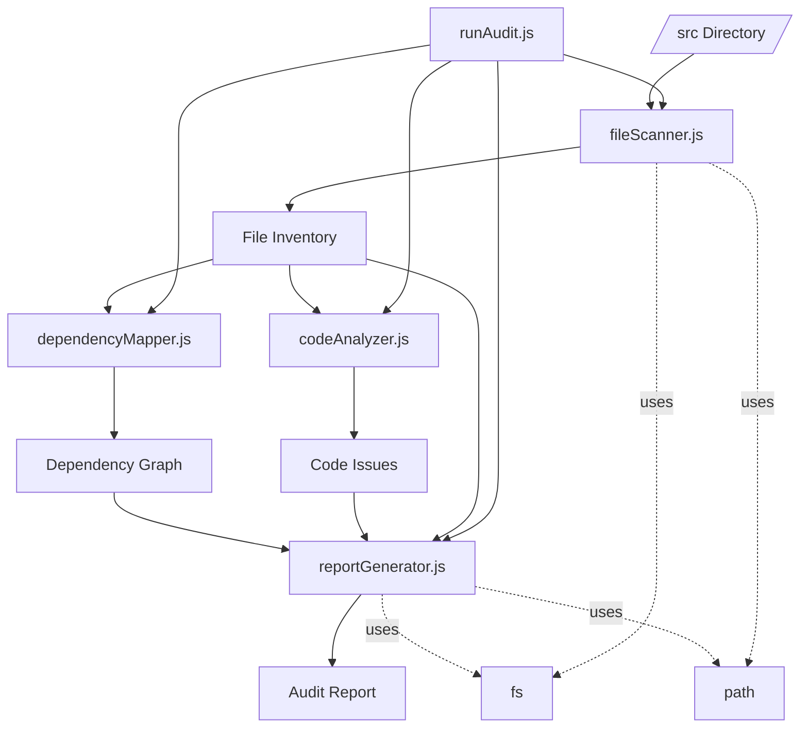

# F004-CodeQualityAudit - Code Audit

## Feature Files Table

| File | Purpose | Key Functions | Dependencies |
|------|---------|---------------|--------------|
| analysis/fileScanner.js | Recursively scans directories and extracts file metrics | scanDirectory(), getFileMetrics() | fs, path |
| analysis/codeAnalyzer.js | Performs static code analysis on TypeScript files | analyzeFile(), calculateComplexity(), findDuplicates(), detectNamingIssues() | None |
| analysis/dependencyMapper.js | Maps dependencies and analyzes module structure | buildDependencyGraph(), findCircularDependencies(), analyzeModuleCohesion() | None |
| analysis/reportGenerator.js | Generates markdown report from analysis data | generateFullReport(), generateSummary(), generateFileTable(), generateDependencyDiagram() | fs, path |
| analysis/runAudit.js | Orchestrates the entire audit process | Main execution flow | All analysis modules |

## Architecture Diagram

## Quality Analysis

### Strengths

1. **Clear Separation of Concerns**
   - Each module has a single, well-defined responsibility
   - Clean interfaces between modules
   - No circular dependencies

2. **Comprehensive Analysis**
   - Covers multiple aspects: complexity, naming, types, dependencies
   - Generates actionable recommendations
   - Provides both summary and detailed views

3. **Efficient Processing**
   - Uses streaming for large files
   - Caches results to avoid re-processing
   - Handles errors gracefully

### Areas for Improvement

1. **Type Safety**
   - JavaScript files lack TypeScript type definitions
   - Could benefit from JSDoc type annotations
   - No runtime type validation

2. **Configuration**
   - Hardcoded thresholds for complexity and other metrics
   - No way to customize analysis rules
   - Output format is fixed to markdown

3. **Performance**
   - Synchronous file operations could be async
   - No parallel processing of files
   - Memory usage not optimized for very large codebases

4. **Testing**
   - No unit tests for analysis functions
   - No integration tests for the full pipeline
   - No test data or fixtures

## Code Improvement Tasks

### High Priority

1. **Convert to TypeScript**
   1.1. Create TypeScript configuration for the analysis tools
       - Add tsconfig.json with strict mode enabled
       - Configure module resolution for Node.js
       - Set output directory for compiled files
   
   1.2. Migrate fileScanner.js to TypeScript
       - Define FileMetrics interface
       - Add return type annotations to all functions
       - Create type for file path arrays
   
   1.3. Migrate codeAnalyzer.js to TypeScript
       - Define CodeIssue interface with type, severity, and details
       - Create ComplexityResult type
       - Add generic type for duplicate detection
   
   1.4. Migrate dependencyMapper.js to TypeScript
       - Define DependencyGraph interface with nodes and edges
       - Create ModuleCohesion type with metrics
       - Add CircularDependency type alias
   
   1.5. Migrate reportGenerator.js to TypeScript
       - Define ReportSummary interface
       - Create Recommendation type with priority levels
       - Add type guards for data validation
   
   1.6. Migrate runAudit.js to TypeScript
       - Import and use all defined types
       - Add error handling with proper types
       - Create main execution type signature

2. **Add Configuration Support**
   2.1. Design configuration schema
       - Create JSON schema for validation
       - Define default values for all options
       - Document each configuration option
   
   2.2. Implement config file loading
       - Support .auditrc.json in project root
       - Allow CLI override of config values
       - Validate config against schema
   
   2.3. Make analysis rules configurable
       - Complexity threshold (default: 10)
       - Naming convention regex patterns
       - File/folder exclusion patterns
       - Maximum file size to analyze
   
   2.4. Add output format options
       - Support markdown (default)
       - Add JSON output for CI integration
       - Create HTML report with charts
       - Support custom templates

3. **Implement Async Operations**
   3.1. Convert file operations to async
       - Replace fs.readFileSync with fs.promises.readFile
       - Use async/await in scanDirectory
       - Implement concurrent file reading with Promise.all
   
   3.2. Add parallel file processing
       - Use worker_threads for CPU-intensive analysis
       - Implement work queue with configurable concurrency
       - Add progress reporting from workers
   
   3.3. Optimize large file handling
       - Stream large files instead of loading fully
       - Process files in chunks
       - Add memory usage monitoring

### Medium Priority

4. **Add Testing Suite**
   4.1. Set up testing framework
       - Install Jest with TypeScript support
       - Configure test coverage reporting
       - Add test scripts to package.json
   
   4.2. Create unit tests for fileScanner
       - Test directory traversal with symlinks
       - Test file metrics calculation
       - Test error handling for missing permissions
   
   4.3. Create unit tests for codeAnalyzer
       - Test complexity calculation with fixtures
       - Test duplicate detection accuracy
       - Test naming convention detection
   
   4.4. Create unit tests for dependencyMapper
       - Test graph building with various import styles
       - Test circular dependency detection
       - Test module cohesion calculation
   
   4.5. Add integration tests
       - Test full audit pipeline with sample project
       - Test report generation with edge cases
       - Test configuration loading and validation

5. **Enhance Error Handling**
   5.1. Create custom error classes
       - FileAccessError for permission issues
       - ParseError for invalid TypeScript
       - ConfigError for invalid configuration
   
   5.2. Implement graceful degradation
       - Continue analysis if single file fails
       - Provide partial results on errors
       - Log errors to separate error report
   
   5.3. Add detailed error context
       - Include file path in all errors
       - Add line numbers for parse errors
       - Provide suggestions for common issues

6. **Improve Documentation**
   6.1. Add comprehensive JSDoc comments
       - Document all public functions
       - Include parameter descriptions
       - Add usage examples in comments
   
   6.2. Create user documentation
       - Write README with quick start guide
       - Add configuration reference
       - Include troubleshooting section
   
   6.3. Generate API documentation
       - Use TypeDoc for automatic generation
       - Host documentation on GitHub Pages
       - Add architecture diagrams

### Low Priority

7. **Add More Analysis Rules**
   7.1. Implement dead code detection
       - Find unused functions and variables
       - Detect unreachable code paths
       - Identify unused imports
   
   7.2. Add security scanning
       - Check for hardcoded credentials
       - Detect unsafe regex patterns
       - Find potential injection vulnerabilities
   
   7.3. Create performance analysis
       - Detect N+1 query patterns
       - Find synchronous operations in async code
       - Identify memory leak patterns

8. **Create CLI Interface**
   8.1. Implement command-line parser
       - Use commander.js or yargs
       - Add help documentation
       - Support config file path option
   
   8.2. Add interactive features
       - Watch mode for continuous analysis
       - Interactive issue browser
       - Fix suggestions with confirmation
   
   8.3. Create progress indicators
       - Show file processing progress
       - Display estimated time remaining
       - Add verbose logging option

9. **Optimize Memory Usage**
   9.1. Implement streaming analysis
       - Process files as streams
       - Use SAX-style parsing for AST
       - Limit in-memory data structures
   
   9.2. Add caching layer
       - Cache analysis results by file hash
       - Implement LRU cache for AST nodes
       - Store dependency graph efficiently
   
   9.3. Profile and optimize
       - Add memory profiling hooks
       - Identify and fix memory leaks
       - Optimize data structure usage

## Summary

The Code Quality Audit feature is well-structured and functional, successfully analyzing 112 TypeScript files and generating comprehensive reports. The modular architecture makes it easy to extend with new analysis rules. The main improvements needed are type safety through TypeScript migration, configuration support, and performance optimizations for larger codebases.