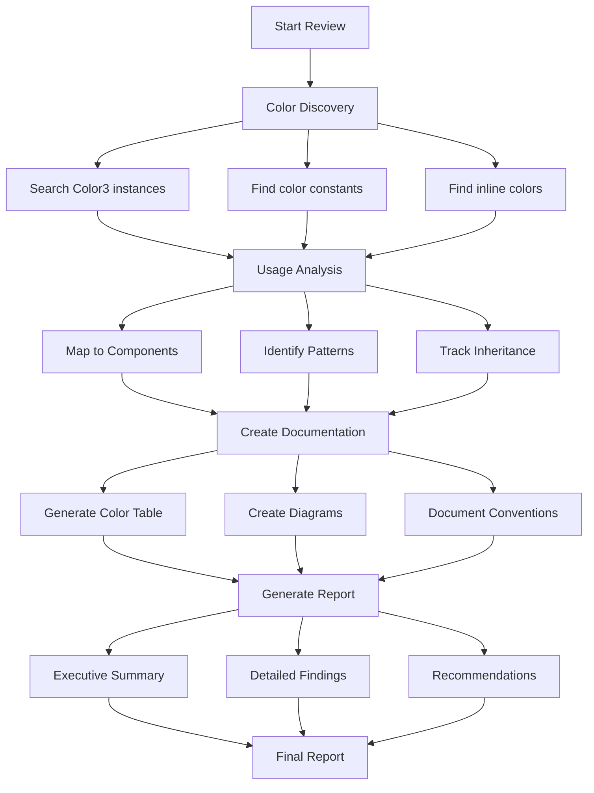

# Color System Review Specification

## Summary

This feature involves conducting a comprehensive review of how colors are used throughout the Roblox portion of the codebase and providing recommendations for improvement. The review will analyze color definitions, usage patterns, consistency, and organization to identify opportunities for better maintainability and visual coherence.

## Requirements

1. ⬛ R1: Analyze all color definitions and their locations in the codebase
2. ⬛ R2: Document color usage patterns across different components
3. ⬛ R3: Identify redundant or inconsistent color definitions
4. ⬛ R4: Create a comprehensive table of all colors with their usage context
5. ⬛ R5: Generate visual diagrams showing color relationships and hierarchies
6. ⬛ R6: Provide actionable recommendations for color system improvements
7. ⬛ R7: Focus on Roblox-specific code (src/ directory, excluding _webapp)

## Task List

1. ⬛ T1: Color Discovery and Inventory
   1. ⬛ T1.1: Search for all Color3 instantiations in the codebase
   2. ⬛ T1.2: Identify color constant files and modules
   3. ⬛ T1.3: Find inline color definitions
   4. ⬛ T1.4: Document color import/export patterns

2. ⬛ T2: Color Usage Analysis
   1. ⬛ T2.1: Map colors to their component usage (nodes, swimlanes, shadows, etc.)
   2. ⬛ T2.2: Identify color assignment patterns (sequential, mapped, hardcoded)
   3. ⬛ T2.3: Analyze color inheritance and propagation
   4. ⬛ T2.4: Document visual property mapping systems

3. ⬛ T3: Create Color Documentation
   1. ⬛ T3.1: Generate comprehensive color usage table
   2. ⬛ T3.2: Create color relationship diagrams
   3. ⬛ T3.3: Document color naming conventions
   4. ⬛ T3.4: Map colors to their visual output

4. ⬛ T4: Generate Analysis Report
   1. ⬛ T4.1: Write executive summary
   2. ⬛ T4.2: Create detailed findings section
   3. ⬛ T4.3: Develop improvement recommendations
   4. ⬛ T4.4: Propose color system architecture

## Risks

- Risk 1: Large codebase may have colors defined in unexpected locations
- Risk 2: Dynamic color generation may be difficult to track statically
- Risk 3: Some colors may be defined in Luau output files rather than TypeScript source

## Decision Points

- Decision 1: Focus on TypeScript source files rather than compiled Luau output
- Decision 2: Prioritize architectural patterns over individual color values
- Decision 3: Emphasize maintainability and consistency in recommendations

## ASCII Representation of Report Structure

```
┌─────────────────────────────────────────────────────┐
│             COLOR SYSTEM REVIEW REPORT              │
├─────────────────────────────────────────────────────┤
│ EXECUTIVE SUMMARY                                   │
│ ├─ Key Findings                                     │
│ ├─ Current State Overview                           │
│ └─ Impact Assessment                                │
├─────────────────────────────────────────────────────┤
│ COLOR INVENTORY TABLE                               │
│ ┌─────────┬──────────┬─────────┬────────────────┐ │
│ │ Color   │ RGB      │ Usage   │ Location       │ │
│ ├─────────┼──────────┼─────────┼────────────────┤ │
│ │ Blue    │ 0.2,0.4..│ Nodes   │ colorMapper.ts │ │
│ │ Shadow  │ 0.5,0.7..│ Shadows │ blockConst...  │ │
│ └─────────┴──────────┴─────────┴────────────────┘ │
├─────────────────────────────────────────────────────┤
│ COLOR USAGE DIAGRAMS                                │
│ ├─ Component Color Map                              │
│ ├─ Color Flow Diagram                               │
│ └─ Color Hierarchy Tree                             │
├─────────────────────────────────────────────────────┤
│ RECOMMENDATIONS                                     │
│ ├─ 1. Centralization Strategy                       │
│ ├─ 2. Naming Convention                             │
│ ├─ 3. Theme System                                  │
│ └─ 4. Implementation Roadmap                        │
└─────────────────────────────────────────────────────┘
```

## File and Function Structure

```
F004-ColorSystemReview/
├── 000-ColorSystemReview-InitialSpec-001.md
├── Revised Spec/
│   ├── 000-01-Summary.md
│   ├── 000-02-Requirements.md
│   └── 000-03-Tasks.md
└── ColorSystemReport.md
    ├── ExecutiveSummary
    ├── ColorInventoryTable
    ├── UsageDiagrams
    └── Recommendations
```

## Flowchart

