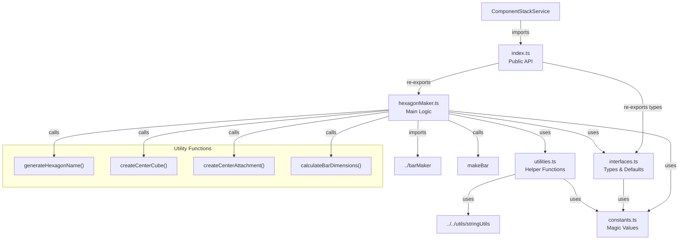

# HexagonMaker Module Restructure Specification

## Summary

This plan outlines the restructuring of the `hexagonMaker.ts` module to match the organized folder structure pattern established by `labelBlockMaker` and `barMaker`. The current hexagonMaker is a single file with ~110 lines containing interfaces, utility functions, and the main hexagon creation logic. This restructure will improve maintainability, consistency, and modularity across the codebase.

## Requirements

1. ✅ R1: Match the folder structure pattern established by labelBlockMaker and barMaker
2. ✅ R2: Maintain backward compatibility - external imports must continue to work
3. ✅ R3: Extract constants into a dedicated constants file
4. ✅ R4: Separate interfaces and type definitions into interfaces.ts
5. ✅ R5: Move utility functions to utilities.ts
6. ✅ R6: Keep main hexagon creation logic in hexagonMaker.ts
7. ✅ R7: Create an index.ts for clean public API
8. ✅ R8: Ensure the main file is named hexagonMaker.ts for searchability

## Task List

1. ✅ T1: Create folder structure
   1. ✅ T1.1: Create `src/shared/modules/hexagonMaker/` directory
   2. ✅ T1.2: Move current `hexagonMaker.ts` into the new folder temporarily

2. ✅ T2: Extract interfaces and types
   1. ✅ T2.1: Create `interfaces.ts` file
   2. ✅ T2.2: Move `HexagonConfig` interface
   3. ✅ T2.3: Create default configuration constants in interfaces.ts

3. ✅ T3: Create constants file
   1. ✅ T3.1: Create `constants.ts` file
   2. ✅ T3.2: Extract magic numbers and values:
      - Default center position `[0, 2, 0]`
      - Default width (10)
      - Default height (0.5)
      - Default labels `["Front", "Left", "Right"]`
      - Golden color `[0.9, 0.7, 0.3]`
      - Center cube size (0.1)
      - Center cube transparency (0.4)
      - Rotation angles (60 degrees)
      - Number of bars (3)
      - Name prefixes ("h", "st", "centerCube", "att000")
   3. ✅ T3.3: Add hexagon geometry constants (radius calculations)

4. ✅ T4: Extract utility functions
   1. ✅ T4.1: Create `utilities.ts` file
   2. ✅ T4.2: Move `generateHexagonName` function
   3. ✅ T4.3: Create `createCenterCube` function from inline code
   4. ✅ T4.4: Create `createCenterAttachment` function from inline code
   5. ✅ T4.5: Create `calculateBarDimensions` function for geometry calculations
   6. ✅ T4.6: Add necessary imports

5. ✅ T5: Clean up main hexagonMaker.ts
   1. ✅ T5.1: Remove moved interfaces and types
   2. ✅ T5.2: Remove moved utility functions
   3. ✅ T5.3: Add imports from new files
   4. ✅ T5.4: Refactor main function to use extracted utilities
   5. ✅ T5.5: Keep only the main `makeHexagon` function

6. ✅ T6: Create index.ts
   1. ✅ T6.1: Create `index.ts` file
   2. ✅ T6.2: Export `makeHexagon` from hexagonMaker.ts
   3. ✅ T6.3: Export `HexagonConfig` type from interfaces.ts

7. ✅ T7: Update external imports
   1. ✅ T7.1: Find all files importing from hexagonMaker
   2. ✅ T7.2: Verify imports still work (they should due to index.ts)
   3. ✅ T7.3: Run build to ensure no breaking changes

8. ✅ T8: Testing and validation
   1. ✅ T8.1: Run `npm run build`
   2. ✅ T8.2: Verify componentStackService still works (main consumer)
   3. ✅ T8.3: Check for any TypeScript errors
   4. ✅ T8.4: Test in Roblox Studio to ensure hexagons render correctly

## Risks

- Risk 1: Breaking existing imports - Mitigated by creating index.ts that maintains the same export interface
- Risk 2: Circular dependencies with barMaker - Mitigated by careful import organization
- Risk 3: Runtime errors in Roblox - Mitigated by thorough testing after restructure

## Decision Points

- Decision 1: Keep padNumber import from shared utils rather than duplicating
- Decision 2: Extract center cube and attachment creation into separate utility functions for reusability
- Decision 3: Group all hexagon geometry calculations into a dedicated utility function
- Decision 4: Export only necessary types through index.ts (makeHexagon and HexagonConfig)

## File and Function Structure

```
src/shared/modules/hexagonMaker/
├── index.ts
│   └── export { makeHexagon }
│   └── export type { HexagonConfig }
├── hexagonMaker.ts
│   └── makeHexagon()
├── interfaces.ts
│   └── interface HexagonConfig
│   └── const defaultConfig
├── constants.ts
│   └── HEXAGON_CONSTANTS object
└── utilities.ts
    └── generateHexagonName()
    └── createCenterCube()
    └── createCenterAttachment()
    └── calculateBarDimensions()
```

## Flowchart



## Sample Objects

```typescript
// HEXAGON_CONSTANTS structure
const HEXAGON_CONSTANTS = {
  // Default values
  DEFAULT_CENTER_POSITION: [0, 2, 0] as [number, number, number],
  DEFAULT_WIDTH: 10,
  DEFAULT_HEIGHT: 0.5,
  DEFAULT_LABELS: ["Front", "Left", "Right"],
  
  // Hexagon properties
  NUM_BARS: 3,
  ROTATION_ANGLE: 60, // degrees between bars
  
  // Bar properties
  DEFAULT_BAR_COLOR: [0.9, 0.7, 0.3] as [number, number, number], // Golden
  
  // Center cube properties
  CENTER_CUBE: {
    SIZE: 0.1,
    TRANSPARENCY: 0.4,
    COLOR_RGB: [255, 255, 0] as [number, number, number] // Yellow
  },
  
  // Name prefixes
  NAME_PREFIXES: {
    HEXAGON: "h",
    STACK: "st",
    CENTER_CUBE: "centerCube",
    CENTER_ATTACHMENT: "att000"
  }
};

// Example HexagonConfig
const hexagonConfig: HexagonConfig = {
  id: 5,
  centerPosition: [10, 5, 0],
  width: 12,
  height: 1,
  barProps: {
    Color: [0.5, 0.8, 0.2]
  },
  labels: ["Top", "Left", "Right"],
  stackIndex: 2,
  hexIndex: 3,
  guid: "unique-guid-123"
};
```

## Example Code

```typescript
// index.ts
export { makeHexagon } from "./hexagonMaker";
export type { HexagonConfig } from "./interfaces";

// Usage remains the same:
import { makeHexagon } from "../../shared/modules/hexagonMaker";

const hexagon = makeHexagon({
  id: 1,
  centerPosition: [0, 10, 0],
  width: 8,
  labels: ["Front", "Side A", "Side B"],
  stackIndex: 1,
  hexIndex: 1
});

// utilities.ts example
export function calculateBarDimensions(width: number, height: number) {
  const radius = width / 2;
  const barLength = radius;
  const barWidth = radius * math.sqrt(3); // Proper width for solid hexagon
  const barHeight = height;
  
  return {
    barLength,
    barWidth,
    barHeight,
    radius
  };
}
```