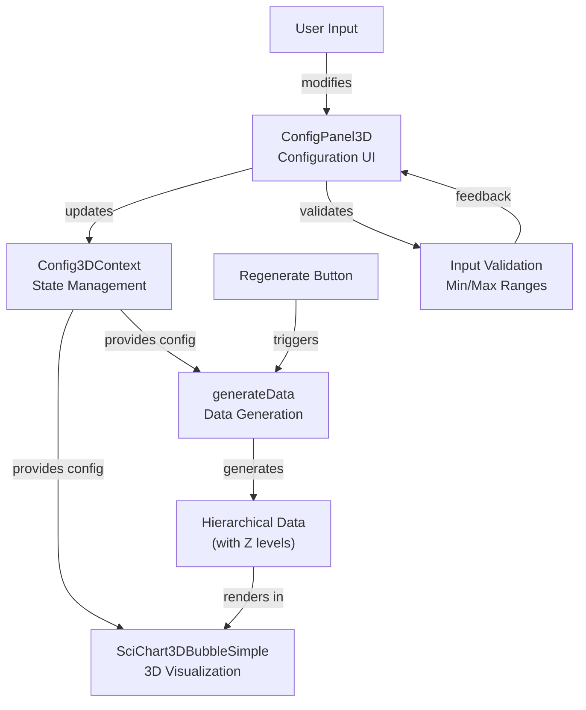

# 3D Controller Feature Specification

## Summary

This feature implements a web-based configuration controller for the 3D scatter chart in the Next.js application. It provides a user interface that mirrors the Roblox Configuration GUI (F002) functionality, allowing users to adjust data generation parameters and see immediate updates in the 3D visualization. The controller will integrate with the existing SciChart 3D bubble chart component to provide real-time parameter adjustments without requiring Roblox Studio.

## Requirements

1. ⬛ R1: Web-based Configuration Interface
   1. ⬛ R1.1: The system shall provide a configuration panel positioned alongside the 3D chart
   2. ⬛ R1.2: The panel shall display current configuration parameters matching F002-ConfigGUI
   3. ⬛ R1.3: The interface shall use React components with Next.js app router compatibility
   4. ⬛ R1.4: The panel shall be responsive and work on desktop and tablet viewports

2. ⬛ R2: Parameter Controls
   1. ⬛ R2.1: Number of Level 1 Nodes input (range: 1-10)
   2. ⬛ R2.2: Number of Level 2 Nodes input (range: 1-50)
   3. ⬛ R2.3: Number of Level 3 Nodes input (range: 1-100)
   4. ⬛ R2.4: Children per Node input (range: 1-5)
   5. ⬛ R2.5: Node Types selector (range: 1-10)
   6. ⬛ R2.6: Link Types selector (range: 1-10)

3. ⬛ R3: Real-time Updates
   1. ⬛ R3.1: The 3D chart shall update immediately when configuration changes
   2. ⬛ R3.2: The system shall maintain smooth transitions during updates
   3. ⬛ R3.3: The chart shall preserve camera position during regeneration

4. ⬛ R4: Data Generation Integration
   1. ⬛ R4.1: The controller shall use the existing generateData functions
   2. ⬛ R4.2: The system shall apply hierarchical positioning using Z_LEVEL_SPACING
   3. ⬛ R4.3: Generated data shall match the Roblox visualization structure

## Task List

1. ⬛ T1: Create Configuration Panel Component
   1. ⬛ T1.1: Create `components/ConfigPanel3D.tsx` component
   2. ⬛ T1.2: Implement panel layout with form controls
   3. ⬛ T1.3: Add styling to match existing UI theme
   4. ⬛ T1.4: Ensure responsive design for different viewports

2. ⬛ T2: Implement Parameter Input Controls
   1. ⬛ T2.1: Create NumberInput component with validation
   2. ⬛ T2.2: Add input fields for level node counts
   3. ⬛ T2.3: Add children per node control
   4. ⬛ T2.4: Create dropdown selectors for node/link types
   5. ⬛ T2.5: Implement input validation with min/max constraints

3. ⬛ T3: Integrate with 3D Chart Component
   1. ⬛ T3.1: Modify SciChart3DBubbleSimple to accept config props
   2. ⬛ T3.2: Add configuration state management
   3. ⬛ T3.3: Implement config change handler
   4. ⬛ T3.4: Connect panel controls to chart updates

4. ⬛ T4: Update Data Generation
   1. ⬛ T4.1: Extend generateData to accept configuration parameters
   2. ⬛ T4.2: Implement hierarchical node generation based on levels
   3. ⬛ T4.3: Apply Z_LEVEL_SPACING for proper 3D positioning
   4. ⬛ T4.4: Generate relationships based on children per node

5. ⬛ T5: Add Regenerate Functionality
   1. ⬛ T5.1: Create Regenerate button component
   2. ⬛ T5.2: Implement data regeneration logic
   3. ⬛ T5.3: Add loading state during regeneration
   4. ⬛ T5.4: Preserve camera state during updates

6. ⬛ T6: Testing and Polish
   1. ⬛ T6.1: Test all parameter combinations
   2. ⬛ T6.2: Verify 3D positioning matches expectations
   3. ⬛ T6.3: Ensure smooth performance with max nodes
   4. ⬛ T6.4: Add visual feedback for user actions

## Risks

- Risk 1: Performance degradation with maximum node counts - Mitigate with efficient data structures and SciChart optimization settings
- Risk 2: State synchronization issues between panel and chart - Mitigate with proper React state management
- Risk 3: Browser memory limitations with large datasets - Mitigate with data limits and cleanup

## Decision Points

- Decision 1: Use controlled components for all inputs to ensure state consistency
- Decision 2: Implement configuration as a single state object for atomic updates
- Decision 3: Use React Context for configuration state to avoid prop drilling
- Decision 4: Keep camera state separate from data regeneration

## File and Function Structure

```
_webapp/src/
├── components/
│   ├── ConfigPanel3D.tsx
│   │   └── ConfigPanel3D()
│   │   └── NumberInput()
│   │   └── SelectInput()
│   ├── graphs/
│   │   └── SciChart3DBubbleSimple.tsx
│   │       └── handleConfigChange()
│   │       └── regenerateData()
├── lib/
│   └── generateData.ts
│       └── generateHierarchicalData()
│       └── applyConfiguration()
├── types/
│   └── config3d.ts
│       └── Config3D interface
│       └── ValidationRules
└── contexts/
    └── Config3DContext.tsx
        └── Config3DProvider
        └── useConfig3D()
```

## Flowchart



## Sample Objects

```typescript
// Configuration interface matching F002 requirements
interface Config3D {
  numLevel1Nodes: number;  // 1-10
  numLevel2Nodes: number;  // 1-50
  numLevel3Nodes: number;  // 1-100
  childrenPerNode: number; // 1-5
  numNodeTypes: number;    // 1-10
  numLinkTypes: number;    // 1-10
}

// Default configuration
const defaultConfig: Config3D = {
  numLevel1Nodes: 1,
  numLevel2Nodes: 6,
  numLevel3Nodes: 12,
  childrenPerNode: 3,
  numNodeTypes: 3,
  numLinkTypes: 3
};

// Validation rules
const validationRules = {
  numLevel1Nodes: { min: 1, max: 10 },
  numLevel2Nodes: { min: 1, max: 50 },
  numLevel3Nodes: { min: 1, max: 100 },
  childrenPerNode: { min: 1, max: 5 },
  numNodeTypes: { min: 1, max: 10 },
  numLinkTypes: { min: 1, max: 10 }
};

// Generated node structure
interface HierarchicalNode {
  id: string;
  x: number;
  y: number;
  z: number;      // levelNumber * Z_LEVEL_SPACING
  size: number;
  nodeType: number;
  level: number;
  parentId?: string;
}
```

## Example Code

```typescript
// ConfigPanel3D.tsx
export function ConfigPanel3D() {
  const { config, updateConfig } = useConfig3D();
  
  const handleInputChange = (field: keyof Config3D, value: number) => {
    const rules = validationRules[field];
    const validValue = Math.min(Math.max(value, rules.min), rules.max);
    updateConfig({ ...config, [field]: validValue });
  };

  return (
    <div className="config-panel">
      <h3>3D Chart Configuration</h3>
      
      <NumberInput
        label="Level 1 Nodes"
        value={config.numLevel1Nodes}
        min={1}
        max={10}
        onChange={(val) => handleInputChange('numLevel1Nodes', val)}
      />
      
      {/* Additional inputs... */}
      
      <button onClick={regenerateData}>
        Regenerate
      </button>
    </div>
  );
}

// Data generation with configuration
export function generateHierarchicalData(config: Config3D): HierarchicalNode[] {
  const nodes: HierarchicalNode[] = [];
  let nodeId = 0;
  
  // Level 1 nodes
  for (let i = 0; i < config.numLevel1Nodes; i++) {
    nodes.push({
      id: `node-${nodeId++}`,
      x: Math.random() * 100 - 50,
      y: Math.random() * 100 - 50,
      z: 0 * Z_LEVEL_SPACING,  // Level 0
      size: 10,
      nodeType: Math.floor(Math.random() * config.numNodeTypes),
      level: 0
    });
  }
  
  // Generate child nodes for subsequent levels...
  
  return nodes;
}
```