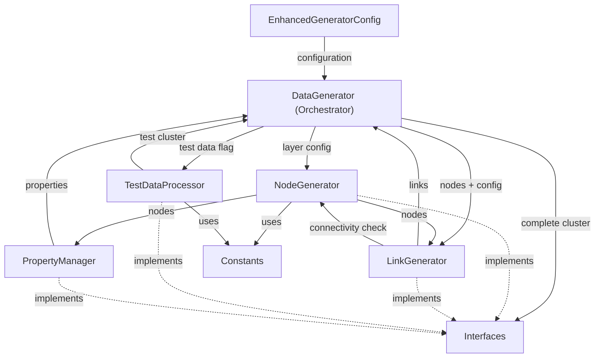

# DataGenerator Refactoring Specification

## Summary

Refactor the large `dataGenerator.ts` file (631 lines) into smaller, focused modules to improve maintainability, testability, and code organization. The current file violates single responsibility principle by handling node generation, link generation, property management, and test data processing.

## Requirements

1. ⬛ R1 - Code Organization
   1. ⬛ R1.1 - Split dataGenerator.ts into logical modules
   2. ⬛ R1.2 - Maintain backward compatibility with existing interfaces
   3. ⬛ R1.3 - Preserve all current functionality

2. ⬛ R2 - Module Separation
   1. ⬛ R2.1 - Create dedicated NodeGenerator module for node creation
   2. ⬛ R2.2 - Create dedicated LinkGenerator module for link creation
   3. ⬛ R2.3 - Create dedicated TestDataProcessor module for test data handling
   4. ⬛ R2.4 - Create dedicated PropertyManager module for property discovery

3. ⬛ R3 - Performance
   1. ⬛ R3.1 - Maintain current generation speed
   2. ⬛ R3.2 - No memory overhead increase
   3. ⬛ R3.3 - Preserve maxDataItems configuration functionality

4. ⬛ R4 - Code Quality
   1. ⬛ R4.1 - Reduce file complexity from 631 lines to <200 lines per module
   2. ⬛ R4.2 - Eliminate code duplication in property assignment
   3. ⬛ R4.3 - Improve type safety and error handling

## Task List

1. ⬛ T1 - Analysis and Planning
   1. ⬛ T1.1 - Analyze current dependencies and interfaces
   2. ⬛ T1.2 - Design module boundaries and responsibilities
   3. ⬛ T1.3 - Plan interface contracts between modules

2. ⬛ T2 - Create Core Modules
   1. ⬛ T2.1 - Create NodeGenerator module
   2. ⬛ T2.2 - Create LinkGenerator module
   3. ⬛ T2.3 - Create PropertyManager module
   4. ⬛ T2.4 - Create TestDataProcessor module

3. ⬛ T3 - Refactor Main DataGenerator
   1. ⬛ T3.1 - Update DataGenerator to use new modules
   2. ⬛ T3.2 - Remove duplicated code from main class
   3. ⬛ T3.3 - Update imports and dependencies

4. ⬛ T4 - Testing and Validation
   1. ⬛ T4.1 - Verify backward compatibility
   2. ⬛ T4.2 - Test with existing configurations
   3. ⬛ T4.3 - Validate performance benchmarks

## Risks

- Risk 1: Breaking existing functionality during refactoring - Mitigation: Incremental changes with validation at each step
- Risk 2: Performance degradation from module overhead - Mitigation: Keep modules lightweight and avoid unnecessary abstractions
- Risk 3: Complex inter-module dependencies - Mitigation: Clear interface contracts and dependency injection patterns

## Decision Points

- Decision 1: Use composition over inheritance for module organization - Chosen for better testability and flexibility
- Decision 2: Keep original DataGenerator as orchestrator rather than complete replacement - Preserves backward compatibility
- Decision 3: Use factory pattern for node/link creation - Enables better type safety and extensibility

## ASCII representation of GUI

```
Current DataGenerator (631 lines):
┌─────────────────────────────────────┐
│  DataGenerator                      │
│  ├── generateClusterFromLayers()    │
│  ├── generateLayerNodes()           │
│  ├── createNode()                   │
│  ├── addTypeSpecificProperties()    │
│  ├── generateLayerLinks()           │
│  ├── createLink()                   │
│  ├── generateClusterFromTestData()  │
│  ├── ensureNodeConnectivity()       │
│  └── writeTempData()                │
└─────────────────────────────────────┘

Refactored Structure:
┌──────────────────┐ ┌──────────────────┐
│  DataGenerator   │ │  NodeGenerator   │
│  (Orchestrator)  │→│  (~150 lines)    │
│  (~150 lines)    │ │                  │
└──────────────────┘ └──────────────────┘
         │
         ↓
┌──────────────────┐ ┌──────────────────┐
│  LinkGenerator   │ │ TestDataProcessor│
│  (~120 lines)    │ │  (~100 lines)    │
└──────────────────┘ └──────────────────┘
         │
         ↓
┌──────────────────┐
│ PropertyManager  │
│  (~80 lines)     │
└──────────────────┘
```

## File and Function Structure

```
src/shared/modules/renderers/unifiedDataRenderer/core/
├── dataGenerator/
│   ├── dataGenerator.ts (orchestrator ~150 lines)
│   │   ├── generateClusterFromLayers()
│   │   ├── constructor()
│   │   └── setUseTestData()
│   ├── nodeGenerator.ts (~150 lines)
│   │   ├── generateLayerNodes()
│   │   ├── createNode()
│   │   └── addTypeSpecificProperties()
│   ├── linkGenerator.ts (~120 lines)
│   │   ├── generateLayerLinks()
│   │   ├── createLink()
│   │   ├── ensureNodeConnectivity()
│   │   └── generateInterLayerLink()
│   ├── testDataProcessor.ts (~100 lines)
│   │   ├── generateClusterFromTestData()
│   │   ├── getFileName()
│   │   └── getServiceColor()
│   ├── propertyManager.ts (~80 lines)
│   │   ├── discoverProperties()
│   │   └── validateProperties()
│   └── interfaces/
│       ├── nodeGenerator.interface.ts
│       ├── linkGenerator.interface.ts
│       └── dataProcessor.interface.ts
```

## Flowchart

