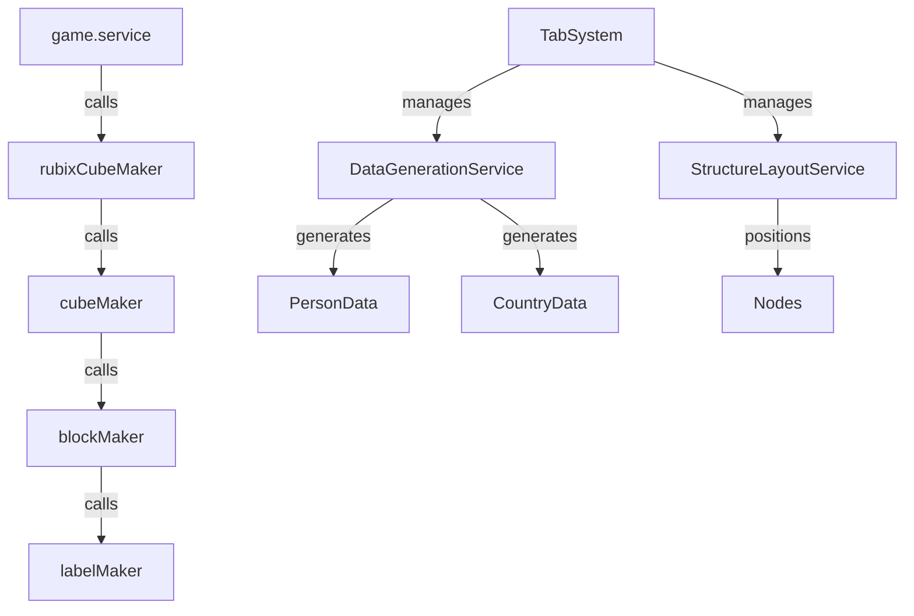

# GraphBlaster Geometric Graph Layout Specification

## Summary

DesignANewGeometricGraphLayout - We will design a new geometric layout upon which we will overlay graph data feature nodes and links. The resulting structures will be rendered in Roblox.

## Requirements

### R1: GUIs

1. ⬛ Data Generation Engine GUI
    1. ⬛ Number of records control
    2. ⬛ Unique values per property control
    3. ⬛ Live data preview table (1 row)
2. ⬛ Structure Layout Engine GUI
    1. ⬛ Placeholder interface for future layout controls
3. ⬛ Data Linking GUI
    1. ⬛ Placeholder interface for link configuration
4. ⬛ Settings GUI
    1. ⬛ Placeholder interface for general settings
5. ⬛ GUI Tabbing System
    1. ⬛ Compact tab list on left side
    2. ⬛ Tab switching closes previous GUI
    3. ⬛ Data Generation Engine as default tab

### R2: Services

1. ⬛ Data Generation Engine Service
    1. ⬛ Generate random JSON data at runtime
    2. ⬛ Write to TypeScript object file
    3. ⬛ Person entity generation
        1. Random property selection (10 unique choices):
            1. firstName
            2. lastName  
            3. country
            4. petType
            5. countryLivesIn (Country reference)
            6. countryBornIn (Country reference)
            7. countryWorksIn (Country reference)
    4. ⬛ Country entity generation
        1. name
        2. isSunny (boolean)
        3. isWarm (boolean)
        4. happiness (1-10)
        5. expensive (1-10)
2. ⬛ Structure Layout Engine Service
    1. ⬛ Generate geometric container structures
    2. ⬛ Position nodes within structures

### R3: Code Structure

1. ⬛ New isolated folder structure (src2)
    1. ⬛ No overlap with existing codebase
    2. ⬛ Follow existing best practices
    3. ⬛ Organized folder hierarchy
2. ⬛ Sample validation code
    1. ⬛ game.service calls rubixCubeMaker
    2. ⬛ rubixCubeMaker calls cubeMaker
    3. ⬛ cubeMaker calls blockMaker
    4. ⬛ blockMaker calls labelMaker

## Task List

### T1: ⬛ Setup Project Structure

1. ⬛ T1.1: Create src2 folder structure
2. ⬛ T1.3: Create service folder hierarchy

### T2: ⬛ Implement Data Generation Engine

1. ⬛ T2.1: Create data types/interfaces
2. ⬛ T2.2: Implement random data generators
3. ⬛ T2.3: Create file writing utilities
4. ⬛ T2.4: Generate sample data

### T3: ⬛ Create GUI Framework

1. ⬛ T3.1: Implement tab system
2. ⬛ T3.2: Create base GUI components
3. ⬛ T3.3: Build Data Generation Engine GUI
4. ⬛ T3.4: Create placeholder GUIs

### T4: ⬛ Implement Sample Validation Code

1. ⬛ T4.1: Create labelMaker function
2. ⬛ T4.2: Create blockMaker function
3. ⬛ T4.3: Create cubeMaker function
4. ⬛ T4.4: Create rubixCubeMaker function
5. ⬛ T4.5: Integrate with game.service

### T5: ⬛ Structure Layout Engine Foundation

1. ⬛ T5.1: Create layout engine service structure
2. ⬛ T5.2: Implement basic positioning logic
3. ⬛ T5.3: Create placeholder functionality

## Risks

- Risk 1: Integration with existing game.service may require modifications
- Risk 2: Performance impact of runtime data generation needs monitoring

## Decision Points

- Decision 1: Using TypeScript files for data storage instead of JSON for type safety
- Decision 2: Implementing tab system from scratch for better control

## ASCII Representation of GUI

```
┌─────────────────────────────────────────────────────────────┐
│ GraphBlaster Control Panel                                  │
├─────────────┬───────────────────────────────────────────────┤
│ TABS        │ [Data Generation Engine]                      │
│             │ ┌───────────────────────────────────────────┐ │
│ ▶ Data Gen  │ │ Records to Create: [50    ] ▼            │ │
│   Structure │ │ Unique Values:     [10    ] ▼            │ │
│   Linking   │ │                                           │ │
│   Settings  │ │ Preview:                                  │ │
│             │ │ ┌─────────────────────────────────────┐ │ │
│             │ │ │ Name    | Country | Pet  | Lives   │ │ │
│             │ │ ├─────────────────────────────────────┤ │ │
│             │ │ │ John S. | USA     | Dog  | Canada  │ │ │
│             │ │ └─────────────────────────────────────┘ │ │
│             │ │                                           │ │
│             │ │ [Generate Data]                          │ │
│             │ └───────────────────────────────────────────┘ │
└─────────────┴───────────────────────────────────────────────┘
```

## File and Function Structure

```
src2/
├── services/
│   ├── dataGeneration/
│   │   ├── dataGenerator.service.ts
│   │   │   └── generateData()
│   │   │   └── writeDataFile()
│   │   ├── types/
│   │   │   └── person.interface.ts
│   │   │   └── country.interface.ts
│   │   └── generators/
│   │       └── personGenerator.ts
│   │       └── countryGenerator.ts
│   ├── structureLayout/
│   │   └── layoutEngine.service.ts
│   │       └── generateLayout()
│   └── gui/
│       ├── tabSystem/
│       │   └── tabManager.ts
│       └── panels/
│           └── dataGenerationPanel.ts
└── validation/
    ├── rubixCubeMaker.ts
    │   └── rubixCubeMaker()
    ├── cubeMaker.ts
    │   └── cubeMaker()
    ├── blockMaker.ts
    │   └── blockMaker()
    └── labelMaker.ts
        └── labelMaker()
```

## Flowchart



