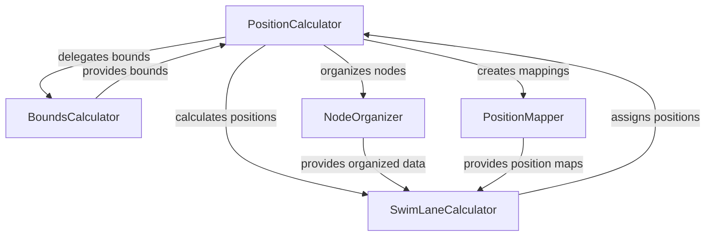

# Position Calculator Refactoring Specification

## Summary

Refactor the positionCalculator.ts module (350 lines) to improve code organization, maintainability, and separation of concerns. The module currently handles swim lane positioning, origin centering, and property-based positioning logic in a single class. This refactoring will break down the monolithic class into smaller, focused modules while maintaining all existing functionality.

## Requirements

1. ⬛ R1: Maintain all existing public API methods and signatures
2. ⬛ R2: Preserve swim lane positioning algorithm behavior
3. ⬛ R3: Keep origin centering functionality intact
4. ⬛ R4: Maintain property-based positioning for X, Y, and Z axes
5. ⬛ R5: Ensure backward compatibility with current consumers
6. ⬛ R6: Improve code organization and separation of concerns
7. ⬛ R7: Reduce complexity of individual methods
8. ⬛ R8: Create focused modules with single responsibilities

## Task List

1. ⬛ T1: Analyze Current Implementation
   1. ⬛ T1.1: Map all method dependencies
   2. ⬛ T1.2: Identify logical module boundaries
   3. ⬛ T1.3: Document current data flow

2. ⬛ T2: Design Module Architecture
   1. ⬛ T2.1: Define module interfaces
   2. ⬛ T2.2: Plan module responsibilities
   3. ⬛ T2.3: Design inter-module communication

3. ⬛ T3: Create Core Modules
   1. ⬛ T3.1: Extract BoundsCalculator module
   2. ⬛ T3.2: Extract NodeOrganizer module
   3. ⬛ T3.3: Extract PositionMapper module
   4. ⬛ T3.4: Extract SwimLaneCalculator module

4. ⬛ T4: Refactor Main Class
   1. ⬛ T4.1: Update PositionCalculator to orchestrate modules
   2. ⬛ T4.2: Delegate responsibilities to new modules
   3. ⬛ T4.3: Simplify public method implementations

5. ⬛ T5: Testing and Validation
   1. ⬛ T5.1: Verify all public methods work correctly
   2. ⬛ T5.2: Test with existing configurations
   3. ⬛ T5.3: Ensure no behavior changes

## Risks

- Risk 1: Breaking existing functionality - Mitigated by maintaining public API and thorough testing
- Risk 2: Performance degradation - Mitigated by careful module design and avoiding excessive object creation

## Decision Points

- Decision 1: Use internal classes vs separate files - Choose internal classes to avoid Roblox module loading issues
- Decision 2: Module granularity - Balance between too many small modules and too few large ones

## ASCII representation of GUI

```
Not applicable - This is a backend calculation module
```

## File and Function Structure

```
src/shared/modules/renderers/unifiedDataRenderer/core/
├── positionCalculator.ts
│   ├── class BoundsCalculator
│   │   ├── calculateBounds()
│   │   └── getClusterBounds()
│   ├── class NodeOrganizer
│   │   ├── organizeNodesByProperty()
│   │   └── sortTypesByCount()
│   ├── class PositionMapper
│   │   ├── createPropertyPositionMap()
│   │   └── applyOffsets()
│   ├── class SwimLaneCalculator
│   │   ├── calculateTypeColumnPositions()
│   │   └── assignNodePositionsWithProperties()
│   └── class PositionCalculator (main orchestrator)
│       ├── constructor()
│       ├── getClusterBounds()
│       ├── centerBottomAtOrigin()
│       └── calculateLayerSwimLanePositions()
```

## Flowchart

