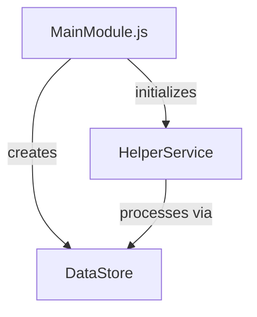

|----------------------------------------------------------------------|
Summary:
Create a tic tac toe game in TS that runs on the command line in nodejs.
|----------------------------------------------------------------------|
Features:
X's should be red and O's should be blue.
Player vs. computer

|----------------------------------------------------------------------|

|----------------------------------------------------------------------|
note to AI Agent:
This file is a set of instrctions that you will follow in order to help plan a feature.
Following the instructions will create a final product that is a folder containing a set of documents that will be used one of more AI agents.

Follow each Step.
After you complete the Step, ask the user the User Question provided for that task.
The user will possibly make some edits, and direct you to do the next Step.
Do not perform any Step unless told to.
When told to run this file, assume the Summary and Features above have been updated to reflect current needs.
A sample of the final output folder can be found here.
Sample Output:
./F000-TicTacToe (example)
|----------------------------------------------------------------------|

Step 1. - Create Single Spec Document

1. Inputs

   1. Summary and Features provided above

2. Actions for AI Agent

   1. Read Inputs
   2. Use the "Spec Building Instructions" below to create output

3. Outputs
   1. folder that follows the naming conventions in Sample Output
   2. file that follows this naming convention
      1. 000-TicTacToe-InitialSpec-001
4. User Question:
   1. I have created Step 1. <step name>
   2. I used these inputs <Inputs names> to create these Outputs
   3. <output names>
   4. Make any changes, ask me to update it, and tell me when you are ready for
   5. Step 2 <step name>

|----------------------------------------------------------------------|
Step 2. - Break Spec into Smaller Files

1. Inputs

   1. Output doc from Step 1. Example: "F000-00-TicTacToe-InitialSpec-001"

2. Actions for AI Agent
   1. Read the Inputs and Create the Outputs
3. Outputs

   1. Create a folder called: "Revised Spec"
   2. Divide the information in the Input doc into the following 3 docs and place them in the new folder
      1. 000-01-Summary.md
      2. 000--02-Requirements.md
      3. 000-03-Tasks.md
   3. (The purpose is to isolate the tasks and make them easier to review and execute)

4. User Question:
   1. I have converted the Spec <doc name> into a set of smaller docs, which can be found here: Make any changes, ask me to update them, and tell me when you are ready for step 2.

When told to do so:
execute tasks, starting with task 1.
mark each task complete before starting the next task.
if a task fails or cannot be done, stop and wait for instructions.

Use these outline conventions when creating the doc

```
1. ⬛ Cat Breeds

   1. ✅ Long-haired Cats
      1. ⬛ Persian
      2. ⬛ Maine Coon
      3. ⬛ Ragdoll
   2. ⬛ Short-haired Cats
      1. ⬛ Siamese
      2. ⬛ Russian Blue
      3. ⬛ British Shorthair

2. ⬛ Cat Behavior
```

## Provide a section summarizing the purpose of the feature or plan

## Core Principles

1. The design should:
   1.1. Be as simple as possible
   1.2. Include only the features necessary to prove the concept
   1.3. No mock data
   1.4. Minimal error handling
   1.5. No tests

## Required Elements

Organize the doc into these sections, in this order:

1. Summary
2. Requirements
   1.1. Each should have a unique number (R1, R2, etc.)
   1.2. Include References section if needed
3. Task List. Each task described with:
   2.1. Line item
   2.2. Unique number
   2.3. Unchecked checkbox icon
   2.4. read this doc and follow the conventions: 001-outline-conventions.md
4. List of risks (if any)
5. List of decision points (if any)
6. Text based file/function tree
7. A mermaid flowchart
8. Sample objects
9. Example code

## Example Format

# Feature Name Specification

## Requirements

1. ⬛ Requirements
   1. ⬛ The feature should accomplish X
   2. ⬛ The feature should integrate with Y
   3. ⬛ The feature should respond within Z milliseconds

## Risks

- Risk 1: Description of potential risk and mitigation strategy
- Risk 2: Description of another potential risk

## Decision Points

- Decision 1: Choice made between X and Y approaches because of Z
- Decision 2: Selected technology A over B because of C requirements

## File and Function Structure

src/
├── featureName/
│ ├── featureName.js
│ │ └── function1()
│ │ └── function2()
│ ├── helperModule.js
│ │ └── helperFunction1()
│ │ └── helperFunction2()

## Flowchart



## Sample Objects

```javascript
// Sample object structure
const sampleObject = {
  property1: "value1",
  property2: 123,
  nestedProperty: {
    subProperty: true,
  },
};
```

## Example Code

```javascript
function mainFunction() {
  // Implementation example
}
```
