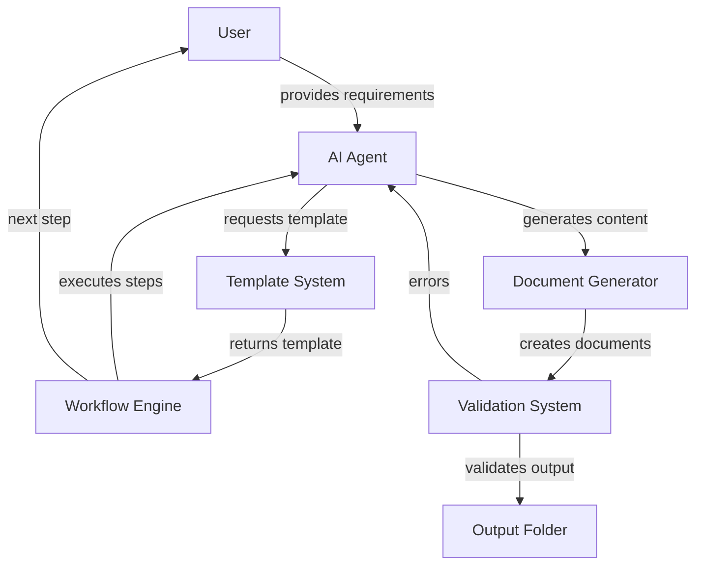

# Feature Planning System Specification

## Summary

The Feature Planning System is an AI-assisted framework for systematically planning and documenting software features. It provides a structured approach where AI agents follow predefined steps to create comprehensive feature specifications, requirements documents, and task lists. The system ensures consistency across feature planning by using templates and standardized document structures.

## Requirements

1. ⬛ R1: The system shall provide templates for feature specification creation
2. ⬛ R2: The system shall guide AI agents through a multi-step planning process
3. ⬛ R3: The system shall generate standardized documentation outputs
4. ⬛ R4: The system shall support hierarchical feature organization
5. ⬛ R5: The system shall maintain consistent naming conventions across all documents

## Task List

1. ⬛ F1: Template Management System
   
   1. ⬛ F1.1: Create base template structure
      1. ⬛ F1.1.1: Define template file format
      2. ⬛ F1.1.2: Create template validation schema
      3. ⬛ F1.1.3: Implement template versioning
   
   2. ⬛ F1.2: Template customization features
      1. ⬛ F1.2.1: Add variable substitution support
      2. ⬛ F1.2.2: Create conditional sections
      3. ⬛ F1.2.3: Implement template inheritance
   
   3. ⬛ F1.3: Template library management
      1. ⬛ F1.3.1: Build template catalog
      2. ⬛ F1.3.2: Add search functionality
      3. ⬛ F1.3.3: Create template preview system

2. ⬛ F2: Multi-Step Workflow Engine
   
   1. ⬛ F2.1: Step definition framework
      1. ⬛ F2.1.1: Create step configuration schema
      2. ⬛ F2.1.2: Implement step dependencies
      3. ⬛ F2.1.3: Add step validation rules
   
   2. ⬛ F2.2: Workflow execution control
      1. ⬛ F2.2.1: Build step orchestrator
      2. ⬛ F2.2.2: Add pause/resume capability
      3. ⬛ F2.2.3: Implement rollback mechanism
   
   3. ⬛ F2.3: Progress tracking system
      1. ⬛ F2.3.1: Create progress indicators
      2. ⬛ F2.3.2: Add completion validation
      3. ⬛ F2.3.3: Build reporting dashboard

3. ⬛ F3: Document Generation System
   
   1. ⬛ F3.1: Document structure management
      1. ⬛ F3.1.1: Define document schemas
      2. ⬛ F3.1.2: Create section templates
      3. ⬛ F3.1.3: Implement auto-formatting
   
   2. ⬛ F3.2: Content generation tools
      1. ⬛ F3.2.1: Build markdown generator
      2. ⬛ F3.2.2: Add diagram creation
      3. ⬛ F3.2.3: Implement code snippet management
   
   3. ⬛ F3.3: Output organization
      1. ⬛ F3.3.1: Create folder structure generator
      2. ⬛ F3.3.2: Add file naming conventions
      3. ⬛ F3.3.3: Build document linking system

4. ⬛ F4: AI Agent Integration Framework
   
   1. ⬛ F4.1: Agent communication protocol
      1. ⬛ F4.1.1: Define message formats
      2. ⬛ F4.1.2: Create command interface
      3. ⬛ F4.1.3: Implement response handling
   
   2. ⬛ F4.2: Context management system
      1. ⬛ F4.2.1: Build context storage
      2. ⬛ F4.2.2: Add context retrieval
      3. ⬛ F4.2.3: Implement context sharing
   
   3. ⬛ F4.3: Agent guidance features
      1. ⬛ F4.3.1: Create instruction parser
      2. ⬛ F4.3.2: Add validation feedback
      3. ⬛ F4.3.3: Build help system

5. ⬛ F5: Quality Assurance Tools
   
   1. ⬛ F5.1: Document validation system
      1. ⬛ F5.1.1: Create completeness checker
      2. ⬛ F5.1.2: Add consistency validator
      3. ⬛ F5.1.3: Implement format verification
   
   2. ⬛ F5.2: Review workflow
      1. ⬛ F5.2.1: Build review checklist
      2. ⬛ F5.2.2: Add approval process
      3. ⬛ F5.2.3: Create revision tracking
   
   3. ⬛ F5.3: Compliance checking
      1. ⬛ F5.3.1: Define compliance rules
      2. ⬛ F5.3.2: Build rule engine
      3. ⬛ F5.3.3: Generate compliance reports

## Risks

- Risk 1: AI agents may misinterpret instructions - Mitigation: Provide clear, unambiguous templates with examples
- Risk 2: Document inconsistency across features - Mitigation: Enforce strict validation and formatting rules
- Risk 3: Complex features may not fit standard templates - Mitigation: Allow template customization and extension

## Decision Points

- Decision 1: Use markdown format for all documents to ensure universal readability and version control compatibility
- Decision 2: Implement step-by-step workflow rather than all-at-once generation to allow user intervention and guidance
- Decision 3: Store templates as separate files rather than hardcoded to enable easy updates and customization

## File and Function Structure

```
FeaturePlanningSystem/
├── templates/
│   ├── base-template.md
│   ├── feature-spec-template.md
│   └── task-list-template.md
├── workflow/
│   ├── workflow-engine.ts
│   │   └── executeStep()
│   │   └── validateStep()
│   └── step-definitions.ts
├── generators/
│   ├── document-generator.ts
│   │   └── generateDocument()
│   │   └── formatContent()
│   └── folder-structure.ts
│       └── createFolderStructure()
├── validation/
│   ├── document-validator.ts
│   │   └── validateCompleteness()
│   │   └── checkConsistency()
│   └── template-validator.ts
└── agent-interface/
    ├── command-parser.ts
    │   └── parseCommand()
    │   └── executeCommand()
    └── context-manager.ts
        └── saveContext()
        └── loadContext()
```

## Flowchart



## Sample Objects

```javascript
// Template configuration object
const templateConfig = {
  templateId: "feature-spec-v1",
  version: "1.0.0",
  sections: [
    {
      name: "summary",
      required: true,
      maxLength: 500
    },
    {
      name: "requirements",
      required: true,
      itemPrefix: "R",
      minItems: 3
    }
  ],
  variables: {
    featureName: "placeholder",
    featureId: "F000"
  }
};

// Workflow step object
const workflowStep = {
  stepId: "step-1",
  name: "Initial Specification",
  inputs: ["summary", "features"],
  outputs: ["specification-document"],
  validation: {
    requiredSections: ["summary", "requirements", "tasks"],
    outputFormat: "markdown"
  },
  userPrompt: "Review the initial specification and provide feedback"
};

// Document metadata object
const documentMetadata = {
  documentId: "000-FeatureName-InitialSpec-001",
  type: "specification",
  version: "001",
  created: "2024-01-07T10:00:00Z",
  status: "draft",
  linkedDocuments: ["requirements.md", "tasks.md"]
};
```

## Example Code

```typescript
// Template processing function
function processTemplate(template: Template, data: FeatureData): string {
  let content = template.content;
  
  // Replace variables
  Object.entries(data.variables).forEach(([key, value]) => {
    content = content.replace(new RegExp(`{{${key}}}`, 'g'), value);
  });
  
  // Process conditional sections
  data.conditions.forEach(condition => {
    if (condition.evaluate()) {
      content = includeSection(content, condition.sectionName);
    } else {
      content = removeSection(content, condition.sectionName);
    }
  });
  
  return content;
}

// Workflow step execution
async function executeWorkflowStep(step: WorkflowStep, context: Context): Promise<StepResult> {
  // Validate inputs
  const validation = await validateInputs(step.inputs, context);
  if (!validation.isValid) {
    return { success: false, errors: validation.errors };
  }
  
  // Execute step logic
  const output = await step.execute(context);
  
  // Save outputs to context
  context.outputs[step.stepId] = output;
  
  // Prompt user for review
  await promptUser(step.userPrompt, output);
  
  return { success: true, output };
}
```