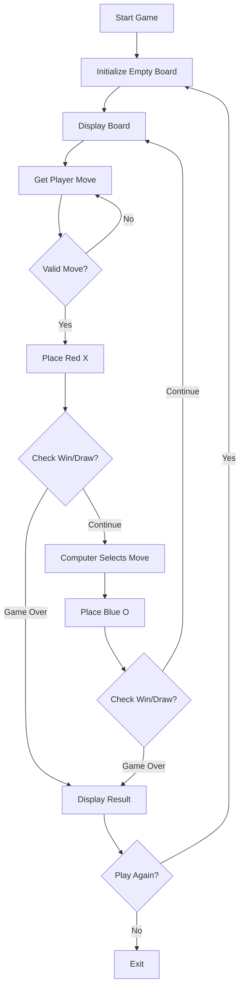

# Tic Tac Toe Game Specification

## Summary

Create a tic tac toe game in TypeScript that runs on the command line in Node.js. The game will feature X's displayed in red and O's displayed in blue, with a player versus computer mode. The implementation will focus on simplicity and proving the core concept without unnecessary complexity.

## Requirements

1. ⬛ R1: The game shall run in a Node.js command line environment
   1. ⬛ R1.1: The game shall be executable from the command line using Node.js
   2. ⬛ R1.2: The game shall support Node.js version 14.0 or higher
   3. ⬛ R1.3: The game shall not require any browser environment

2. ⬛ R2: The game shall be implemented in TypeScript
   1. ⬛ R2.1: All source code shall be written in TypeScript
   2. ⬛ R2.2: The project shall include TypeScript configuration (tsconfig.json)
   3. ⬛ R2.3: The code shall compile without TypeScript errors

3. ⬛ R3: X's shall be displayed in red color
   1. ⬛ R3.1: The player's marks (X) shall use ANSI red color codes
   2. ⬛ R3.2: The red color shall be visible in standard terminals
   3. ⬛ R3.3: The color shall be applied using a terminal color library

4. ⬛ R4: O's shall be displayed in blue color
   1. ⬛ R4.1: The computer's marks (O) shall use ANSI blue color codes
   2. ⬛ R4.2: The blue color shall be visible in standard terminals
   3. ⬛ R4.3: The color shall be applied using the same library as X's

5. ⬛ R5: The game shall support player versus computer mode
   1. ⬛ R5.1: The human player shall always play as X
   2. ⬛ R5.2: The computer shall always play as O
   3. ⬛ R5.3: The player shall always move first
   4. ⬛ R5.4: The computer shall make moves automatically

6. ⬛ R6: The game board shall be a standard 3x3 grid
   1. ⬛ R6.1: The board shall consist of 9 positions
   2. ⬛ R6.2: Positions shall be arranged in 3 rows and 3 columns
   3. ⬛ R6.3: Each position shall be uniquely identifiable
   4. ⬛ R6.4: The board shall be displayed with grid lines

7. ⬛ R7: The game shall detect win conditions (3 in a row horizontally, vertically, or diagonally)
   1. ⬛ R7.1: The game shall check for 3 matching marks in any row
   2. ⬛ R7.2: The game shall check for 3 matching marks in any column
   3. ⬛ R7.3: The game shall check for 3 matching marks on the main diagonal
   4. ⬛ R7.4: The game shall check for 3 matching marks on the anti-diagonal
   5. ⬛ R7.5: Win detection shall occur after each move

8. ⬛ R8: The game shall detect draw conditions (board full with no winner)
   1. ⬛ R8.1: The game shall check if all 9 positions are filled
   2. ⬛ R8.2: Draw detection shall only occur if no win condition is met
   3. ⬛ R8.3: The game shall announce a draw when detected

## Task List

1. ⬛ T1: Set up TypeScript project

   1. ⬛ T1.1: Initialize npm project
   2. ⬛ T1.2: Install TypeScript and Node.js types
   3. ⬛ T1.3: Configure tsconfig.json
   4. ⬛ T1.4: Set up build script

2. ⬛ T2: Create game board representation

   1. ⬛ T2.1: Define board data structure (3x3 array)
   2. ⬛ T2.2: Create board initialization function
   3. ⬛ T2.3: Implement board display function with colors

3. ⬛ T3: Implement player input handling

   1. ⬛ T3.1: Create input prompt for player moves
   2. ⬛ T3.2: Validate player input (1-9 or row/col format)
   3. ⬛ T3.3: Check if selected position is empty
   4. ⬛ T3.4: Place player's mark (X) on board

4. ⬛ T4: Implement computer AI

   1. ⬛ T4.1: Create simple AI that selects random empty position
   2. ⬛ T4.2: Implement AI move function
   3. ⬛ T4.3: Place computer's mark (O) on board

5. ⬛ T5: Implement game logic

   1. ⬛ T5.1: Create win condition checker
      1. ⬛ T5.1.1: Check horizontal wins
      2. ⬛ T5.1.2: Check vertical wins
      3. ⬛ T5.1.3: Check diagonal wins
   2. ⬛ T5.2: Create draw condition checker
   3. ⬛ T5.3: Implement game loop
   4. ⬛ T5.4: Handle game end conditions

6. ⬛ T6: Add color formatting

   1. ⬛ T6.1: Install chalk or similar color library
   2. ⬛ T6.2: Apply red color to X marks
   3. ⬛ T6.3: Apply blue color to O marks

7. ⬛ T7: Create main game runner
   1. ⬛ T7.1: Implement main function
   2. ⬛ T7.2: Add welcome message
   3. ⬛ T7.3: Handle game restart option

## Risks

- Risk 1: Terminal color support may vary across different systems - Mitigation: Use a well-tested library like chalk that handles cross-platform compatibility
- Risk 2: Input handling in Node.js can be complex - Mitigation: Use readline-sync for simple synchronous input

## Decision Points

- Decision 1: Use readline-sync instead of native readline for simpler synchronous input handling
- Decision 2: Use chalk library for colors instead of ANSI escape codes for better cross-platform support
- Decision 3: Use simple random AI instead of minimax algorithm to meet "as simple as possible" requirement

## File and Function Structure

```
tic-tac-toe/
├── src/
│   ├── index.ts
│   │   └── main()
│   ├── game.ts
│   │   └── initializeBoard()
│   │   └── displayBoard()
│   │   └── makePlayerMove()
│   │   └── makeComputerMove()
│   │   └── checkWinner()
│   │   └── checkDraw()
│   │   └── gameLoop()
│   └── types.ts
│       └── Board type definition
│       └── Player type definition
├── package.json
└── tsconfig.json
```

## Flowchart



## Sample Objects

```typescript
// Board representation
type Board = string[][];

const emptyBoard: Board = [
  ["", "", ""],
  ["", "", ""],
  ["", "", ""],
];

// Game state
interface GameState {
  board: Board;
  currentPlayer: "X" | "O";
  isGameOver: boolean;
  winner: "X" | "O" | "draw" | null;
}

// Move representation
interface Move {
  row: number;
  col: number;
}
```

## Example Code

```typescript
import chalk from "chalk";
import readlineSync from "readline-sync";

function displayBoard(board: Board): void {
  console.clear();
  console.log("\n   1   2   3");
  board.forEach((row, i) => {
    const displayRow = row.map((cell) => {
      if (cell === "X") return chalk.red("X");
      if (cell === "O") return chalk.blue("O");
      return " ";
    });
    console.log(`${i + 1}  ${displayRow.join(" | ")}`);
    if (i < 2) console.log("  -----------");
  });
}

function makePlayerMove(board: Board): Move {
  while (true) {
    const input = readlineSync.question("Enter your move (row,col): ");
    const [row, col] = input.split(",").map((n) => parseInt(n) - 1);

    if (row >= 0 && row < 3 && col >= 0 && col < 3 && board[row][col] === "") {
      return { row, col };
    }
    console.log("Invalid move! Try again.");
  }
}

function checkWinner(board: Board): "X" | "O" | null {
  // Check rows, columns, and diagonals
  for (let i = 0; i < 3; i++) {
    // Check rows
    if (
      board[i][0] &&
      board[i][0] === board[i][1] &&
      board[i][1] === board[i][2]
    ) {
      return board[i][0] as "X" | "O";
    }
    // Check columns
    if (
      board[0][i] &&
      board[0][i] === board[1][i] &&
      board[1][i] === board[2][i]
    ) {
      return board[0][i] as "X" | "O";
    }
  }
  // Check diagonals
  if (
    board[0][0] &&
    board[0][0] === board[1][1] &&
    board[1][1] === board[2][2]
  ) {
    return board[0][0] as "X" | "O";
  }
  if (
    board[0][2] &&
    board[0][2] === board[1][1] &&
    board[1][1] === board[2][0]
  ) {
    return board[0][2] as "X" | "O";
  }
  return null;
}
```
