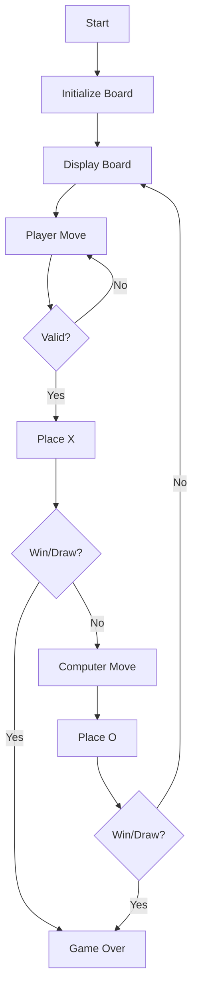

# Tic Tac Toe Summary

Create a tic tac toe game in TypeScript that runs on the command line in Node.js. X's should be red and O's should be blue. Player vs. computer mode.

## ASCII representation of GUI

```
   1   2   3
1  X | O | X
  -----------
2    | X | O
  -----------
3  O |   | X

Enter move (row,col): 2,1
```

## File and Function Structure (ascii)

```
src/
├── index.ts
│   └── main()
├── game.ts
│   └── initBoard()
│   └── displayBoard()
│   └── makeMove()
│   └── checkWin()
│   └── gameLoop()
└── types.ts
    └── Board type
    └── Player type
```

## Flowchart

