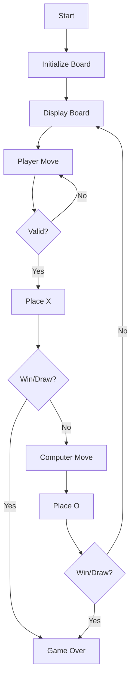

# Tic Tac Toe Specification

## Summary

Create a tic tac toe game in TypeScript that runs on the command line in Node.js. X's should be red and O's should be blue. Player vs. computer mode.

## Requirements

1. ⬛ R1: Command line Node.js execution
2. ⬛ R2: TypeScript implementation
3. ⬛ R3: Red colored X marks
4. ⬛ R4: Blue colored O marks
5. ⬛ R5: Player versus computer gameplay
6. ⬛ R6: 3x3 grid board
7. ⬛ R7: Win detection (horizontal, vertical, diagonal)
8. ⬛ R8: Draw detection

## Task List

1. ⬛ T1: Project setup
   1. ⬛ T1.1: Initialize npm
   2. ⬛ T1.2: Install TypeScript
   3. ⬛ T1.3: Configure tsconfig.json

2. ⬛ T2: Board implementation
   1. ⬛ T2.1: Create 3x3 array structure
   2. ⬛ T2.2: Display board with colors

3. ⬛ T3: Player input
   1. ⬛ T3.1: Get move input
   2. ⬛ T3.2: Validate move
   3. ⬛ T3.3: Place X mark

4. ⬛ T4: Computer AI
   1. ⬛ T4.1: Random move selection
   2. ⬛ T4.2: Place O mark

5. ⬛ T5: Game logic
   1. ⬛ T5.1: Check win conditions
   2. ⬛ T5.2: Check draw
   3. ⬛ T5.3: Game loop

6. ⬛ T6: Color implementation
   1. ⬛ T6.1: Install chalk
   2. ⬛ T6.2: Apply colors

## Risks

- Risk 1: Terminal color compatibility - Use chalk library
- Risk 2: Input complexity - Use readline-sync

## Decision Points

- Decision 1: readline-sync for simple input
- Decision 2: chalk for cross-platform colors
- Decision 3: Random AI for simplicity

## ASCII representation of GUI

```
   1   2   3
1  X | O | X
  -----------
2    | X | O
  -----------
3  O |   | X

Enter move (row,col): 2,1
```

## File and Function Structure (ascii)

```
src/
├── index.ts
│   └── main()
├── game.ts
│   └── initBoard()
│   └── displayBoard()
│   └── makeMove()
│   └── checkWin()
│   └── gameLoop()
└── types.ts
    └── Board type
    └── Player type
```

## Flowchart

