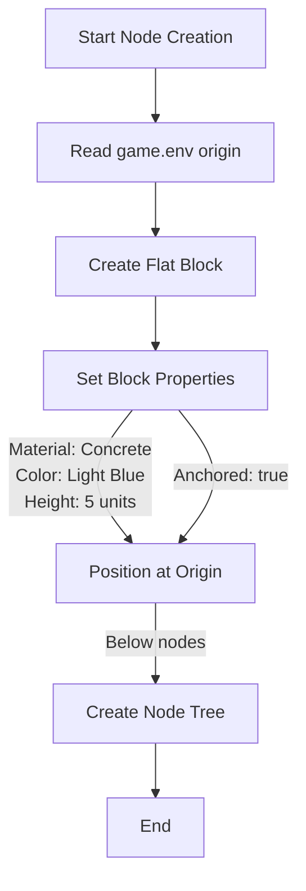

# Flat Block Under Nodes Specification

## Summary

Create a large flat block positioned under the node tree as part of the node creation process in the Roblox game. This block serves as a visual foundation or ground plane for the hierarchical node visualization.

## Requirements

1. ⬛ R1: Block must be centered at the origin defined in game.env
2. ⬛ R2: Block height must be 5 units
3. ⬛ R3: Block material must be Concrete
4. ⬛ R4: Block color must be light blue
5. ⬛ R5: Block must be anchored (not affected by physics)
6. ⬛ R6: Block creation must be integrated into existing node creation process
7. ⬛ R7: Block should be positioned below all nodes in the tree

## Task List

1. ⬛ T1: Locate game.env and identify origin definition
   1. ⬛ T1.1: Find game.env file location
   2. ⬛ T1.2: Extract origin coordinates

2. ⬛ T2: Create flat block creation function
   1. ⬛ T2.1: Create new module for flat block creation
   2. ⬛ T2.2: Define block properties (size, material, color)
   3. ⬛ T2.3: Implement anchoring property
   4. ⬛ T2.4: Position block at origin with appropriate offset

3. ⬛ T3: Integrate with node creation process
   1. ⬛ T3.1: Locate main node creation entry point
   2. ⬛ T3.2: Add flat block creation call
   3. ⬛ T3.3: Ensure block is created before nodes

4. ⬛ T4: Calculate appropriate block dimensions
   1. ⬛ T4.1: Determine node tree bounds
   2. ⬛ T4.2: Size block to extend beyond tree bounds
   3. ⬛ T4.3: Position block below lowest node

## Risks

- Risk 1: Origin coordinates in game.env might not be in expected format - Parse carefully with fallback to default
- Risk 2: Block might interfere with existing node interactions - Ensure CanCollide is false

## Decision Points

- Decision 1: Use Part instance for simplicity over MeshPart
- Decision 2: Fixed height of 5 units as specified rather than dynamic sizing
- Decision 3: Create block as sibling to GraphMaker folder for clear organization

## ASCII Representation

```
Side View:
     [Node Tree]
        | | |
        v v v
========================
|    FLAT BLOCK (5u)   |
========================
        ^
     Origin

Top View:
+------------------------+
|                        |
|     * * * * * *       |
|     (Node Tree)        |
|          O             |
|       (Origin)         |
|                        |
+------------------------+
```

## File and Function Structure

```
src/
├── shared/
│   └── modules/
│       ├── renderers/
│       │   └── flatBlockCreator.ts
│       │       ├── createFlatBlock()
│       │       └── calculateBlockDimensions()
│       └── game.service.ts (existing)
│           └── renderData() (modify)
```

## Flowchart

