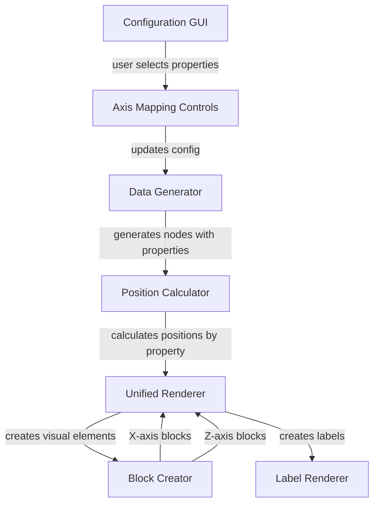

# 3D Node Pivot Graph Specification

## Summary

Upgrade the existing 3D graph layout to function like a pivot table, allowing users to dynamically select which node properties are represented on the X and Z axes through the GUI. Currently, the Y axis depicts hierarchical relationships (which remains unchanged), X axis shows node type, and Z axis shows pet type. This feature adds flexibility for users to pivot the data visualization by different properties.

## Requirements

1. **R1**: Add petColor property to all person nodes (man, woman, child, grandparent)
2. **R2**: Add visual labels to each swimlane on both X and Z axes
3. **R3**: Create shadow blocks under Z-axis swimlanes similar to existing X-axis swimlane blocks
4. **R4**: Add dropdown selectors in GUI for X and Z axis property selection
5. **R5**: Support dynamic re-rendering when axis properties are changed
6. **R6**: Maintain existing Y-axis hierarchical relationships unchanged

## Task List

1. ⬛ T1: Add petColor property to person nodes
   1. ⬛ T1.1: Define PET_COLORS constant array
   2. ⬛ T1.2: Update Node interface to include petColor property
   3. ⬛ T1.3: Modify dataGenerator to assign random petColor to person nodes

2. ⬛ T2: Add swimlane labels
   1. ⬛ T2.1: Create label generation function for X-axis swimlanes
   2. ⬛ T2.2: Create label generation function for Z-axis swimlanes
   3. ⬛ T2.3: Position labels appropriately at swimlane boundaries

3. ⬛ T3: Create Z-axis shadow blocks
   1. ⬛ T3.1: Calculate bounds for each pet type group
   2. ⬛ T3.2: Create shadow blocks matching Z-axis swimlane dimensions
   3. ⬛ T3.3: Apply appropriate colors and transparency
   4. ⬛ T3.4: Parent Z-axis blocks to appropriate container

4. ⬛ T4: Implement GUI axis property selectors
   1. ⬛ T4.1: Add axisMapping to EnhancedGeneratorConfig interface
   2. ⬛ T4.2: Create dropdown components for X and Z axis selection
   3. ⬛ T4.3: Populate dropdowns with available node properties
   4. ⬛ T4.4: Handle dropdown change events

5. ⬛ T5: Implement dynamic positioning system
   1. ⬛ T5.1: Create generic property-based positioning function
   2. ⬛ T5.2: Extract unique values for selected properties
   3. ⬛ T5.3: Calculate appropriate spacing based on value count
   4. ⬛ T5.4: Update positionCalculator to use selected properties

6. ⬛ T6: Integration and testing
   1. ⬛ T6.1: Connect GUI changes to re-render trigger
   2. ⬛ T6.2: Update swimlane block generation for both axes
   3. ⬛ T6.3: Ensure labels update with axis changes

## Risks

- Risk 1: Performance impact when re-rendering large graphs on axis change - mitigate by implementing efficient update mechanism
- Risk 2: Z-axis shadow blocks may overlap with existing blocks - ensure proper layering and transparency

## Decision Points

- Decision 1: Use dropdown selectors over radio buttons for better scalability with future properties
- Decision 2: Maintain separate shadow blocks for X and Z axes rather than combined blocks for clearer visualization

## ASCII Representation of GUI

```
┌─────────────────────────────────────────┐
│ Configuration GUI                        │
├─────────────────────────────────────────┤
│ Axis Mapping                            │
│ ┌───────────────────────────────────┐   │
│ │ X-Axis Property: [Node Type    ▼] │   │
│ │ Z-Axis Property: [Pet Type     ▼] │   │
│ └───────────────────────────────────┘   │
│                                         │
│ [Other existing GUI elements...]        │
│                                         │
│ [Generate] [Update]                     │
└─────────────────────────────────────────┘
```

## File and Function Structure

```
src/
├── shared/
│   ├── interfaces/
│   │   └── enhancedGenerator.interface.ts
│   │       └── AxisMapping interface
│   ├── modules/
│   │   └── renderers/
│   │       ├── unifiedDataRenderer/
│   │       │   ├── constants.ts
│   │       │   │   └── PET_COLORS
│   │       │   ├── core/
│   │       │   │   ├── dataGenerator.ts
│   │       │   │   │   └── addPetColor()
│   │       │   │   └── positionCalculator.ts
│   │       │   │       └── calculatePropertyBasedPosition()
│   │       │   └── rendering/
│   │       │       └── labelRenderer.ts
│   │       │           ├── createXAxisLabels()
│   │       │           └── createZAxisLabels()
│   │       └── flatBlockCreator.ts
│   │           └── createZAxisShadowBlocks()
└── client/
    └── services/
        └── configGui/
            └── components/
                └── axisMappingControls.ts
                    ├── createAxisDropdowns()
                    └── handleAxisChange()
```

## Flowchart

