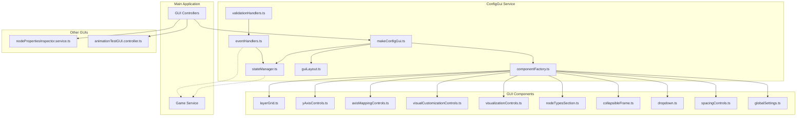

# GUI Code Audit

## Table of Contents
1. [Current GUI Structure](#current-gui-structure)
2. [File Inventory](#file-inventory)
3. [Architecture Diagram](#architecture-diagram)
4. [Component Relationships](#component-relationships)
5. [Refactoring Recommendations](#refactoring-recommendations)

## Current GUI Structure

### ASCII Depiction of Current GUIs

```
┌─────────────────────────────────────────────────────────┐
│ Graph Configuration                               [−]    │
├─────────────────────────────────────────────────────────┤
│ ┌─── Global Settings ─────────────────────────────────┐ │
│ │ Node Height:    [1.0  ] ▼  Radius: [0.5  ] ▼       │ │
│ │ Layer Spacing: [2.0  ] ▼  Node Spacing: [1.0  ] ▼  │ │
│ │ Swimlane Spacing: [1.0] ▼  Link Diameter: [0.5 ] ▼ │ │
│ │ Y Origin Offset: [0.0 ] ▼                           │ │
│ └─────────────────────────────────────────────────────┘ │
│                                                          │
│ ┌─── Node/Link Types ─────────────────────────────────┐ │
│ │ Node Types: [3] ▼  Link Types: [2] ▼  Pet Types: [5]│ │
│ └─────────────────────────────────────────────────────┘ │
│                                                          │
│ ┌─── Layer Configuration (Scrollable) ────────────────┐ │
│ │ Layer │ Nodes │ Conn │ Node Type │ Link Type │ [X] │ │
│ │   1   │  10   │  2   │   Auto    │   Auto    │     │ │
│ │   2   │  20   │  3   │   Auto    │   Auto    │     │ │
│ │   3   │  15   │  2   │   Auto    │   Auto    │     │ │
│ │ [+ Add Layer]                                        │ │
│ └─────────────────────────────────────────────────────┘ │
│                                                          │
│ ┌─── Axis Mapping ────────────────────────────────────┐ │
│ │ X Axis (Left/Right): [type        ] ▼               │ │
│ │ Z Axis (Forward/Back): [petType   ] ▼               │ │
│ └─────────────────────────────────────────────────────┘ │
│                                                          │
│ ┌─── Visual Customization ────────────────────────────┐ │
│ │ Node Background Color: [None      ] ▼               │ │
│ │ Node Border Color: [None          ] ▼               │ │
│ └─────────────────────────────────────────────────────┘ │
│                                                          │
│ ┌─── Y-Axis Configuration ────────────────────────────┐ │
│ │ ◉ Use Layer for Y Position                          │ │
│ │ ○ Use Property: [Select Property  ] ▼               │ │
│ └─────────────────────────────────────────────────────┘ │
│                                                          │
│ [Regenerate] [Update] [Clear] [Export]                  │
│                                                          │
│ Status: Ready                                            │
└─────────────────────────────────────────────────────────┘

┌─────────────────────────────────────────────────────────┐
│ Visualization Controls                            [+]    │
├─────────────────────────────────────────────────────────┤
│ ☑ Show nodes          ☑ Show link labels               │
│ ☑ Show connectors     ☐ Create same-layer links        │
│ ☐ Rand Z                                                │
│ Z Offset: [5]                                           │
└─────────────────────────────────────────────────────────┘

┌─────────────────────────────────┐
│ Node Properties Inspector   [X] │
├─────────────────────────────────┤
│ Node: man 2-3                   │
│ ─────────────────────────────── │
│ UUID: node_2_3                  │
│ Type: man                       │
│ Color: [0.2, 0.4, 0.8]         │
│ Properties:                     │
│   • age: 42                     │
│   • petType: dog                │
│   • petColor: brown             │
│   • firstName: John             │
│   • lastName: Smith             │
│   • countryOfBirth: USA         │
│   • countryOfResidence: Canada │
└─────────────────────────────────┘
```

## File Inventory

### ConfigGui Service Files (src/client/services/configGui/)

| File | Size | Purpose |
|------|------|---------|
| **Core Files** | | |
| makeConfigGui.ts | 12KB | Main GUI service implementation |
| index.ts | 493B | Module exports |
| interfaces.ts | 849B | TypeScript interfaces |
| constants.ts | 2.6KB | GUI constants and configuration |
| **State & Logic** | | |
| stateManager.ts | 7.7KB | GUI state management |
| eventHandlers.ts | 8.4KB | Event handling logic |
| validationHandlers.ts | 5.6KB | Input validation |
| utilities.ts | 2.3KB | Utility functions |
| **Layout & Creation** | | |
| componentFactory.ts | 8.6KB | Component creation factory |
| guiLayout.ts | 2.6KB | Layout management |
| **Components** | | |
| components/layerGrid.ts | 12KB | Layer configuration grid |
| components/yAxisControls.ts | 9.3KB | Y-axis controls |
| components/axisMappingControls.ts | 8.4KB | Axis mapping controls |
| components/visualCustomizationControls.ts | 8.3KB | Visual customization |
| components/visualizationControls.ts | 6.8KB | Visualization toggles |
| components/nodeTypesSection.ts | 6.3KB | Node type configuration |
| components/collapsibleFrame.ts | 5.5KB | Collapsible container |
| components/dropdown.ts | 3.4KB | Dropdown component |
| components/spacingControls.ts | 3.2KB | Spacing controls |
| components/globalSettings.ts | 1.5KB | Global settings |
| components/frame.ts | 1.5KB | Basic frame |
| components/status.ts | 1.4KB | Status display |
| components/title.ts | 746B | Title component |

### Other GUI Files

| File | Size | Purpose |
|------|------|---------|
| controllers/configGUI.controller.ts | 5.9KB | GUI controller integration |
| controllers/animationTestGUI.controller.ts | 4.2KB | Animation test GUI |
| services/nodePropertiesInspector.service.ts | 9.9KB | Node inspector GUI |

**Total GUI Code: ~125KB across 23 files**

## Architecture Diagram



## Component Relationships

### 1. **Data Flow**
- User Input → Event Handlers → Validation → State Manager → Game Service
- Game Service → State Manager → Components (for updates)

### 2. **Component Hierarchy**
```
ScreenGui
├── ConfigFrame (Collapsible)
│   ├── Global Settings
│   ├── Node/Link Types
│   ├── Layer Grid (Scrollable)
│   ├── Axis Mapping
│   ├── Visual Customization
│   ├── Y-Axis Controls
│   ├── Action Buttons
│   └── Status Area
└── Visualization Controls (Collapsible)
    └── Checkboxes & Options
```

### 3. **State Management**
- **Central State**: `stateManager.ts` holds all configuration
- **Event Handling**: `eventHandlers.ts` processes all user actions
- **Validation**: `validationHandlers.ts` ensures data integrity

## Refactoring Recommendations

### 1. **Separate Concerns**

#### Current Issues:
- Components mix presentation and business logic
- Event handling is centralized in one large file
- State management includes GUI-specific logic

#### Proposed Structure:
```
configGui/
├── core/
│   ├── state/           # Pure state management
│   ├── events/          # Event system
│   └── validation/      # Validation logic
├── components/
│   ├── base/           # Base components (Frame, Button, etc.)
│   ├── controls/       # Control components (Dropdown, Checkbox, etc.)
│   └── sections/       # Section components (LayerGrid, etc.)
├── layouts/
│   └── ConfigLayout.ts  # Layout management
└── services/
    └── ConfigService.ts # Business logic interface
```

### 2. **Component Abstraction**

Create base component classes:
```typescript
abstract class BaseComponent {
  protected frame: Frame;
  abstract render(): void;
  abstract destroy(): void;
}

abstract class BaseControl extends BaseComponent {
  abstract getValue(): any;
  abstract setValue(value: any): void;
  abstract onChange(callback: (value: any) => void): void;
}
```

### 3. **Event System Improvements**

Replace direct callbacks with event emitter pattern:
```typescript
class EventBus {
  emit(event: string, data: any): void;
  on(event: string, handler: (data: any) => void): void;
  off(event: string, handler: (data: any) => void): void;
}
```

### 4. **State Management Separation**

Split state management into:
- **ConfigStore**: Pure configuration data
- **UIStore**: UI-specific state (collapsed/expanded, etc.)
- **ValidationStore**: Validation state and errors

### 5. **Component Composition**

Use composition over large monolithic components:
```typescript
// Instead of one large LayerGrid
class LayerGrid {
  private header: LayerGridHeader;
  private rows: LayerGridRow[];
  private addButton: AddLayerButton;
}
```

### 6. **Testing Improvements**

- Extract business logic from GUI components
- Create mock GUI framework for unit testing
- Separate validation logic for easy testing

### 7. **Performance Optimizations**

- Implement virtual scrolling for layer grid
- Batch GUI updates
- Use object pooling for frequently created/destroyed components

### 8. **Code Organization**

- Move constants to domain-specific files
- Create typed event definitions
- Use dependency injection for services

### 9. **Documentation**

- Add JSDoc comments to all public APIs
- Create component usage examples
- Document state flow and event handling

### 10. **Future Extensibility**

- Create plugin system for custom controls
- Make theme system for different color schemes
- Add internationalization support structure