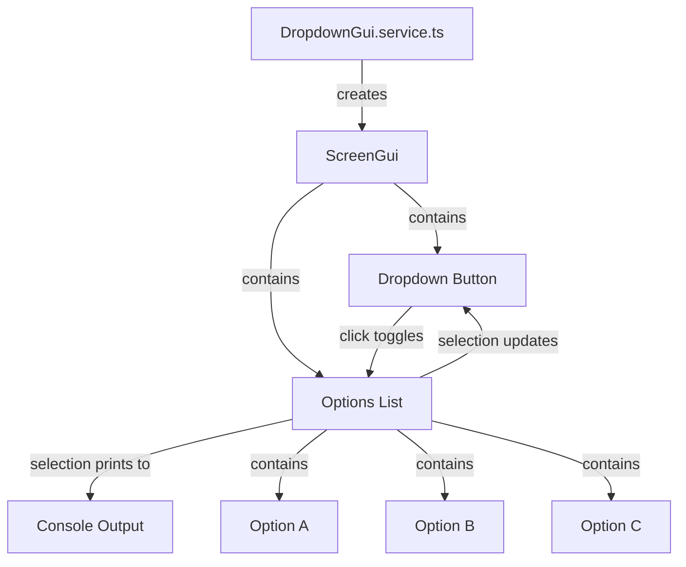

# GUI Dropdown Test Summary

Create a simple GUI with a dropdown that allows selection from three options (a, b, c) and prints the selected value to the console.

## ASCII representation of GUI

```
┌─────────────────────────────────┐
│         Dropdown Test           │
│                                 │
│  ┌─────────────────┬──┐        │
│  │ Select Option   │▼ │        │ ← Dropdown Button
│  └─────────────────┴──┘        │
│  ┌─────────────────────┐       │
│  │   a                 │       │ ← Option List (hidden initially)
│  ├─────────────────────┤       │
│  │   b                 │       │
│  ├─────────────────────┤       │
│  │   c                 │       │
│  └─────────────────────┘       │
│                                 │
└─────────────────────────────────┘
```

## File and Function Structure

```
src/
├── client/
│   ├── services/
│   │   └── dropdownGui/
│   │       ├── dropdownGui.service.ts
│   │       │   ├── constructor()
│   │       │   ├── initialize()
│   │       │   ├── createGUI()
│   │       │   ├── createDropdownButton()
│   │       │   ├── createOptionsList()
│   │       │   ├── toggleDropdown()
│   │       │   ├── selectOption()
│   │       │   └── destroy()
│   │       └── constants.ts
│   │           └── GUI_CONSTANTS
│   └── controllers/
│       └── main.controller.ts (update to include service)
```

## Flowchart

