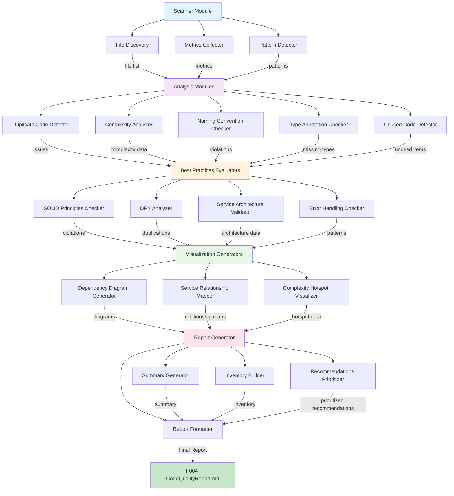

# F004 - Code Quality and Best Practices Audit Specification

## Summary

This feature performs a comprehensive audit of the TypeScript codebase to identify code quality issues, assess adherence to best practices, and provide actionable recommendations for improvement. The audit generates a detailed report with metrics, visualizations, and prioritized recommendations.

## Requirements

1. ⬛ R1: Analyze all TypeScript files in the src directory
2. ⬛ R2: Generate a comprehensive report with summary, table, diagrams, and recommendations
3. ⬛ R3: Identify code quality issues including:
   1. ⬛ R3.1: Duplicate code patterns
   2. ⬛ R3.2: Overly complex functions
   3. ⬛ R3.3: Inconsistent naming conventions
   4. ⬛ R3.4: Missing type annotations
   5. ⬛ R3.5: Unused variables and imports
4. ⬛ R4: Evaluate adherence to best practices:
   1. ⬛ R4.1: SOLID principles
   2. ⬛ R4.2: DRY principle
   3. ⬛ R4.3: Service architecture patterns
   4. ⬛ R4.4: Error handling patterns
5. ⬛ R5: Generate visual diagrams showing:
   1. ⬛ R5.1: Module dependencies
   2. ⬛ R5.2: Service relationships
   3. ⬛ R5.3: Code complexity hotspots
6. ⬛ R6: Provide actionable recommendations for improvements
7. ⬛ R7: Analysis must be performed statically without executing code
8. ⬛ R8: Support TypeScript and Roblox-specific patterns
9. ⬛ R9: Generate report in Markdown format
10. ⬛ R10: Include mermaid diagrams for visualization
11. ⬛ R11: Executive summary with key metrics
12. ⬛ R12: Detailed file inventory with:
    1. ⬛ R12.1: File path and name
    2. ⬛ R12.2: Lines of code
    3. ⬛ R12.3: File size
    4. ⬛ R12.4: Number of issues found
    5. ⬛ R12.5: Complexity score
13. ⬛ R13: Prioritized recommendations:
    1. ⬛ R13.1: High priority (critical issues)
    2. ⬛ R13.2: Medium priority (important improvements)
    3. ⬛ R13.3: Low priority (nice-to-have enhancements)

## Task List

1. ⬛ T1: Create code audit scanner
   1. ⬛ T1.1: Implement file discovery for TypeScript files
   2. ⬛ T1.2: Create file metrics collector (LOC, size)
   3. ⬛ T1.3: Implement complexity analysis
   4. ⬛ T1.4: Create pattern detection for code quality issues

2. ⬛ T2: Implement analysis modules
   1. ⬛ T2.1: Create duplicate code detector
   2. ⬛ T2.2: Implement complexity analyzer
   3. ⬛ T2.3: Create naming convention checker
   4. ⬛ T2.4: Implement type annotation checker
   5. ⬛ T2.5: Create unused code detector

3. ⬛ T3: Build best practices evaluator
   1. ⬛ T3.1: Implement SOLID principles checker
   2. ⬛ T3.2: Create DRY principle analyzer
   3. ⬛ T3.3: Implement service architecture validator
   4. ⬛ T3.4: Create error handling pattern checker

4. ⬛ T4: Generate visualizations
   1. ⬛ T4.1: Create module dependency diagram generator
   2. ⬛ T4.2: Implement service relationship mapper
   3. ⬛ T4.3: Build complexity hotspot visualizer

5. ⬛ T5: Create report generator
   1. ⬛ T5.1: Implement executive summary generator
   2. ⬛ T5.2: Create file inventory table builder
   3. ⬛ T5.3: Implement recommendations prioritizer
   4. ⬛ T5.4: Build final Markdown report formatter

6. ⬛ T6: Execute audit and generate report
   1. ⬛ T6.1: Run full codebase analysis
   2. ⬛ T6.2: Generate and save report
   3. ⬛ T6.3: Create improvement task list

## Risks

- Risk 1: Large codebase may require significant analysis time
- Risk 2: Complex TypeScript/Roblox patterns may be difficult to analyze automatically
- Risk 3: Some best practices may be subjective and context-dependent

## Decision Points

- Decision 1: Use static analysis approach rather than runtime analysis for safety
- Decision 2: Focus on TypeScript-specific patterns and Roblox framework conventions
- Decision 3: Prioritize actionable recommendations over theoretical improvements

## ASCII Representation of GUI

```
┌─────────────────────────────────────────────────────────────────┐
│                 Code Quality Audit Report                        │
├─────────────────────────────────────────────────────────────────┤
│ Executive Summary                                                │
│ ┌─────────────────┬──────────────┬─────────────┬──────────────┐│
│ │ Total Files: 142│ Total LOC:   │ Issues: 287 │ Score: 7.2/10││
│ │                 │ 15,432       │             │              ││
│ └─────────────────┴──────────────┴─────────────┴──────────────┘│
│                                                                  │
│ File Inventory                                                   │
│ ┌───────────────────────────────────────────────────────────┐   │
│ │ Path                    │ LOC  │ Issues │ Complexity     │   │
│ ├───────────────────────────────────────────────────────────┤   │
│ │ game.service.ts         │ 1243 │   12   │    High        │   │
│ │ unifiedDataRenderer.ts  │  892 │    8   │    Medium      │   │
│ │ positionCalculator.ts   │  654 │    5   │    Medium      │   │
│ └───────────────────────────────────────────────────────────┘   │
│                                                                  │
│ Recommendations                                                  │
│ ┌─────────────────────────────────────────────────────────┐     │
│ │ HIGH PRIORITY:                                          │     │
│ │ • Extract complex methods in game.service.ts           │     │
│ │ • Add type annotations to 23 functions                 │     │
│ │                                                         │     │
│ │ MEDIUM PRIORITY:                                        │     │
│ │ • Consolidate duplicate color handling logic           │     │
│ │ • Improve error handling in data renderers             │     │
│ └─────────────────────────────────────────────────────────┘     │
└─────────────────────────────────────────────────────────────────┘
```

## File and Function Structure

```
src/
├── codeAudit/
│   ├── scanner/
│   │   ├── fileDiscovery.ts
│   │   │   └── discoverTypeScriptFiles()
│   │   │   └── getFileMetrics()
│   │   ├── metricsCollector.ts
│   │   │   └── collectFileMetrics()
│   │   │   └── calculateComplexity()
│   │   └── patternDetector.ts
│   │       └── detectCodePatterns()
│   │       └── findDuplicates()
│   ├── analyzers/
│   │   ├── duplicateCodeDetector.ts
│   │   │   └── detectDuplicateCode()
│   │   ├── complexityAnalyzer.ts
│   │   │   └── analyzeComplexity()
│   │   ├── namingConventionChecker.ts
│   │   │   └── checkNamingConventions()
│   │   ├── typeAnnotationChecker.ts
│   │   │   └── checkTypeAnnotations()
│   │   └── unusedCodeDetector.ts
│   │       └── detectUnusedCode()
│   ├── evaluators/
│   │   ├── solidPrinciplesChecker.ts
│   │   │   └── checkSOLIDPrinciples()
│   │   ├── dryAnalyzer.ts
│   │   │   └── analyzeDRYViolations()
│   │   ├── serviceArchitectureValidator.ts
│   │   │   └── validateServiceArchitecture()
│   │   └── errorHandlingChecker.ts
│   │       └── checkErrorHandlingPatterns()
│   ├── visualizers/
│   │   ├── dependencyDiagramGenerator.ts
│   │   │   └── generateDependencyDiagram()
│   │   ├── serviceRelationshipMapper.ts
│   │   │   └── mapServiceRelationships()
│   │   └── complexityHotspotVisualizer.ts
│   │       └── visualizeComplexityHotspots()
│   └── report/
│       ├── summaryGenerator.ts
│       │   └── generateExecutiveSummary()
│       ├── inventoryBuilder.ts
│       │   └── buildFileInventory()
│       ├── recommendationsPrioritizer.ts
│       │   └── prioritizeRecommendations()
│       └── reportFormatter.ts
│           └── formatMarkdownReport()
└── F004-CodeQualityReport.md (output)
```

## Flowchart

