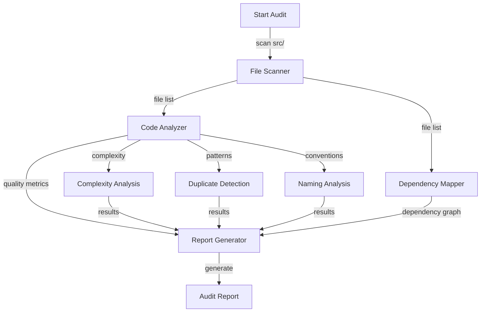

# Code Quality and Best Practices Audit - Tasks

## Task List

1. ✅ T1: Setup and Analysis
   1. ✅ T1.1: Create analysis utilities to scan the codebase
   2. ✅ T1.2: Identify all TypeScript files in src directory
   3. ✅ T1.3: Create file inventory with basic metrics (lines, size, last modified)

2. ✅ T2: Code Quality Analysis
   1. ✅ T2.1: Analyze function complexity (cyclomatic complexity)
   2. ✅ T2.2: Identify duplicate code patterns
   3. ✅ T2.3: Check naming convention consistency
   4. ✅ T2.4: Identify missing type annotations
   5. ✅ T2.5: Find unused imports and variables

3. ✅ T3: Architecture Analysis
   1. ✅ T3.1: Map service dependencies
   2. ✅ T3.2: Identify circular dependencies
   3. ✅ T3.3: Analyze module cohesion
   4. ✅ T3.4: Evaluate separation of concerns

4. ✅ T4: Report Generation
   1. ✅ T4.1: Create summary section with key findings
   2. ✅ T4.2: Generate file inventory table
   3. ✅ T4.3: Create dependency diagrams using mermaid
   4. ✅ T4.4: Write recommendations section
   5. ✅ T4.5: Generate final report document

## File and Function Structure

```
____000FeaturePlanningSystem/F004-CodeQualityAudit/
├── analysis/
│   ├── codeAnalyzer.ts
│   │   ├── analyzeFile()
│   │   ├── calculateComplexity()
│   │   └── findDuplicates()
│   ├── dependencyMapper.ts
│   │   ├── mapDependencies()
│   │   └── findCircularDeps()
│   └── reportGenerator.ts
│       ├── generateSummary()
│       ├── createTable()
│       └── buildDiagrams()
├── reports/
│   └── CodeQualityAuditReport.md
└── 000-CodeQualityAudit-InitialSpec-001.md
```

## Flowchart

