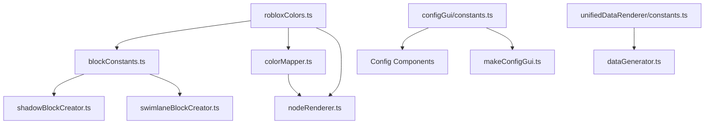
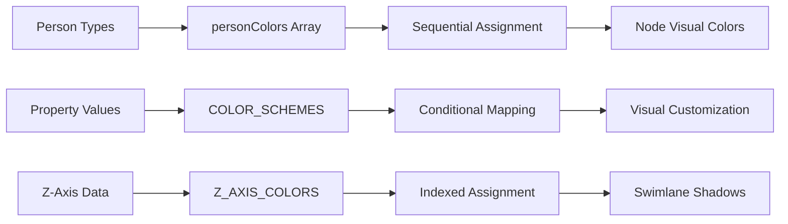
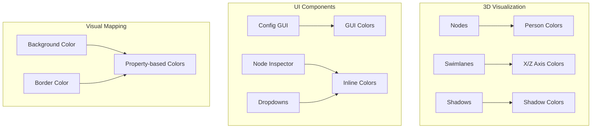

# Color System Review Report

## Executive Summary

### Key Findings
- **124 Color3 instantiations** found across 31 files in the Roblox codebase
- **5 main color constant files** containing organized color definitions
- **Mixed approaches**: Some colors centralized, others scattered inline
- **Inconsistent naming**: Mix of descriptive names, RGB values, and semantic meanings
- **Multiple color arrays** for different use cases (nodes, swimlanes, UI elements)

### Current State Overview
The codebase uses a partially centralized color system with recent improvements:
- Primary color definitions moved to `robloxColors.ts`
- Some modules still contain inline color definitions
- UI components use their own color constants
- Sequential color assignment patterns for dynamic content

### Impact Assessment
- **Maintainability**: Medium risk - scattered colors make theme changes difficult
- **Consistency**: Low risk - recent centralization efforts improving
- **Scalability**: Medium risk - adding new color schemes requires multiple file changes

## Color Inventory Table

### Centralized Colors (robloxColors.ts)

| Color Name | RGB Values | Usage | Category |
|------------|-----------|--------|----------|
| Red | 0.8, 0.2, 0.2 | Basic palette | robloxColors[0] |
| Green | 0.2, 0.8, 0.2 | Basic palette | robloxColors[1] |
| Blue | 0.2, 0.2, 0.8 | Basic palette | robloxColors[2] |
| Yellow | 0.8, 0.8, 0.2 | Basic palette | robloxColors[3] |
| Magenta | 0.8, 0.2, 0.8 | Basic palette | robloxColors[4] |
| Cyan | 0.2, 0.8, 0.8 | Basic palette | robloxColors[5] |
| Brown | 0.6, 0.3, 0.1 | Basic palette | robloxColors[6] |
| Orange | 1, 0.5, 0 | Basic palette | robloxColors[7] |
| Purple | 0.5, 0, 0.5 | Basic palette | robloxColors[8] |
| Dark Green | 0, 0.5, 0 | Basic palette | robloxColors[9] |

### Z-Axis Colors (24 colors for swimlanes)
24 saturated colors used for Z-axis swimlane visualization, ranging from greens to blues to purples.

### X-Axis Colors (20 colors for swimlanes)
20 hue-based colors following a spectrum pattern from red through the color wheel.

### Person Type Colors (personColors)
| Type | RGB Values | Usage |
|------|-----------|--------|
| man | 0.2, 0.4, 0.8 | Blue - Person nodes |
| woman | 0.8, 0.2, 0.8 | Magenta - Person nodes |
| child | 0.2, 0.8, 0.2 | Green - Person nodes |
| grandparent | 0.8, 0.8, 0.2 | Yellow - Person nodes |
| Animals | 0.8, 0.4, 0.2 | Orange - Animal nodes |

### Block Constants Colors

| Color Name | RGB Values | Usage |
|------------|-----------|--------|
| SHADOW | 0.5, 0.7, 1 | Light blue for group shadows |
| PLATFORM | 0.5, 0, 0.5 | Purple for platforms |

### GUI Colors (configGui/constants.ts)

| Color Name | RGB Values | Usage |
|------------|-----------|--------|
| BACKGROUND | 0.2, 0.2, 0.2 | Dark gray UI background |
| TEXT | 1, 1, 1 | White text |
| ERROR | 1, 0.5, 0.5 | Light red for errors |
| SUCCESS | 0.1, 0.4, 0.1 | Dark green for success |
| BUTTON.DEFAULT | 0.1, 0.3, 0.5 | Blue button default |
| BUTTON.HOVER | 0.15, 0.35, 0.55 | Lighter blue on hover |
| BUTTON.ACTIVE | 0.05, 0.25, 0.45 | Darker blue when active |

### Inline Colors (Most Common)

| RGB Values | Usage Count | Common Uses |
|------------|-------------|-------------|
| 0.3, 0.3, 0.3 | 15 | Input backgrounds, dark UI elements |
| 0.2, 0.2, 0.2 | 12 | Panel backgrounds |
| 1, 1, 1 | 25 | White text throughout UI |
| 0.5, 0.5, 0.5 | 8 | Gray elements, scrollbars |
| 0.8, 0.2, 0.2 | 6 | Red for close buttons, errors |

## Color Usage Diagrams

### Color Module Dependencies



### Color Assignment Flow



### Component Color Usage



## Recommendations

### 1. Complete Centralization Strategy

**Short-term (1-2 weeks)**
- Move all inline Color3 definitions to appropriate constant files
- Create a unified `uiColors.ts` for all UI-related colors
- Consolidate duplicate color definitions

**Long-term (1-2 months)**
- Create a single source of truth: `@/shared/constants/colors/index.ts`
- Export themed color sets from sub-modules
- Remove all inline color definitions

### 2. Implement Consistent Naming Convention

**Proposed Structure:**
```typescript
export const COLORS = {
  // Semantic colors
  primary: new Color3(0.1, 0.3, 0.5),
  secondary: new Color3(0.8, 0.2, 0.8),
  success: new Color3(0.2, 0.8, 0.2),
  error: new Color3(0.8, 0.2, 0.2),
  warning: new Color3(0.8, 0.8, 0.2),
  
  // Component-specific
  node: {
    person: { /* person type colors */ },
    animal: { /* animal colors */ }
  },
  
  // UI Elements
  ui: {
    background: { /* background variations */ },
    text: { /* text color variations */ },
    button: { /* button states */ }
  }
};
```

### 3. Implement Theme System

**Architecture:**
```typescript
interface ColorTheme {
  name: string;
  colors: {
    primary: Color3;
    secondary: Color3;
    // ... other theme colors
  };
}

class ThemeManager {
  private currentTheme: ColorTheme;
  
  getColor(path: string): Color3 {
    // Return color from current theme
  }
  
  setTheme(theme: ColorTheme): void {
    // Update current theme and notify components
  }
}
```

### 4. Migration Roadmap

**Phase 1: Audit and Document (Week 1)**
- ✅ Complete color inventory (done)
- Create migration checklist for each file
- Document color usage patterns

**Phase 2: Centralize Constants (Week 2-3)**
- Move inline colors to constant files
- Create semantic color mappings
- Update imports in affected files

**Phase 3: Implement Theme System (Week 4-5)**
- Build ThemeManager class
- Create default theme
- Add theme switching capability

**Phase 4: Refactor Components (Week 6-8)**
- Update components to use theme system
- Remove hardcoded colors
- Add theme context providers

### 5. Best Practices

1. **No inline colors** - All Color3 instantiations should reference constants
2. **Semantic naming** - Use purpose-based names, not color descriptions
3. **Single source** - One file/module should own each color definition
4. **Theme-aware** - Components should adapt to theme changes
5. **Documentation** - Each color should have a comment explaining its usage


## Conclusion

The Roblox codebase has made progress toward color centralization with the recent creation of `robloxColors.ts`, but significant work remains. The mixed approach of centralized constants and inline definitions creates maintenance challenges. By following the recommended migration path and implementing a proper theme system, the codebase can achieve better maintainability, consistency, and flexibility for future color scheme changes.