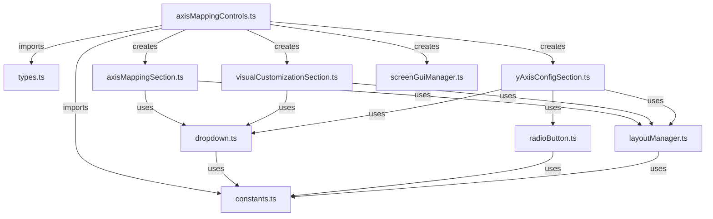

# Refactor AxisMappingControls Specification

## Summary

The `axisMappingControls.ts` file has grown to 555 lines and contains multiple responsibilities. This refactoring will break it into smaller, more focused modules while maintaining its functionality for managing axis mapping, visual customization, and Y-axis configuration controls in the GUI.

## Requirements

1. ⬛ R1: Split the monolithic file into smaller, focused modules without breaking existing functionality
2. ⬛ R2: Extract constants and configuration values into a dedicated constants file
3. ⬛ R3: Separate UI component creation logic from business logic
4. ⬛ R4: Create reusable dropdown component that can be used across the application
5. ⬛ R5: Maintain backward compatibility with existing imports and API
6. ⬛ R6: Improve code organization and maintainability
7. ⬛ R7: Reduce coupling between UI components

## Task List

1. ⬛ T1: Analysis and Planning
   1. ⬛ T1.1: Analyze current file structure and identify logical boundaries
   2. ⬛ T1.2: Map out dependencies and data flow
   3. ⬛ T1.3: Create target file structure

2. ⬛ T2: Extract Constants and Types
   1. ⬛ T2.1: Create `constants.ts` file for all configuration values
   2. ⬛ T2.2: Create `types.ts` file for interfaces and type definitions
   3. ⬛ T2.3: Update imports in main file

3. ⬛ T3: Extract Dropdown Component
   1. ⬛ T3.1: Create `dropdown.ts` file with reusable dropdown logic
   2. ⬛ T3.2: Extract dropdown creation and management functions
   3. ⬛ T3.3: Create standardized dropdown interface

4. ⬛ T4: Separate UI Sections
   1. ⬛ T4.1: Create `axisMappingSection.ts` for X/Z axis controls
   2. ⬛ T4.2: Create `visualCustomizationSection.ts` for color controls
   3. ⬛ T4.3: Create `yAxisConfigSection.ts` for Y-axis configuration
   4. ⬛ T4.4: Create `radioButton.ts` for reusable radio button component

5. ⬛ T5: Create Layout Manager
   1. ⬛ T5.1: Create `layoutManager.ts` for frame positioning and sizing
   2. ⬛ T5.2: Extract UI styling utilities
   3. ⬛ T5.3: Implement consistent spacing system

6. ⬛ T6: Refactor Main File
   1. ⬛ T6.1: Update main file to use new modules
   2. ⬛ T6.2: Implement facade pattern for backward compatibility
   3. ⬛ T6.3: Add module exports

7. ⬛ T7: Testing and Validation
   1. ⬛ T7.1: Verify all functionality works as before
   2. ⬛ T7.2: Check that no imports are broken
   3. ⬛ T7.3: Validate UI renders correctly

8. ⬛ T8: Generate Report
   1. ⬛ T8.1: Create summary of changes
   2. ⬛ T8.2: Generate file metrics comparison
   3. ⬛ T8.3: Create dependency diagram
   4. ⬛ T8.4: List improvement recommendations

## Risks

- Risk 1: Breaking existing functionality during refactoring - Mitigate by maintaining original API surface
- Risk 2: Performance impact from additional module loading - Mitigate by keeping critical path optimized
- Risk 3: Increased complexity from multiple files - Mitigate by clear naming and documentation

## Decision Points

- Decision 1: Use functional approach over class-based for UI components to match existing codebase style
- Decision 2: Keep singleton pattern for ScreenGui management to prevent duplicate GUIs
- Decision 3: Extract dropdown as generic component for reuse in other parts of the application

## ASCII Representation of GUI

```
┌─────────────────────────────────────┐
│ Axis Mapping                        │
├─────────────────────────────────────┤
│ x-axis: [type            ▼]        │
│ z-axis: [petType         ▼]        │
├─────────────────────────────────────┤
│ Visual Customization                │
├─────────────────────────────────────┤
│ background: [none        ▼]        │
│ border:     [none        ▼]        │
├─────────────────────────────────────┤
│ Y-Axis Configuration                │
├─────────────────────────────────────┤
│ ◉ Use Layer for Y Position         │
│ ○ Use Property: [Select Property ▼] │
└─────────────────────────────────────┘
```

## File and Function Structure

```
client/services/configGui/components/axisMappingControls/
├── index.ts
│   └── export * (re-exports for compatibility)
├── axisMappingControls.ts
│   └── createAxisMappingControls() (main entry point)
├── constants.ts
│   ├── AVAILABLE_PROPERTIES
│   ├── VISUAL_PROPERTIES
│   └── UI_CONSTANTS (sizes, colors, spacing)
├── types.ts
│   ├── AxisMappingControlsProps
│   └── CompactAxisControlsProps
├── components/
│   ├── dropdown.ts
│   │   ├── createDropdown()
│   │   └── DropdownProps interface
│   ├── radioButton.ts
│   │   ├── createRadioButton()
│   │   └── RadioButtonProps interface
│   ├── axisMappingSection.ts
│   │   └── createAxisMappingSection()
│   ├── visualCustomizationSection.ts
│   │   └── createVisualCustomizationSection()
│   └── yAxisConfigSection.ts
│       └── createYAxisConfigSection()
└── utils/
    ├── layoutManager.ts
    │   ├── createSection()
    │   ├── createLabel()
    │   └── applyCornerRadius()
    └── screenGuiManager.ts
        └── getOrCreateScreenGui()
```

## Flowchart

