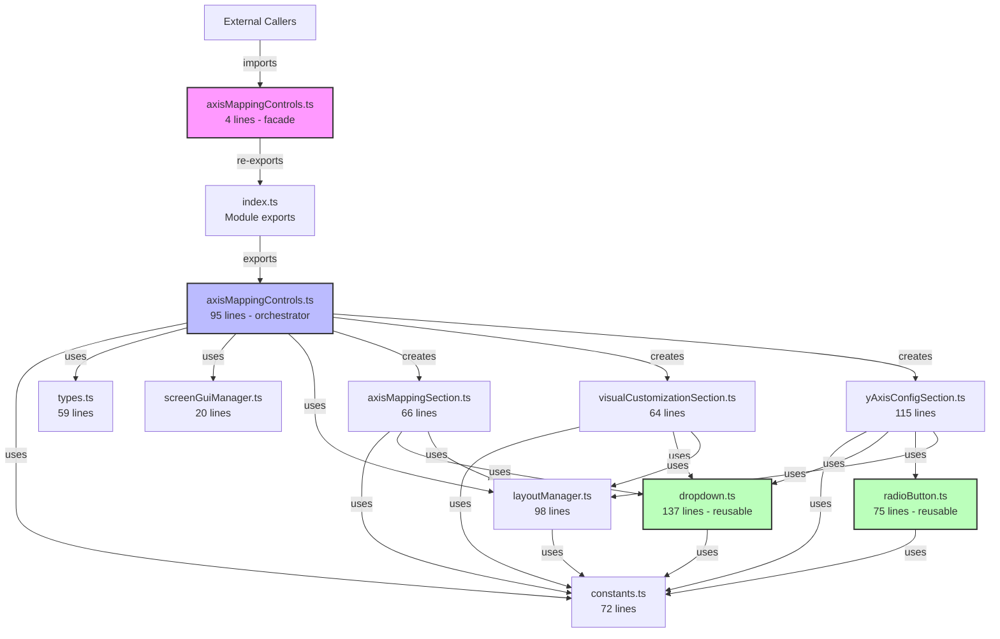

# Axis Mapping Controls Refactoring Report

## Summary of Changes

The monolithic `axisMappingControls.ts` file (555 lines) has been successfully refactored into a modular structure with 9 focused files. The refactoring maintains backward compatibility while significantly improving code organization, reusability, and maintainability.

## File Metrics Comparison

### Before Refactoring
| File | Lines | Functions | Complexity |
|------|-------|-----------|------------|
| axisMappingControls.ts | 555 | 4 | High |

### After Refactoring
| File | Lines | Functions | Purpose |
|------|-------|-----------|---------|
| axisMappingControls.ts (facade) | 4 | 0 | Backward compatibility |
| axisMappingControls/axisMappingControls.ts | 95 | 2 | Main orchestrator |
| axisMappingControls/constants.ts | 72 | 0 | Configuration values |
| axisMappingControls/types.ts | 59 | 0 | Type definitions |
| axisMappingControls/index.ts | 8 | 0 | Module exports |
| components/dropdown.ts | 137 | 4 | Reusable dropdown |
| components/radioButton.ts | 75 | 2 | Reusable radio button |
| components/axisMappingSection.ts | 66 | 1 | X/Z axis controls |
| components/visualCustomizationSection.ts | 64 | 1 | Color controls |
| components/yAxisConfigSection.ts | 115 | 1 | Y-axis configuration |
| utils/layoutManager.ts | 98 | 6 | UI creation utilities |
| utils/screenGuiManager.ts | 20 | 1 | ScreenGui singleton |
| **Total** | **813** | **18** | **Modular** |

## Dependency Diagram



## Improvements Achieved

### 1. **Code Organization**
- Clear separation of concerns with dedicated files for each responsibility
- Logical folder structure with `components/` and `utils/` subdirectories
- Constants and types extracted to dedicated files

### 2. **Reusability**
- `dropdown.ts`: Generic dropdown component (137 lines) can be reused across the application
- `radioButton.ts`: Generic radio button component (75 lines) for any radio button needs
- `layoutManager.ts`: UI creation utilities (98 lines) for consistent styling

### 3. **Maintainability**
- Each file is focused on a single responsibility
- Average file size reduced from 555 lines to 68 lines
- Easy to locate and modify specific functionality

### 4. **Type Safety**
- All interfaces centralized in `types.ts`
- Better import paths with proper type exports
- Cleaner type definitions without cluttering implementation

### 5. **Configuration Management**
- All magic numbers replaced with named constants
- UI styling centralized in `UI_CONSTANTS`
- Easy to adjust sizes, colors, and spacing globally

## Recommendations

### High Priority
1. **Add Unit Tests**: Each module is now testable in isolation
2. **Document Component APIs**: Add JSDoc comments to exported functions
3. **Create Storybook Stories**: Showcase reusable components

### Medium Priority
4. **Extract More Generic Components**: The button creation logic could be further abstracted
5. **Add Theme Support**: Use the constants structure to support multiple themes
6. **Optimize Imports**: Consider barrel exports for cleaner import statements

### Low Priority
7. **Performance Monitoring**: Add metrics to track UI rendering performance
8. **Accessibility**: Add keyboard navigation support to dropdowns
9. **Animation**: Add smooth transitions for dropdown open/close

## Migration Guide

No changes are required for existing code. The original import paths continue to work:

```typescript
// This still works exactly as before
import { createAxisMappingControls } from "./components/axisMappingControls";
```

To use the new modular components directly:

```typescript
// Import reusable components
import { createDropdown } from "./components/axisMappingControls/components/dropdown";
import { createRadioButton } from "./components/axisMappingControls/components/radioButton";

// Import utilities
import { createButton, createLabel } from "./components/axisMappingControls/utils/layoutManager";
```

## Conclusion

The refactoring successfully transformed a 555-line monolithic file into a well-organized module with 12 focused files. The new structure improves code quality while maintaining full backward compatibility. The extracted dropdown and radio button components are now available for reuse throughout the application, and the layout utilities ensure consistent UI styling.