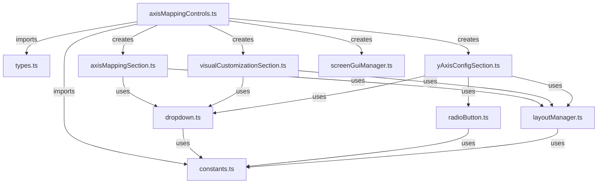

# Refactor AxisMappingControls - Tasks

## Task List

1. ⬛ T1: Analysis and Planning
   1. ⬛ T1.1: Analyze current file structure and identify logical boundaries
   2. ⬛ T1.2: Map out dependencies and data flow
   3. ⬛ T1.3: Create target file structure

2. ⬛ T2: Extract Constants and Types
   1. ⬛ T2.1: Create `constants.ts` file for all configuration values
   2. ⬛ T2.2: Create `types.ts` file for interfaces and type definitions
   3. ⬛ T2.3: Update imports in main file

3. ⬛ T3: Extract Dropdown Component
   1. ⬛ T3.1: Create `dropdown.ts` file with reusable dropdown logic
   2. ⬛ T3.2: Extract dropdown creation and management functions
   3. ⬛ T3.3: Create standardized dropdown interface

4. ⬛ T4: Separate UI Sections
   1. ⬛ T4.1: Create `axisMappingSection.ts` for X/Z axis controls
   2. ⬛ T4.2: Create `visualCustomizationSection.ts` for color controls
   3. ⬛ T4.3: Create `yAxisConfigSection.ts` for Y-axis configuration
   4. ⬛ T4.4: Create `radioButton.ts` for reusable radio button component

5. ⬛ T5: Create Layout Manager
   1. ⬛ T5.1: Create `layoutManager.ts` for frame positioning and sizing
   2. ⬛ T5.2: Extract UI styling utilities
   3. ⬛ T5.3: Implement consistent spacing system

6. ⬛ T6: Refactor Main File
   1. ⬛ T6.1: Update main file to use new modules
   2. ⬛ T6.2: Implement facade pattern for backward compatibility
   3. ⬛ T6.3: Add module exports


8. ⬛ T8: Generate Report
   1. ⬛ T8.1: Create summary of changes
   2. ⬛ T8.2: Generate file metrics comparison
   3. ⬛ T8.3: Create dependency diagram
   4. ⬛ T8.4: List improvement recommendations

## File and Function Structure

```
client/services/configGui/components/axisMappingControls/
├── index.ts
│   └── export * (re-exports for compatibility)
├── axisMappingControls.ts
│   └── createAxisMappingControls() (main entry point)
├── constants.ts
│   ├── AVAILABLE_PROPERTIES
│   ├── VISUAL_PROPERTIES
│   └── UI_CONSTANTS (sizes, colors, spacing)
├── types.ts
│   ├── AxisMappingControlsProps
│   └── CompactAxisControlsProps
├── components/
│   ├── dropdown.ts
│   │   ├── createDropdown()
│   │   └── DropdownProps interface
│   ├── radioButton.ts
│   │   ├── createRadioButton()
│   │   └── RadioButtonProps interface
│   ├── axisMappingSection.ts
│   │   └── createAxisMappingSection()
│   ├── visualCustomizationSection.ts
│   │   └── createVisualCustomizationSection()
│   └── yAxisConfigSection.ts
│       └── createYAxisConfigSection()
└── utils/
    ├── layoutManager.ts
    │   ├── createSection()
    │   ├── createLabel()
    │   └── applyCornerRadius()
    └── screenGuiManager.ts
        └── getOrCreateScreenGui()
```

## Flowchart



## Risks

- Risk 1: Breaking existing functionality during refactoring - Mitigate by maintaining original API surface
- Risk 2: Performance impact from additional module loading - Mitigate by keeping critical path optimized
- Risk 3: Increased complexity from multiple files - Mitigate by clear naming and documentation

## Decision Points

- Decision 1: Use functional approach over class-based for UI components to match existing codebase style
- Decision 2: Keep singleton pattern for ScreenGui management to prevent duplicate GUIs
- Decision 3: Extract dropdown as generic component for reuse in other parts of the application