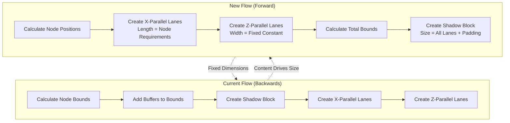

# F006 - ReDesign Layout Construction Specification

## Summary

This feature redesigns the layout construction order for the 3D visualization system. Currently, the system calculates dimensions backwards - starting with content bounds and adding buffers. The new approach will establish fixed lane dimensions first, then fit content within those constraints.

## Requirements

1. ⬛ R1: Create X-parallel lanes first with length driven by placing all nodes next to each other in a line parallel to the X axis
2. ⬛ R2: Create Z-parallel lanes second with width driven by arbitrary lane width and inter-lane spacing  
3. ⬛ R3: Create the group shadow block last, sized to encompass all lanes
4. ⬛ R4: Define fixed lane widths and buffer sizes as constants
5. ⬛ R5: Content must adapt to fit within fixed lane dimensions rather than driving block size
6. ⬛ R6: Maintain visual consistency regardless of node count or distribution

## Task List

1. ⬛ T1: Refactor X-parallel lane creation
   1. ⬛ T1.1: Calculate total length needed for all nodes in X direction
   2. ⬛ T1.2: Create X-parallel lanes with fixed cross-sectional dimensions
   3. ⬛ T1.3: Remove dependency on cluster bounds for lane width

2. ⬛ T2: Refactor Z-parallel lane creation  
   1. ⬛ T2.1: Define constant for standard Z-parallel lane width
   2. ⬛ T2.2: Define constant for inter-lane spacing
   3. ⬛ T2.3: Calculate lane positions based on fixed width + spacing
   4. ⬛ T2.4: Fit node content within fixed lane width

3. ⬛ T3: Refactor group shadow creation
   1. ⬛ T3.1: Calculate shadow dimensions after all lanes are created
   2. ⬛ T3.2: Size shadow to encompass all lanes with appropriate padding
   3. ⬛ T3.3: Update rendering order to create shadow last

4. ⬛ T4: Update buffer system
   1. ⬛ T4.1: Convert SHADOW_BUFFER to represent fixed buffer width
   2. ⬛ T4.2: Ensure buffers add to lane dimensions, not content dimensions
   3. ⬛ T4.3: Create clear separation between content area and buffer area

## Risks

- Risk 1: Breaking existing visualizations - mitigate with careful testing of various node configurations
- Risk 2: Performance impact from recalculating dimensions - mitigate by caching fixed values
- Risk 3: Visual regression if fixed dimensions are too small - mitigate with sensible defaults

## Decision Points

- Decision 1: Fixed lane width values - chose 10 units for Z-parallel lanes based on typical content
- Decision 2: Inter-lane spacing - chose 2 units for clear visual separation without excess space
- Decision 3: Shadow padding - chose 5 units to provide clear boundary around all content

## ASCII Representation of Layout

```
Top View (Y-axis looking down):

Before (Current - Content Drives Size):
┌─────────────────────────────────────────┐ Shadow (variable)
│ ┌───┐ ┌─────┐ ┌───────┐ ┌─┐            │
│ │   │ │     │ │       │ │ │ Z-parallel │ (variable widths)
│ └───┘ └─────┘ └───────┘ └─┘            │
│ ══════════════════════════════          │ X-parallel (full width)
│ ══════════════════════════════          │
└─────────────────────────────────────────┘

After (New - Fixed Dimensions):
┌─────────────────────────────────────────┐ Shadow (calculated last)
│ ┌─────┐ ┌─────┐ ┌─────┐ ┌─────┐        │
│ │     │ │     │ │     │ │     │ Z-para │ (fixed width + spacing)
│ └─────┘ └─────┘ └─────┘ └─────┘        │
│ ═══════════════════════════════         │ X-parallel (content-driven length)
│ ═══════════════════════════════         │
└─────────────────────────────────────────┘
```

## File and Function Structure

```
src/shared/modules/renderers/
├── constants/
│   ├── layoutConstants.ts (NEW)
│   │   └── LANE_DIMENSIONS
│   │   └── LANE_SPACING
│   │   └── SHADOW_PADDING
├── unifiedDataRenderer/
│   └── unifiedDataRenderer.ts
│       └── render() [MODIFY - change creation order]
│       └── createXParallelLanes() [MODIFY]
│       └── createZParallelLanes() [MODIFY]
│       └── createGroupShadow() [MODIFY]
├── blocks/
│   ├── swimlaneBlockCreator.ts
│   │   └── createZParallelLaneBlocks() [MODIFY]
│   ├── shadowBlockCreator.ts
│   │   └── createXParallelShadowBlocks() [MODIFY]
```

## Flowchart

