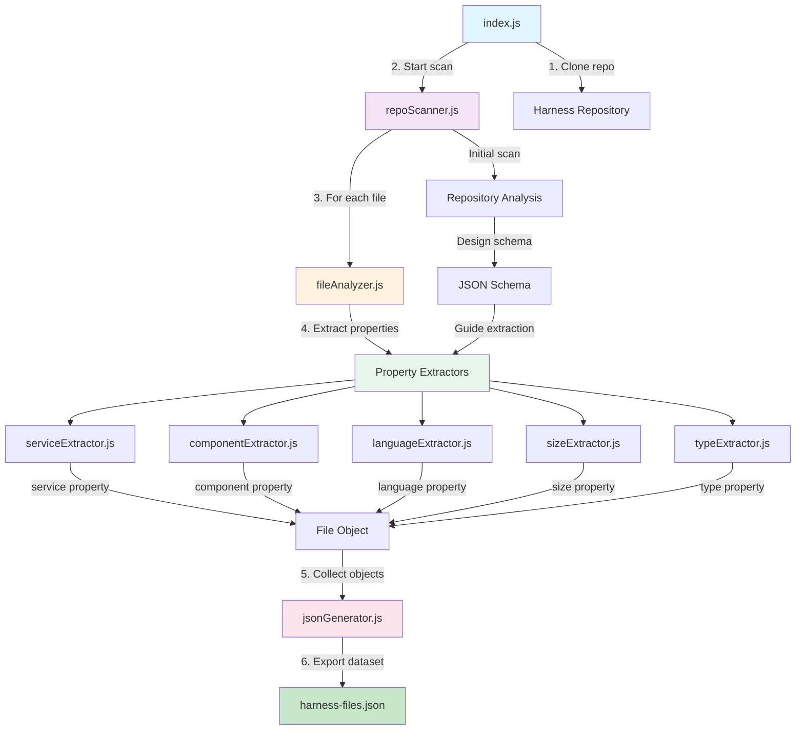

# F007 - Harness Code Categorization Specification

## Summary

This feature analyzes the Harness repository (https://github.com/harness/harness) to generate structured data for visualization. It scans the codebase to identify file properties and creates 200 JSON objects with categorized metadata, replacing the current fake data with real repository information.

## Requirements

1. ⬛ R1: Clone and scan the Harness repository
2. ⬛ R2: Analyze files to identify 5 distinct properties per file
3. ⬛ R3: Ensure each property has at least 5 different categories
4. ⬛ R4: Generate 200 file objects as JSON data
5. ⬛ R5: Properties should include service association and component type
6. ⬛ R6: Perform initial scan to understand repository structure
7. ⬛ R7: Design JSON schema based on initial findings
8. ⬛ R8: Execute full scan to generate final dataset

## Task List

1. ⬛ T1: Repository Setup
   1. ⬛ T1.1: Clone Harness repository
   2. ⬛ T1.2: Create script directory structure
   3. ⬛ T1.3: Set up file scanning infrastructure

2. ⬛ T2: Initial Repository Analysis
   1. ⬛ T2.1: Scan repository structure
   2. ⬛ T2.2: Identify service boundaries
   3. ⬛ T2.3: Catalog component types
   4. ⬛ T2.4: Document initial findings

3. ⬛ T3: Property Schema Design
   1. ⬛ T3.1: Define 5 properties based on analysis
   2. ⬛ T3.2: Ensure minimum 5 categories per property
   3. ⬛ T3.3: Create JSON schema definition
   4. ⬛ T3.4: Validate schema with sample data

4. ⬛ T4: Full Repository Scan
   1. ⬛ T4.1: Implement property extractors
   2. ⬛ T4.2: Process files and extract metadata
   3. ⬛ T4.3: Generate 200 file objects
   4. ⬛ T4.4: Export as JSON dataset

5. ⬛ T5: Data Validation
   1. ⬛ T5.1: Verify 200 objects generated
   2. ⬛ T5.2: Confirm property distribution
   3. ⬛ T5.3: Validate category counts
   4. ⬛ T5.4: Generate summary report

## Risks

- Risk 1: Repository size may require significant processing time
- Risk 2: Complex repository structure might make service identification challenging
- Risk 3: Property categorization may require domain knowledge of Harness

## Decision Points

- Decision 1: Use static analysis rather than build-time analysis for efficiency
- Decision 2: Focus on file-level properties rather than function-level analysis
- Decision 3: Prioritize easily identifiable properties like file type, location, and size

## ASCII Representation of GUI

```
┌─────────────────────────────────────────────────────────────────┐
│                 Harness Repository Analyzer                      │
├─────────────────────────────────────────────────────────────────┤
│ Scanning Progress                                                │
│ ┌─────────────────────────────────────────────────────────┐    │
│ │ ████████████████████████░░░░░░░░░░  75% (150/200 files) │    │
│ └─────────────────────────────────────────────────────────┘    │
│                                                                  │
│ Property Distribution                                            │
│ ┌───────────────────────────────────────────────────────────┐  │
│ │ Service:      [Platform: 45] [CI: 38] [CD: 32] [CE: 25]   │  │
│ │ Component:    [API: 55] [UI: 42] [Utils: 38] [Test: 35]   │  │
│ │ Language:     [Java: 78] [Go: 52] [JS: 40] [Python: 20]   │  │
│ │ Size:         [Small: 95] [Medium: 65] [Large: 30]         │  │
│ │ Type:         [Source: 140] [Test: 35] [Config: 25]        │  │
│ └───────────────────────────────────────────────────────────┘  │
│                                                                  │
│ Sample Output                                                    │
│ ┌───────────────────────────────────────────────────────────┐  │
│ │ {                                                           │  │
│ │   "path": "platform/service/src/api/handler.java",         │  │
│ │   "service": "platform",                                    │  │
│ │   "component": "api",                                       │  │
│ │   "language": "java",                                       │  │
│ │   "size": "medium",                                         │  │
│ │   "type": "source"                                          │  │
│ │ }                                                           │  │
│ └───────────────────────────────────────────────────────────┘  │
└─────────────────────────────────────────────────────────────────┘
```

## File and Function Structure

```
scripts/
├── harness-analyzer/
│   ├── index.js
│   │   └── main()
│   │   └── orchestrateAnalysis()
│   ├── scanner/
│   │   ├── repoScanner.js
│   │   │   └── scanRepository()
│   │   │   └── traverseDirectory()
│   │   └── fileAnalyzer.js
│   │       └── analyzeFile()
│   │       └── extractProperties()
│   ├── extractors/
│   │   ├── serviceExtractor.js
│   │   │   └── identifyService()
│   │   ├── componentExtractor.js
│   │   │   └── identifyComponent()
│   │   ├── languageExtractor.js
│   │   │   └── detectLanguage()
│   │   ├── sizeExtractor.js
│   │   │   └── categorizeSize()
│   │   └── typeExtractor.js
│   │       └── classifyType()
│   ├── schema/
│   │   └── fileSchema.js
│   │       └── validateObject()
│   └── output/
│       └── jsonGenerator.js
│           └── generateDataset()
│           └── exportJSON()
├── data/
│   └── harness-files.json (output)
└── reports/
    └── analysis-summary.md
```

## Flowchart

