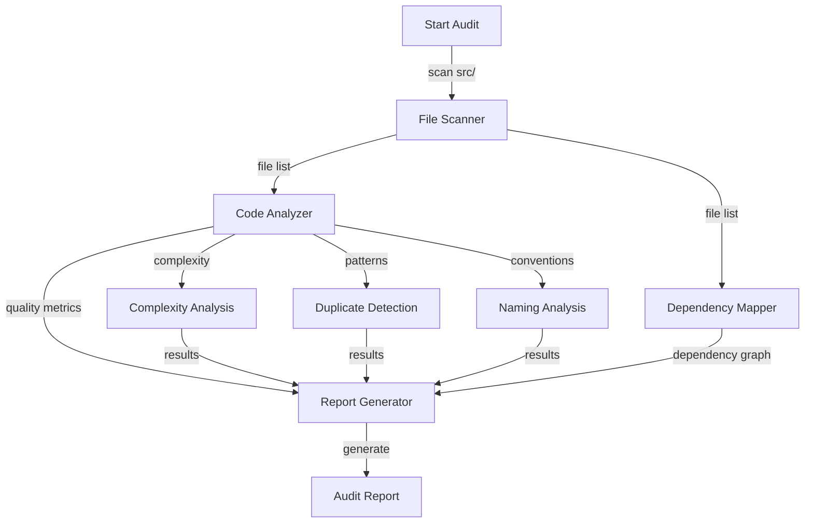

# Code Quality and Best Practices Audit Specification

## Summary

Create a comprehensive audit of code quality and best practices for all code in `/Users/__projects/roblox-mapper-002-multi/cursor/src`. The audit will analyze TypeScript/Roblox code to identify areas for improvement, adherence to best practices, and potential issues.

## Requirements

1. ⬛ R1: Analyze all TypeScript files in the src directory
2. ⬛ R2: Generate a comprehensive report with summary, table, diagrams, and recommendations
3. ⬛ R3: Identify code quality issues including:
   1. ⬛ R3.1: Duplicate code patterns
   2. ⬛ R3.2: Overly complex functions
   3. ⬛ R3.3: Inconsistent naming conventions
   4. ⬛ R3.4: Missing type annotations
   5. ⬛ R3.5: Unused variables and imports
4. ⬛ R4: Evaluate adherence to best practices:
   1. ⬛ R4.1: SOLID principles
   2. ⬛ R4.2: DRY principle
   3. ⬛ R4.3: Service architecture patterns
   4. ⬛ R4.4: Error handling patterns
5. ⬛ R5: Generate visual diagrams showing:
   1. ⬛ R5.1: Module dependencies
   2. ⬛ R5.2: Service relationships
   3. ⬛ R5.3: Code complexity hotspots
6. ⬛ R6: Provide actionable recommendations for improvements

## Task List

1. ⬛ T1: Setup and Analysis
   1. ⬛ T1.1: Create analysis utilities to scan the codebase
   2. ⬛ T1.2: Identify all TypeScript files in src directory
   3. ⬛ T1.3: Create file inventory with basic metrics (lines, size, last modified)

2. ⬛ T2: Code Quality Analysis
   1. ⬛ T2.1: Analyze function complexity (cyclomatic complexity)
   2. ⬛ T2.2: Identify duplicate code patterns
   3. ⬛ T2.3: Check naming convention consistency
   4. ⬛ T2.4: Identify missing type annotations
   5. ⬛ T2.5: Find unused imports and variables

3. ⬛ T3: Architecture Analysis
   1. ⬛ T3.1: Map service dependencies
   2. ⬛ T3.2: Identify circular dependencies
   3. ⬛ T3.3: Analyze module cohesion
   4. ⬛ T3.4: Evaluate separation of concerns

4. ⬛ T4: Report Generation
   1. ⬛ T4.1: Create summary section with key findings
   2. ⬛ T4.2: Generate file inventory table
   3. ⬛ T4.3: Create dependency diagrams using mermaid
   4. ⬛ T4.4: Write recommendations section
   5. ⬛ T4.5: Generate final report document

## Risks

- Risk 1: Large codebase may require significant analysis time
- Risk 2: Complex TypeScript/Roblox patterns may be difficult to analyze automatically
- Risk 3: Some best practices may be subjective and context-dependent

## Decision Points

- Decision 1: Use static analysis approach rather than runtime analysis for safety
- Decision 2: Focus on TypeScript-specific patterns and Roblox framework conventions
- Decision 3: Prioritize actionable recommendations over theoretical improvements

## ASCII Representation of Report Structure

```
┌─────────────────────────────────────────────┐
│          CODE QUALITY AUDIT REPORT          │
├─────────────────────────────────────────────┤
│                                             │
│  EXECUTIVE SUMMARY                          │
│  ├─ Key Findings                           │
│  ├─ Overall Score                          │
│  └─ Critical Issues                        │
│                                             │
│  FILE INVENTORY                             │
│  ┌──────────┬──────┬──────┬───────┐       │
│  │ Filename │ LOC  │ Size │ Issues│       │
│  ├──────────┼──────┼──────┼───────┤       │
│  │ file1.ts │ 234  │ 8KB  │   3   │       │
│  │ file2.ts │ 567  │ 15KB │   7   │       │
│  └──────────┴──────┴──────┴───────┘       │
│                                             │
│  DEPENDENCY DIAGRAM                         │
│  [Mermaid Diagram Here]                     │
│                                             │
│  RECOMMENDATIONS                            │
│  1. High Priority                           │
│  2. Medium Priority                         │
│  3. Low Priority                            │
│                                             │
└─────────────────────────────────────────────┘
```

## File and Function Structure

```
____000FeaturePlanningSystem/F004-CodeQualityAudit/
├── analysis/
│   ├── codeAnalyzer.ts
│   │   ├── analyzeFile()
│   │   ├── calculateComplexity()
│   │   └── findDuplicates()
│   ├── dependencyMapper.ts
│   │   ├── mapDependencies()
│   │   └── findCircularDeps()
│   └── reportGenerator.ts
│       ├── generateSummary()
│       ├── createTable()
│       └── buildDiagrams()
├── reports/
│   └── CodeQualityAuditReport.md
└── 000-CodeQualityAudit-InitialSpec-001.md
```

## Flowchart

