# Code Quality Audit Report

Generated: 2025-07-11T04:30:49.424Z

## Executive Summary

### Overview
- **Total Files**: 138
- **Total Lines**: 54527
- **Total Size**: 1522.15 KB
- **Average Lines per File**: 395

### Code Quality Metrics
- **Total Issues Found**: 1175
- **High Complexity Functions**: 0
- **Naming Convention Issues**: 12
- **Type Annotation Issues**: 1163

### Architecture Metrics
- **Total Dependencies**: 277
- **Circular Dependencies**: 0
- **Number of Modules**: 3
- **Average Module Cohesion**: 0.78

## File Inventory (Top 20 by Size)

| File | Lines | Size | Issues |
|------|-------|------|--------|
| shared/data/tempHarnessTestData.ts | 23033 | 671.1 KB | 0 |
| shared/data/tempHarnessLinks.ts | 14034 | 328.0 KB | 1 |
| shared/modules/renderers/unifiedDataRenderer/core/dataGenerator.ts | 647 | 18.3 KB | 59 |
| shared/modules/renderers/unifiedDataRenderer/managers/laneManager.ts | 422 | 14.5 KB | 48 |
| shared/modules/renderers/unifiedDataRenderer/core/positionCalculator.ts | 397 | 13.8 KB | 55 |
| shared/modules/renderers/unifiedDataRenderer/rendering/updateManager.ts | 397 | 13.5 KB | 60 |
| client/services/configGui/stateManager.ts | 403 | 13.1 KB | 32 |
| client/services/configGui/components/layerGrid.ts | 365 | 11.9 KB | 24 |
| client/services/configGui/makeConfigGui.ts | 359 | 11.5 KB | 29 |
| shared/modules/renderers/unifiedDataRenderer/unifiedDataRenderer.ts | 302 | 10.6 KB | 35 |
| shared/utils/validation/configValidation.ts | 371 | 10.4 KB | 44 |
| client/services/nodePropertiesInspector/nodePropertiesInspector.service.ts | 315 | 10.2 KB | 23 |
| shared/modules/renderers/unifiedDataRenderer/core/dataGenerator/linkGenerator.ts | 334 | 9.2 KB | 32 |
| client/services/configGui/components/yAxisControls.ts | 257 | 8.8 KB | 12 |
| shared/modules/renderers/unifiedDataRenderer/utils/colorMapper.ts | 240 | 8.7 KB | 15 |
| client/services/configGui/componentFactory.ts | 299 | 8.6 KB | 10 |
| shared/modules/renderers/unifiedDataRenderer/rendering/nodeRenderer.ts | 231 | 8.2 KB | 28 |
| shared/modules/renderers/blocks/shadowBlockCreator.ts | 252 | 7.7 KB | 17 |
| shared/modules/renderers/blocks/yParallelShadowCreator.ts | 208 | 7.6 KB | 11 |
| client/services/configGui/components/visualCustomizationControls.ts | 213 | 7.6 KB | 11 |
| client/services/keyboardShortcuts.service.ts | 207 | 7.6 KB | 17 |
| shared/modules/renderers/flatBlockCreator.ts | 237 | 7.2 KB | 7 |
| shared/modules/renderers/blocks/swimlaneBlockCreator.ts | 246 | 7.1 KB | 15 |
| shared/modules/renderers/propertyValueResolver.ts | 258 | 6.9 KB | 9 |
| shared/modules/renderers/verticalWallCreator.ts | 193 | 6.8 KB | 16 |
| shared/modules/renderers/unifiedDataRenderer/rendering/labelRenderer.ts | 185 | 6.6 KB | 10 |
| shared/modules/renderers/dataGeneratorRobloxRendererUtils/ropeCreator.ts | 227 | 6.4 KB | 27 |
| client/services/configGui/components/nodeTypesSection.ts | 170 | 6.4 KB | 7 |
| shared/modules/renderers/unifiedDataRenderer/core/dataGenerator/testDataProcessor.ts | 211 | 6.3 KB | 7 |
| shared/modules/labelGroupMaker.ts | 179 | 6.1 KB | 10 |
| server/services/groupAnimationTest.service.ts | 222 | 5.9 KB | 18 |
| shared/modules/renderers/blocks/endcapBlockCreator.ts | 216 | 5.9 KB | 7 |
| client/services/configGui/validationHandlers.ts | 199 | 5.6 KB | 20 |
| client/services/configGui/components/collapsibleFrame.ts | 186 | 5.5 KB | 14 |
| shared/utils/validation/stringValidation.ts | 214 | 5.4 KB | 12 |
| server/services/configGUIServer.service.ts | 138 | 5.4 KB | 22 |
| client/controllers/configGUI.controller.ts | 164 | 5.3 KB | 26 |
| shared/data/tempTestData.ts | 252 | 5.3 KB | 0 |
| shared/modules/renderers/unifiedDataRenderer/core/dataGenerator/nodeGenerator.ts | 174 | 5.2 KB | 16 |
| client/services/configGui/eventHandlers.ts | 173 | 5.2 KB | 16 |
| shared/modules/renderers/unifiedDataRenderer/core/dataGenerator/propertyManager.ts | 187 | 5.0 KB | 17 |
| shared/modules/renderers/unifiedDataRenderer/core/positionMapper.ts | 154 | 4.6 KB | 14 |
| shared/services/base/BaseService.ts | 172 | 4.5 KB | 12 |
| client/services/configGui/components/visualizationControls.ts | 126 | 4.4 KB | 6 |
| client/services/configGui/components/axisMappingControls/components/dropdown.ts | 149 | 4.3 KB | 10 |
| client/services/configGui/components/dropdownTestControls.ts | 137 | 4.3 KB | 3 |
| shared/modules/renderers/constants/robloxColors.ts | 103 | 4.3 KB | 0 |
| shared/utils/propertyDiscovery.ts | 145 | 4.3 KB | 10 |
| client/controllers/animationTestGUI.controller.ts | 157 | 4.1 KB | 10 |
| server/services/graphInitializer.service.ts | 154 | 4.0 KB | 4 |
| shared/utils/validation/arrayValidation.ts | 177 | 3.9 KB | 5 |
| shared/modules/renderers/unifiedDataRenderer/core/nodeOrganizer.ts | 135 | 3.8 KB | 10 |
| shared/modules/renderers/unifiedDataRenderer/core/boundsCalculator.ts | 154 | 3.8 KB | 14 |
| client/services/configGui/components/axisMappingControls/constants.ts | 134 | 3.8 KB | 10 |
| server/services/colorsTest.service.ts | 126 | 3.7 KB | 6 |
| client/services/configGui/components/axisMappingControls/components/yAxisConfigSection.ts | 123 | 3.6 KB | 10 |
| client/services/configGui/components/spacingControls.ts | 96 | 3.6 KB | 8 |
| client/services/configGui/components/axisMappingControls/components/axisMappingSection.ts | 142 | 3.5 KB | 15 |
| shared/modules/renderers/unifiedDataRenderer/types.ts | 179 | 3.5 KB | 3 |
| shared/modules/labelBlockMaker/standardizedInterfaces.ts | 154 | 3.4 KB | 10 |
| client/services/configGui/components/dropdown.ts | 116 | 3.4 KB | 3 |
| shared/modules/renderers/unifiedDataRenderer/managers/wallManager.ts | 113 | 3.3 KB | 6 |
| client/services/configGui/components/axisMappingControls/utils/layoutManager.ts | 103 | 3.3 KB | 0 |
| shared/modules/barMaker/standardizedInterfaces.ts | 135 | 3.2 KB | 10 |
| client/services/configGui/components/axisMappingControls/main.ts | 97 | 3.1 KB | 6 |
| shared/modules/barMaker/barMaker.ts | 109 | 3.1 KB | 7 |
| shared/modules/hexagonMaker/hexagonMaker.ts | 107 | 3.0 KB | 9 |
| shared/modules/TextLabelMaker.ts | 100 | 3.0 KB | 3 |
| shared/modules/TextBoxMaker.ts | 101 | 2.9 KB | 3 |
| shared/modules/makeOriginBlock.ts | 91 | 2.9 KB | 1 |
| shared/interfaces/IMaker.ts | 128 | 2.8 KB | 0 |
| shared/modules/renderers/blocks/blockDimensionCalculator.ts | 106 | 2.8 KB | 14 |
| client/services/configGui/components/axisMappingControls/components/radioButton.ts | 83 | 2.7 KB | 2 |
| server/services/main/game.service.ts | 92 | 2.7 KB | 7 |
| shared/modules/labelBlockMaker/labelBlockMaker.ts | 94 | 2.7 KB | 1 |
| client/services/configGui/guiLayout.ts | 90 | 2.6 KB | 0 |
| client/services/configGui/constants.ts | 107 | 2.5 KB | 0 |
| shared/utils/nodePropertyHelpers.ts | 89 | 2.5 KB | 4 |
| shared/modules/renderers/unifiedDataRenderer/core/dataGenerator/interfaces.ts | 116 | 2.5 KB | 0 |
| shared/interfaces/enhancedGenerator.interface.ts | 74 | 2.5 KB | 1 |
| shared/modules/ropeLabelMaker/utilities.ts | 88 | 2.4 KB | 14 |
| shared/modules/renderers/unifiedDataRenderer/managers/yParallelShadowManager.ts | 67 | 2.4 KB | 8 |
| shared/modules/renderers/constants/blockConstants.ts | 62 | 2.4 KB | 0 |
| shared/modules/hexagonMaker/utilities.ts | 74 | 2.4 KB | 6 |
| shared/modules/renderers/blocks/baseBlockCreator.ts | 86 | 2.4 KB | 6 |
| client/services/configGui/utilities.ts | 82 | 2.3 KB | 7 |
| shared/modules/renderers/unifiedDataRenderer/constants.ts | 71 | 2.3 KB | 0 |
| shared/interfaces/simpleDataGenerator.interface.ts | 72 | 2.3 KB | 0 |
| shared/modules/hexagonMaker/standardizedInterfaces.ts | 97 | 2.2 KB | 5 |
| shared/modules/renderers/unifiedDataRenderer/managers/platformShadowManager.ts | 69 | 2.2 KB | 6 |
| shared/modules/hexStackMaker/hexStackMaker.ts | 74 | 2.1 KB | 8 |
| client/main.client.ts | 53 | 2.0 KB | 4 |
| shared/constants/axisDefaults.ts | 62 | 2.0 KB | 2 |
| shared/modules/renderers/dataGeneratorRobloxRendererUtils/constants.ts | 79 | 2.0 KB | 0 |
| shared/modules/labelBlockMaker/utilities.ts | 59 | 1.9 KB | 4 |
| shared/modules/renderers/unifiedDataRenderer/interfaces.ts | 75 | 1.8 KB | 0 |
| shared/modules/barMaker/utilities.ts | 49 | 1.8 KB | 6 |
| client/services/configGui/components/axisMappingControls/components/visualCustomizationSection.ts | 74 | 1.8 KB | 2 |
| shared/modules/hexStackMaker/standardizedInterfaces.ts | 73 | 1.7 KB | 2 |
| shared/modules/renderers/blocks/platformBlockCreator.ts | 65 | 1.7 KB | 1 |
| client/services/configGui/components/frame.ts | 49 | 1.5 KB | 1 |
| client/services/configGui/components/axisMappingControls/types.ts | 58 | 1.5 KB | 0 |
| client/services/configGui/components/globalSettings.ts | 48 | 1.5 KB | 0 |
| shared/interfaces/nodeTypes.ts | 54 | 1.5 KB | 0 |
| client/services/configGui/components/status.ts | 40 | 1.4 KB | 2 |
| shared/modules/labelBlockMaker/interfaces.ts | 52 | 1.3 KB | 0 |
| server/services/main/dev2features.ts | 34 | 1.1 KB | 4 |
| shared/modules/renderers/constants/labelConstants.ts | 39 | 1.0 KB | 0 |
| shared/modules/ropeLabelMaker/ropeLabelMaker.ts | 40 | 0.9 KB | 2 |
| client/services/configGui/interfaces.ts | 35 | 0.9 KB | 0 |
| shared/modules/ropeLabelMaker/interfaces.ts | 49 | 0.9 KB | 0 |
| shared/modules/renderers/constants/layoutConstants.ts | 29 | 0.9 KB | 0 |
| shared/modules/renderers/constants/positionConstants.ts | 35 | 0.9 KB | 0 |
| client/services/configGui/components/axisMappingControls/utils/screenGuiManager.ts | 33 | 0.8 KB | 4 |
| shared/modules/barMaker/interfaces.ts | 36 | 0.8 KB | 0 |
| shared/interfaces/IService.ts | 39 | 0.8 KB | 0 |
| server/main.server.ts | 22 | 0.8 KB | 0 |
| shared/modules/labelBlockMaker/constants.ts | 28 | 0.8 KB | 0 |
| client/services/configGui/components/title.ts | 26 | 0.7 KB | 0 |
| shared/modules/ropeLabelMaker/constants.ts | 39 | 0.7 KB | 0 |
| shared/modules/hexagonMaker/constants.ts | 29 | 0.7 KB | 0 |
| shared/modules/hexStackMaker/constants.ts | 23 | 0.6 KB | 0 |
| shared/modules/hexStackMaker/utilities.ts | 16 | 0.5 KB | 2 |
| shared/utils/stringUtils.ts | 22 | 0.5 KB | 2 |
| shared/modules/barMaker/constants.ts | 21 | 0.5 KB | 0 |
| client/services/configGui/index.ts | 11 | 0.5 KB | 0 |
| shared/modules/labelBlockMaker/index.ts | 16 | 0.4 KB | 0 |
| shared/modules/renderers/blocks/index.ts | 10 | 0.3 KB | 0 |
| shared/modules/ropeLabelMaker/index.ts | 12 | 0.2 KB | 0 |
| shared/modules/hexStackMaker/index.ts | 6 | 0.2 KB | 0 |
| shared/modules/hexagonMaker/index.ts | 6 | 0.2 KB | 0 |
| shared/modules/barMaker/index.ts | 6 | 0.2 KB | 0 |
| shared/modules/hexagonMaker/interfaces.ts | 11 | 0.2 KB | 0 |
| shared/modules/renderers/unifiedDataRenderer/index.ts | 9 | 0.2 KB | 1 |
| shared/modules/hexStackMaker/interfaces.ts | 9 | 0.2 KB | 0 |
| client/services/configGui/components/axisMappingControls/index.ts | 5 | 0.2 KB | 0 |
| shared/modules/renderers/constants/index.ts | 7 | 0.1 KB | 0 |
| shared/utils/validation/index.ts | 7 | 0.1 KB | 0 |

## Dependency Diagram (Top 20 Files)

```mermaid
graph TD
    client_controllers_animationTestGUI_controller_ts["animationTestGUI.controller"]
    client_controllers_configGUI_controller_ts["configGUI.controller"]
    client_main_client_ts["main.client"]
    client_services_configGui_componentFactory_ts["componentFactory"]
    client_services_configGui_components_axisMappingControls_components_axisMappingSection_ts["axisMappingSection"]
    client_services_configGui_components_axisMappingControls_components_dropdown_ts["dropdown"]
    client_services_configGui_components_axisMappingControls_components_radioButton_ts["radioButton"]
    client_services_configGui_components_axisMappingControls_components_visualCustomizationSection_ts["visualCustomizationSection"]
    client_services_configGui_components_axisMappingControls_components_yAxisConfigSection_ts["yAxisConfigSection"]
    client_services_configGui_components_axisMappingControls_constants_ts["constants"]
    client_services_configGui_components_axisMappingControls_index_ts["index"]
    client_services_configGui_components_axisMappingControls_main_ts["main"]
    client_services_configGui_components_axisMappingControls_types_ts["types"]
    client_services_configGui_components_axisMappingControls_utils_layoutManager_ts["layoutManager"]
    client_services_configGui_components_axisMappingControls_utils_screenGuiManager_ts["screenGuiManager"]
    client_services_configGui_components_collapsibleFrame_ts["collapsibleFrame"]
    client_services_configGui_components_dropdown_ts["dropdown"]
    client_services_configGui_components_dropdownTestControls_ts["dropdownTestControls"]
    client_services_configGui_components_frame_ts["frame"]
    client_services_configGui_components_globalSettings_ts["globalSettings"]
    client_main_client_ts --> client_controllers_configGUI_controller_ts
    client_main_client_ts --> client_controllers_animationTestGUI_controller_ts
    client_services_configGui_componentFactory_ts --> client_services_configGui_components_dropdown_ts
    client_services_configGui_componentFactory_ts --> client_services_configGui_components_frame_ts
    client_services_configGui_components_axisMappingControls_components_axisMappingSection_ts --> client_services_configGui_components_axisMappingControls_constants_ts
    client_services_configGui_components_axisMappingControls_components_axisMappingSection_ts --> client_services_configGui_components_axisMappingControls_utils_layoutManager_ts
    client_services_configGui_components_axisMappingControls_components_axisMappingSection_ts --> client_services_configGui_components_axisMappingControls_components_dropdown_ts
    client_services_configGui_components_axisMappingControls_components_dropdown_ts --> client_services_configGui_components_axisMappingControls_constants_ts
    client_services_configGui_components_axisMappingControls_components_radioButton_ts --> client_services_configGui_components_axisMappingControls_constants_ts
    client_services_configGui_components_axisMappingControls_components_visualCustomizationSection_ts --> client_services_configGui_components_axisMappingControls_constants_ts
    client_services_configGui_components_axisMappingControls_components_visualCustomizationSection_ts --> client_services_configGui_components_axisMappingControls_components_dropdown_ts
    client_services_configGui_components_axisMappingControls_components_visualCustomizationSection_ts --> client_services_configGui_components_axisMappingControls_utils_layoutManager_ts
    client_services_configGui_components_axisMappingControls_components_yAxisConfigSection_ts --> client_services_configGui_components_axisMappingControls_constants_ts
    client_services_configGui_components_axisMappingControls_components_yAxisConfigSection_ts --> client_services_configGui_components_axisMappingControls_components_dropdown_ts
    client_services_configGui_components_axisMappingControls_components_yAxisConfigSection_ts --> client_services_configGui_components_axisMappingControls_components_radioButton_ts
    client_services_configGui_components_axisMappingControls_components_yAxisConfigSection_ts --> client_services_configGui_components_axisMappingControls_utils_layoutManager_ts
    client_services_configGui_components_axisMappingControls_main_ts --> client_services_configGui_components_axisMappingControls_constants_ts
    client_services_configGui_components_axisMappingControls_main_ts --> client_services_configGui_components_axisMappingControls_utils_screenGuiManager_ts
    client_services_configGui_components_axisMappingControls_main_ts --> client_services_configGui_components_axisMappingControls_utils_layoutManager_ts
    client_services_configGui_components_axisMappingControls_main_ts --> client_services_configGui_components_axisMappingControls_components_axisMappingSection_ts
    client_services_configGui_components_axisMappingControls_main_ts --> client_services_configGui_components_axisMappingControls_components_visualCustomizationSection_ts
    client_services_configGui_components_axisMappingControls_utils_layoutManager_ts --> client_services_configGui_components_axisMappingControls_constants_ts
    client_services_configGui_components_collapsibleFrame_ts --> client_services_configGui_componentFactory_ts
    client_services_configGui_components_dropdownTestControls_ts --> client_services_configGui_componentFactory_ts
```

## Recommendations

### High Priority

### Medium Priority

#### Missing Type Annotations
- **Description**: 1163 places could benefit from explicit type annotations
- **Action**: Add explicit type annotations to improve type safety and code documentation

### Low Priority

#### Low Module Cohesion
- **Description**: Modules server have low cohesion
- **Action**: Consider reorganizing code to improve module cohesion

## Detailed Analysis

### Module Cohesion Analysis

- **client**: Cohesion 87.5%, Coupling 12.5%
  - Files: 39
  - Internal Dependencies: 70
  - External Dependencies: 10

- **server**: Cohesion 46.2%, Coupling 53.8%
  - Files: 7
  - Internal Dependencies: 6
  - External Dependencies: 7

- **shared**: Cohesion 100.0%, Coupling 0.0%
  - Files: 92
  - Internal Dependencies: 184
  - External Dependencies: 0

### Circular Dependencies

No circular dependencies detected.

## Conclusion

This audit has identified 1175 total issues across 138 files. The codebase shows good architectural structure with no circular dependencies. Focus should be placed on addressing the high-priority recommendations to improve code quality and maintainability.
