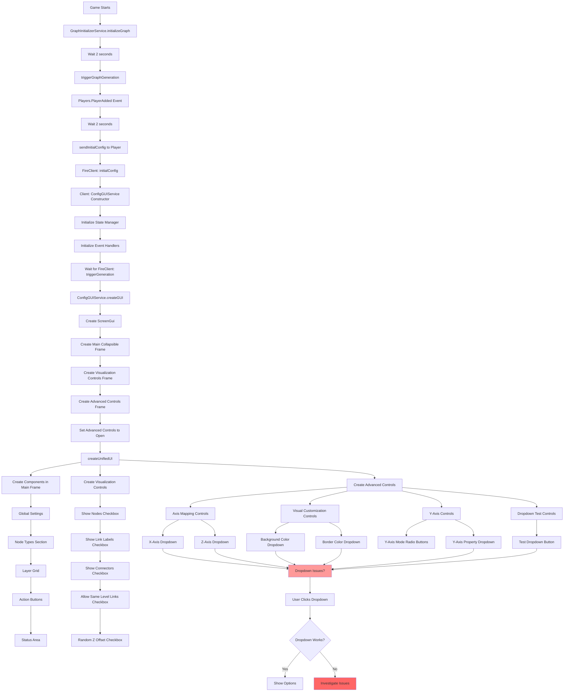

# Dropdown Issues Analysis

## Overview
This document analyzes why dropdowns in the Advanced Controls GUI may not be functioning correctly, including hypotheses and the GUI creation flow.

## Hypotheses for Dropdown Issues

### Hypothesis 1: Z-Index Layering Issues
**Problem**: Dropdown lists may be appearing behind other GUI elements
- **Evidence**: Dropdowns appear to open but options aren't clickable
- **Root Cause**: Other GUI frames have higher ZIndex values
- **Test**: Add higher ZIndex values to dropdown lists (e.g., ZIndex = 100)

### Hypothesis 2: Frame Size Constraints
**Problem**: Parent frame may be clipping dropdown content
- **Evidence**: Dropdown list is cut off when expanded
- **Root Cause**: ClipsDescendants property on parent frames
- **Test**: Ensure all parent frames have ClipsDescendants = false

### Hypothesis 3: Input Event Handling Conflicts
**Problem**: UserInputService events may be consumed by other GUI elements
- **Evidence**: Click events not reaching dropdown options
- **Root Cause**: Multiple GUI elements competing for input focus
- **Test**: Add Active = true and check event propagation order

### Hypothesis 4: Visibility State Management
**Problem**: Dropdown visibility state not properly synchronized
- **Evidence**: Dropdown appears open but isn't interactive
- **Root Cause**: State mismatch between visual appearance and actual visibility
- **Test**: Add debug prints for visibility state changes

### Hypothesis 5: Timing Issues with GUI Creation
**Problem**: Dropdowns created before parent GUI fully initialized
- **Evidence**: Dropdowns work sometimes but not consistently
- **Root Cause**: Race condition in GUI initialization sequence
- **Test**: Add wait() delays or use RenderStepped for initialization

### Hypothesis 6: ScrollingFrame Interference
**Problem**: ScrollingFrame capturing mouse events
- **Evidence**: Dropdowns inside scrolling frames don't respond
- **Root Cause**: ScrollingFrame ScrollingEnabled interfering with child inputs
- **Test**: Temporarily disable scrolling when dropdown is open

## GUI Creation Flow



## Key Observations

1. **Multiple Dropdown Implementations**: The codebase has several different dropdown implementations:
   - Axis mapping dropdowns (axisMappingControls.ts)
   - Visual customization dropdowns (visualCustomizationControls.ts)
   - Y-axis property dropdown (yAxisControls.ts)
   - Dropdown test control (dropdownTestControls.ts)
   - Separate dropdown GUI service (dropdownGui)

2. **Initialization Timing**: GUIs are created after a 2-second delay when players join, which could cause timing issues

3. **Frame Hierarchy**: Dropdowns are nested deep within the frame hierarchy:
   - ScreenGui → Collapsible Frame → Content Frame → Component Frame → Dropdown

4. **Event Handling**: Multiple event handlers competing for mouse input:
   - Individual button click handlers
   - UserInputService global input handlers
   - Frame-level mouse event handlers

## Recommended Debugging Steps

1. **Add Debug Logging**:
   ```typescript
   print("[Dropdown] Button clicked, current state:", isOpen)
   print("[Dropdown] List visibility:", dropdownList.Visible)
   print("[Dropdown] Parent visibility:", dropdownList.Parent.Visible)
   ```

2. **Check Z-Index Hierarchy**:
   - Ensure dropdown lists have highest ZIndex
   - Check all parent frames for ZIndex conflicts

3. **Verify Frame Properties**:
   - ClipsDescendants = false on all parents
   - Active = true on interactive elements
   - AutomaticSize for dynamic content

4. **Test Event Propagation**:
   - Add mouse enter/leave handlers to debug
   - Check if events reach dropdown options

5. **Isolate Issues**:
   - Test dropdowns in isolation
   - Remove other GUI elements temporarily
   - Test outside of scrolling frames

## Common Fixes

1. **Z-Index Fix**:
   ```typescript
   dropdownList.ZIndex = 100; // Ensure on top
   ```

2. **Parent Frame Fix**:
   ```typescript
   parentFrame.ClipsDescendants = false;
   ```

3. **Event Handler Fix**:
   ```typescript
   dropdownOption.Active = true;
   dropdownOption.AutoButtonColor = false;
   ```

4. **Visibility State Fix**:
   ```typescript
   // Ensure state consistency
   const setDropdownOpen = (open: boolean) => {
     isOpen = open;
     dropdownList.Visible = open;
     dropdownList.Parent.Visible = true;
   };
   ```

## Applied Simplifications

1. **Removed unnecessary container frames**:
   - Eliminated intermediate `dropdownFrame` containers
   - Positioned dropdowns and labels directly in parent frames
   - Reduced frame hierarchy depth by 1-2 levels

2. **Standardized to always use ScrollingFrame**:
   - Removed conditional Frame/ScrollingFrame logic
   - All dropdowns now use ScrollingFrame consistently
   - Simplified option parent logic

3. **Unified dropdown structure**:
   ```
   TextButton (dropdown) - Main button
   └── ScrollingFrame (dropdownList) - Always ScrollingFrame
       ├── UICorner
       └── TextButton (itemButton) × N items
   ```

4. **Improved Z-Index management**:
   - Set all dropdown lists to ZIndex = 100
   - Ensures dropdowns appear above other GUI elements

5. **Direct parenting**:
   - Options parented directly to ScrollingFrame
   - No intermediate container frames
   - Cleaner hierarchy for debugging