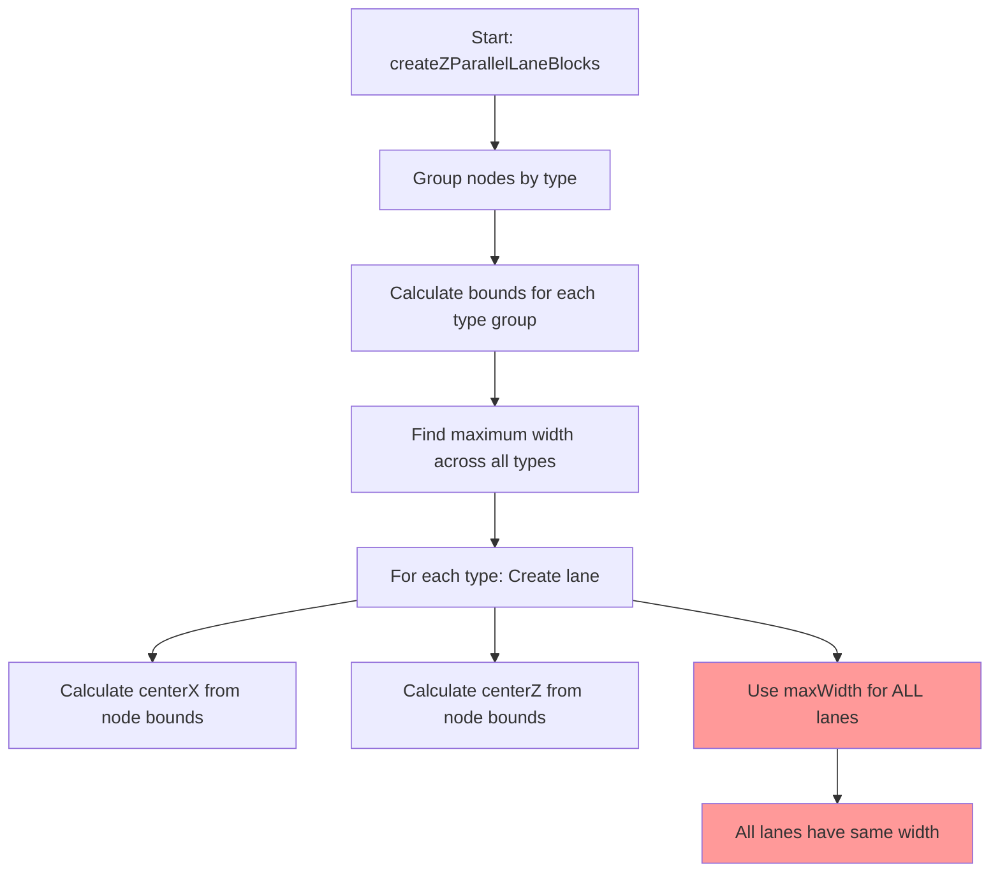

# Z-Parallel Lane Length Calculation Flowchart

## Current Flow (with the bug)



## The Problem

1. **Node Grouping**: Nodes are grouped by type (woman, grandparent, man, child)
2. **Bounds Calculation**: For each group, we calculate minX, maxX, minZ, maxZ
3. **Max Width**: We find the maximum width among all groups
4. **Applied Uniformly**: This max width is applied to ALL lanes

## Why Child Lane Appears Wrong

The issue might be:
- The child lane has the same width as others, but visually appears different
- The centering calculation might be off
- The node positioning for child type might be different

## Current Code Analysis

```typescript
// Find the maximum width across all swimlanes
let maxWidth = 0;
nodesByType.forEach((nodes, typeName) => {
  const bounds = typeBounds.get(typeName)!;
  const width = bounds.maxX - bounds.minX;
  maxWidth = math.max(maxWidth, width);
});

// Later, for each lane:
const blockWidth = maxWidth; // All lanes get the same width
```

## Debugging Steps Needed

1. **Log the bounds for each type**:
   - Woman bounds
   - Grandparent bounds
   - Man bounds
   - Child bounds

2. **Log the calculated widths**:
   - Individual widths
   - Max width value

3. **Log the final positions**:
   - CenterX for each lane
   - Actual block dimensions

## Potential Issues

1. **Node Position Calculation**: The child nodes might be positioned differently in the original layout
2. **Bounds Calculation**: The bounds might not be capturing all child nodes
3. **Visual Illusion**: The lane might be the correct length but appear wrong due to:
   - Different node distribution
   - Z-position differences
   - Perspective issues

## Fix Options

### Option 1: Individual Lane Widths
```typescript
// Use actual bounds for each lane
const blockWidth = bounds.maxX - bounds.minX;
```

### Option 2: Debug First
Add detailed logging to understand why child lane appears different:
```typescript
print(`[DEBUG] ${typeName} bounds: minX=${bounds.minX}, maxX=${bounds.maxX}, width=${bounds.maxX - bounds.minX}`);
print(`[DEBUG] Max width being applied: ${maxWidth}`);
```

### Option 3: Check Node Distribution
Verify that all child nodes are being included in the bounds calculation.

## Next Steps

1. Add debug logging to see actual values
2. Check if all child nodes are included in bounds
3. Verify the visual rendering matches the calculated dimensions
4. Consider if uniform width is actually desired