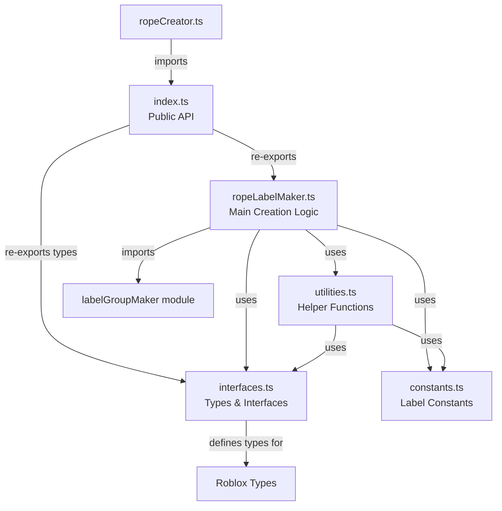

# Rope Label Module Restructure Specification

## Summary

This plan outlines the restructuring of the rope label-related files (`ropeLabelMaker.ts`, `ropeLabelService.ts`, and parts of `ropeCreator.ts`) to match the organized folder structure pattern established by the labelBlockMaker module. The current rope label system consists of three files with ~300 total lines spread across different directories. This restructure will consolidate them into a single module folder with better organization, improved maintainability, and consistency with the codebase patterns.

## Requirements

1. ✅ R1: Match the folder structure pattern established by labelBlockMaker module
2. ✅ R2: Maintain backward compatibility - external imports must continue to work
3. ✅ R3: Extract constants into a dedicated constants file
4. ✅ R4: Separate interfaces and type definitions into interfaces.ts
5. ✅ R5: Move utility functions to utilities.ts
6. ✅ R6: Keep main rope label creation logic in ropeLabelMaker.ts
7. ✅ R7: Create an index.ts for clean public API
8. ✅ R8: Consolidate rope label functionality from multiple files
9. ✅ R9: Remove singleton pattern from service layer

## Task List

1. ✅ T1: Analyze current structure
   1. ✅ T1.1: Document all functions in ropeLabelMaker.ts
   2. ✅ T1.2: Document all functions in ropeLabelService.ts
   3. ✅ T1.3: Identify rope label functions in ropeCreator.ts
   4. ✅ T1.4: Map all external dependencies and imports

2. ✅ T2: Create new folder structure
   1. ✅ T2.1: Create `src/shared/modules/ropeLabelMaker/` directory
   2. ✅ T2.2: Create empty files: index.ts, interfaces.ts, constants.ts, utilities.ts
   3. ✅ T2.3: Keep ropeLabelMaker.ts as the main file

3. ✅ T3: Extract interfaces and types
   1. ✅ T3.1: Create `interfaces.ts` file
   2. ✅ T3.2: Define RopeLabelProps interface
   3. ✅ T3.3: Define ParsedRelation interface
   4. ✅ T3.4: Define RopeLabelConfig interface
   5. ✅ T3.5: Export all interfaces

4. ✅ T4: Create constants file
   1. ✅ T4.1: Create `constants.ts` file
   2. ✅ T4.2: Extract ROPE_LABEL_CONSTANTS object:
      - Label dimensions (height: 1.5, depth: 0.1)
      - Spacing between text blocks (0.2)
      - Text sizes (0.3)
      - Colors for source/relation/target
      - Z offset for label positioning (-3)
      - Default relation separator ("_")

5. ✅ T5: Extract utility functions
   1. ✅ T5.1: Create `utilities.ts` file
   2. ✅ T5.2: Move `parseRelationName` function
   3. ✅ T5.3: Create `calculateLabelPosition` utility
   4. ✅ T5.4: Create `formatNodeName` utility for cleaning node names
   5. ✅ T5.5: Add validation utilities

6. ✅ T6: Refactor main ropeLabelMaker file
   1. ✅ T6.1: Remove extracted functions
   2. ✅ T6.2: Import from new module files
   3. ✅ T6.3: Simplify `createRopeLabel` to use utilities
   4. ✅ T6.4: Remove singleton pattern code
   5. ✅ T6.5: Focus on core label creation logic

7. ✅ T7: Create index.ts
   1. ✅ T7.1: Create `index.ts` file
   2. ✅ T7.2: Export `createRopeLabel` as main function
   3. ✅ T7.3: Export necessary types from interfaces.ts
   4. ✅ T7.4: Export constants if needed externally

8. ✅ T8: Update external imports
   1. ✅ T8.1: Update ropeCreator.ts to import from new module
   2. ✅ T8.2: Remove dependency on ropeLabelService.ts
   3. ✅ T8.3: Update any other files that import rope label functionality

9. ✅ T9: Remove obsolete files
   1. ✅ T9.1: Delete old ropeLabelMaker.ts from modules root
   2. ✅ T9.2: Delete ropeLabelService.ts entirely
   3. ✅ T9.3: Verify no broken imports

10. ✅ T10: Testing and validation
    1. ✅ T10.1: Run `npm run build`
    2. ✅ T10.2: Test rope label creation in Roblox Studio
    3. ✅ T10.3: Verify labels appear correctly on ropes
    4. ✅ T10.4: Check label text parsing works properly

## Risks

- Risk 1: Breaking ropeCreator.ts functionality - Mitigated by careful import updates
- Risk 2: Loss of singleton tracking - Mitigated by moving tracking to ropeCreator if needed
- Risk 3: Import path changes affecting other modules - Mitigated by thorough grep search

## Decision Points

- Decision 1: Remove singleton pattern as it adds unnecessary complexity
- Decision 2: Consolidate all rope label logic into one module folder
- Decision 3: Use same naming conventions as labelBlockMaker for consistency
- Decision 4: Keep parseRelationName as utility rather than class method

## File and Function Structure

```
src/shared/modules/ropeLabelMaker/
├── index.ts
│   └── export { createRopeLabel }
│   └── export type { RopeLabelProps, RopeLabelConfig }
├── ropeLabelMaker.ts
│   └── createRopeLabel()
├── interfaces.ts
│   └── interface RopeLabelProps
│   └── interface ParsedRelation
│   └── interface RopeLabelConfig
├── constants.ts
│   └── ROPE_LABEL_CONSTANTS object
└── utilities.ts
    └── parseRelationName()
    └── calculateLabelPosition()
    └── formatNodeName()
    └── validateRelationFormat()
```

## Flowchart



## Sample Objects

```typescript
// ROPE_LABEL_CONSTANTS structure
const ROPE_LABEL_CONSTANTS = {
  // Dimensions
  LABEL: {
    HEIGHT: 1.5,
    DEPTH: 0.1,
    SPACING: 0.2,
    Z_OFFSET: -3
  },
  
  // Text configuration
  TEXT: {
    SIZE: 0.3,
    COLORS: {
      SOURCE: new Color3(0.5, 0.8, 1),    // Light blue
      RELATION: new Color3(1, 0.8, 0.5),   // Orange
      TARGET: new Color3(0.5, 1, 0.8)      // Light green
    }
  },
  
  // Parsing
  PARSING: {
    SEPARATOR: "_",
    MIN_PARTS: 3,
    SOURCE_INDEX: 0,
    RELATION_INDEX: 1,
    TARGET_INDEX: 2
  }
};

// Example interfaces
interface RopeLabelProps {
  relationName: string;
  rope: RopeConstraint;
  attachment1: Attachment;
  attachment2: Attachment;
}

interface ParsedRelation {
  sourceName: string;
  relationName: string;
  targetName: string;
  isValid: boolean;
}

interface RopeLabelConfig {
  textSize?: number;
  spacing?: number;
  colors?: {
    source?: Color3;
    relation?: Color3;
    target?: Color3;
  };
}
```

## Example Code

```typescript
// index.ts
export { createRopeLabel } from "./ropeLabelMaker";
export type { RopeLabelProps, RopeLabelConfig, ParsedRelation } from "./interfaces";

// Usage after restructure:
import { createRopeLabel } from "shared/modules/ropeLabelMaker";

const label = createRopeLabel({
  relationName: "Customer001_OWNS_Product003",
  rope: ropeConstraint,
  attachment1: sourceAttachment,
  attachment2: targetAttachment
});

// utilities.ts example
export function parseRelationName(relationName: string): ParsedRelation {
  const parts = relationName.split(ROPE_LABEL_CONSTANTS.PARSING.SEPARATOR);
  
  if (parts.size() < ROPE_LABEL_CONSTANTS.PARSING.MIN_PARTS) {
    return {
      sourceName: relationName,
      relationName: "UNKNOWN",
      targetName: "UNKNOWN",
      isValid: false
    };
  }
  
  const sourceName = formatNodeName(parts[0]);
  const relationName = parts[1];
  const targetName = formatNodeName(parts.slice(2).join("_"));
  
  return {
    sourceName,
    relationName,
    targetName,
    isValid: true
  };
}
```