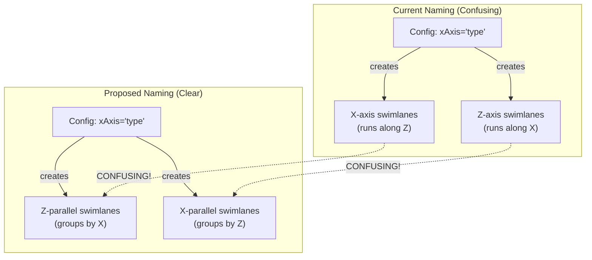

# Geometric Naming Audit and Revision Specification

## Summary

This feature audits and revises the geometric naming conventions in the Roblox mapper codebase. Currently, items placed parallel to the X and Z axes are referred to by the property being displayed on that axis rather than the axis itself. Additionally, some axes and objects are labeled incorrectly. This audit will identify all instances of confusing naming and create a plan to make naming axis-focused rather than data-focused.

## Requirements

1. ⬛ R1: Perform comprehensive code audit of all files under `/Users/__projects/roblox-mapper-002-multi/cursor/src`
2. ⬛ R2: Identify all instances where naming refers to data properties instead of geometric axes
3. ⬛ R3: Document the current naming patterns and their usage locations
4. ⬛ R4: Create clear before/after naming mappings
5. ⬛ R5: Generate visual diagrams showing current data flow and naming confusion
6. ⬛ R6: Propose new naming convention that is data-agnostic and axis-focused
7. ⬛ R7: Create detailed task list for implementing naming changes

## Task List

1. ⬛ T1: Code Audit and Analysis
   1. ⬛ T1.1: Search for all occurrences of "X-axis" and "Z-axis" related naming
   2. ⬛ T1.2: Identify files using property-based naming (e.g., "type", "petType")
   3. ⬛ T1.3: Find all swimlane-related code and naming patterns
   4. ⬛ T1.4: Locate axis labeling and orientation references
   5. ⬛ T1.5: Document buffer and dimension naming conventions

2. ⬛ T2: Create Current State Documentation
   1. ⬛ T2.1: List all confusing naming patterns found
   2. ⬛ T2.2: Map file locations for each pattern
   3. ⬛ T2.3: Create data flow diagram showing current naming
   4. ⬛ T2.4: Document the actual geometric behavior vs named behavior

3. ⬛ T3: Design New Naming Convention
   1. ⬛ T3.1: Define axis-focused naming rules
   2. ⬛ T3.2: Create naming mapping table (old → new)
   3. ⬛ T3.3: Design consistent buffer/dimension naming
   4. ⬛ T3.4: Ensure clarity for swimlane orientation vs grouping

4. ⬛ T4: Create Implementation Plan
   1. ⬛ T4.1: Prioritize changes by impact and risk
   2. ⬛ T4.2: Group related changes into atomic commits
   3. ⬛ T4.3: Identify test points for validation
   4. ⬛ T4.4: Create rollback strategy

## Risks

- Risk 1: Breaking existing functionality due to widespread naming changes - mitigate with thorough testing
- Risk 2: Missing hidden dependencies on current naming - mitigate with comprehensive grep searches
- Risk 3: Confusion during transition period - mitigate with clear documentation

## Decision Points

- Decision 1: Choose between verbose clarity (e.g., "X-grouping-Z-oriented") vs concise naming (e.g., "Z-parallel")
- Decision 2: Whether to include data type in any naming or go fully geometric
- Decision 3: How to handle legacy code compatibility during transition

## ASCII Representation of Current Naming Issue

```
Current Confusing Naming:
┌─────────────────────────────────────────┐
│         X-axis swimlanes                │
│     (groups by X property)              │
│     ══════════════════════              │
│     ║ man  ║ woman ║ child ║           │
│     ══════════════════════              │
│     ↑                                   │
│     Actually runs along Z-axis!         │
└─────────────────────────────────────────┘

Proposed Clear Naming:
┌─────────────────────────────────────────┐
│      Z-parallel swimlanes               │
│     (groups by X property)              │
│     ══════════════════════              │
│     ║ man  ║ woman ║ child ║           │
│     ══════════════════════              │
│     ↑                                   │
│     Clearly shows Z orientation         │
└─────────────────────────────────────────┘
```

## File and Function Structure

```
src/
├── shared/
│   └── modules/
│       └── renderers/
│           ├── unifiedDataRenderer/
│           │   └── unifiedDataRenderer.ts
│           │       ├── createSwimLaneBlocks() // X-axis swimlanes
│           │       └── createZAxisSwimLaneBlocks() // Z-axis swimlanes
│           ├── blocks/
│           │   └── swimlaneBlockCreator.ts
│           │       ├── createXAxisSwimLaneBlocks()
│           │       └── createSwimLaneBlock()
│           └── constants/
│               └── blockConstants.ts
│                   └── X_AXIS_Z_BUFFER // Confusing name
```

## Flowchart

