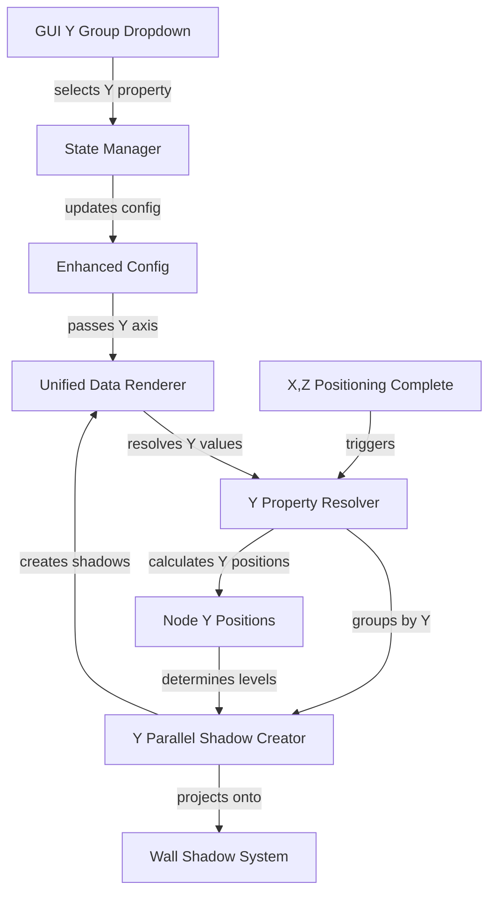

# Vertical Swimlanes Specification

## Summary

Add vertical swimlanes to the 3D visualization system to utilize the Y dimension for mapping a third data property. Currently, X and Z dimensions map to data properties while Y represents hierarchical layers. This feature will repurpose Y to map to a third property similar to how X and Z parallel swimlanes work, creating floating transparent shadow blocks at different Y levels.

## Requirements

1. ✅ R1: Repurpose Y dimension from hierarchical layers to property-based positioning
2. ✅ R2: Use the Y group dropdown value from GUI to determine vertical positioning
3. ✅ R3: Create Y-parallel shadow blocks (70% transparent) that float at each Y level
4. ⬛ R4: Shadow blocks should have the same X,Z footprint as their group shadow
5. ✅ R5: Apply Y positioning after X,Z positioning is complete
6. ⬛ R6: Add swimlane shadows on the vertical walls (partially implemented with old yAxisConfig)
7. ✅ R7: Maintain visual consistency with existing X and Z parallel swimlanes

## Task List

1. ✅ T1: Connect Y Group Dropdown to Data Flow
   1. ✅ T1.1: Update GUI state manager to track Y axis property
   2. ✅ T1.2: Pass Y axis property through config to renderer
   3. ✅ T1.3: Update axis mapping interface to include yAxis property

2. ✅ T2: Implement Y Property-Based Positioning
   1. ✅ T2.1: Create Y property resolver similar to X/Z resolvers (uses existing property resolver)
   2. ✅ T2.2: Calculate Y positions based on property values
   3. ✅ T2.3: Group nodes by Y property value
   4. ✅ T2.4: Apply Y positioning after X,Z positioning

3. ✅ T3: Create Y-Parallel Shadow Blocks
   1. ✅ T3.1: Create YParallelShadowCreator module
   2. ⬛ T3.2: Calculate shadow block dimensions from group footprint (currently uses fixed dimensions)
   3. ✅ T3.3: Create floating shadow blocks at each Y level
   4. ✅ T3.4: Apply 70% transparency to Y shadow blocks

4. ⬛ T4: Add Swimlane Shadows on Walls
   1. ⬛ T4.1: Extend wall shadow system to support Y-based shadows (needs update to use axisMapping)
   2. ⬛ T4.2: Project Y swimlanes onto vertical walls
   3. ⬛ T4.3: Add labels to wall shadows for Y property values

5. ✅ T5: Integration and Testing
   1. ✅ T5.1: Update renderer to create Y-parallel shadows
   2. ✅ T5.2: Ensure proper rendering order
   3. ⬛ T5.3: Test with various Y property selections
   4. ⬛ T5.4: Verify visual alignment with X,Z swimlanes

## Risks

- Risk 1: Y-based positioning may conflict with existing layer-based Y positioning - Mitigation: Completely replace layer system with property-based system
- Risk 2: Floating shadow blocks may obscure node visibility - Mitigation: Use 70% transparency and careful positioning
- Risk 3: Performance impact from additional shadow blocks - Mitigation: Optimize shadow creation and reuse instances where possible

## Decision Points

- Decision 1: Use property-based Y positioning instead of hierarchical layers to maintain consistency with X,Z dimensions
- Decision 2: 70% transparency chosen to balance visibility and visual hierarchy
- Decision 3: Create Y shadows after X,Z positioning to ensure proper spatial relationships

## ASCII Representation of GUI

```
┌─────────────────────────────┐
│ Spatial Grouping            │
├─────────────────────────────┤
│ X group:    [component    ▼]│
│ Z group:    [apiPattern   ▼]│
│ Y group:    [language     ▼]│
├─────────────────────────────┤
│                             │
│ Visual Customization        │
├─────────────────────────────┤
│ background: [httpMethod   ▼]│
│ border:     [none         ▼]│
└─────────────────────────────┘
```

## File and Function Structure

```
src/
├── client/
│   └── services/
│       └── configGui/
│           └── stateManager.ts
│               └── updateYAxisProperty()
├── shared/
│   ├── interfaces/
│   │   └── enhancedGenerator.interface.ts
│   │       └── AxisMapping (add yAxis)
│   └── modules/
│       └── renderers/
│           ├── blocks/
│           │   └── yParallelShadowCreator.ts
│           │       ├── createYParallelShadowBlock()
│           │       └── calculateYGroupBounds()
│           ├── unifiedDataRenderer/
│           │   └── unifiedDataRenderer.ts
│           │       └── createYParallelShadows()
│           └── verticalWallCreator.ts
│               └── createYSwimlaneWallShadows()
```

## Flowchart

