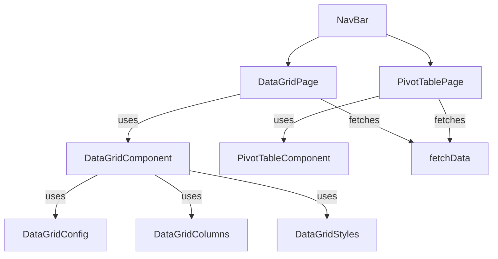

# 001-createNextJsDataViewer-002

## Summary

Develop a Next.js application to view and analyze database records. The app should use Tailwind CSS for styling (applied via JavaScript objects), and include two main pages:

1. **Data Grid Page**: Displays records in an advanced data grid using Material-UI.
2. **Pivot Table Page**: Allows users to analyze data using a pivot table library.

---

## Requirements

R1. The app must be a Next.js project.
R2. Use Tailwind CSS for styling, applied via JS objects.
R3. Include a Data Grid Page (`/data-grid`) using MUI's advanced data grid.
R4. Data Grid Page must show N records from each type, with columns for all properties.
R5. Data Grid must support sort and filter for each column.
R6. Data Grid config, columns, and style must be in separate files.
R7. Include a Pivot Table Page (`/pivot-table`) using a pivot table library.
R8. Pivot Table must allow drag-and-drop, aggregation, and grouping.
R9. Navigation bar to switch between pages, styled with Tailwind via JS objects.

---

## Task List

1. ⬛ Initialize Next.js project and install dependencies
2. ⬛ Configure Tailwind CSS for Next.js and JS object usage
3. ⬛ Scaffold `/data-grid` page with MUI Data Grid
4. ⬛ Create separate files for grid config, columns, and styles
5. ⬛ Implement sort and filter for each column
6. ⬛ Scaffold `/pivot-table` page with pivot table library
7. ⬛ Implement drag-and-drop, aggregation, and grouping in pivot table
8. ⬛ Add navigation bar with Tailwind styling via JS objects

---

## Risks

- Risk: Integrating Tailwind with MUI and JS object styles may require custom solutions.
- Risk: Pivot table library may have limited support for Tailwind or Next.js.

---

## Decision Points

- Decision: Use MUI Data Grid for advanced grid features.
- Decision: Use `react-pivottable` for pivot table functionality.

---

## File and Function Structure

nextjs-data-viewer/
├── pages/
│ ├── data-grid.tsx
│ ├── pivot-table.tsx
│ └── \_app.tsx
├── components/
│ ├── DataGrid/
│ │ ├── DataGridConfig.ts
│ │ ├── DataGridColumns.ts
│ │ └── DataGridStyles.ts
│ └── NavBar.tsx
├── styles/
│ └── tailwind.config.js
├── lib/
│ └── fetchData.ts
└── package.json

---

## Flowchart



---

## Sample Objects

```javascript
// Example record
{
  id: 1,
  type: "User",
  name: "Alice",
  email: "alice@example.com",
  team: "Red"
}
```

---

## Example Code

```javascript
// DataGridStyles.ts
export const styles = {
  container: "p-4 bg-white rounded shadow",
  header: "font-bold text-lg mb-2",
};
```
