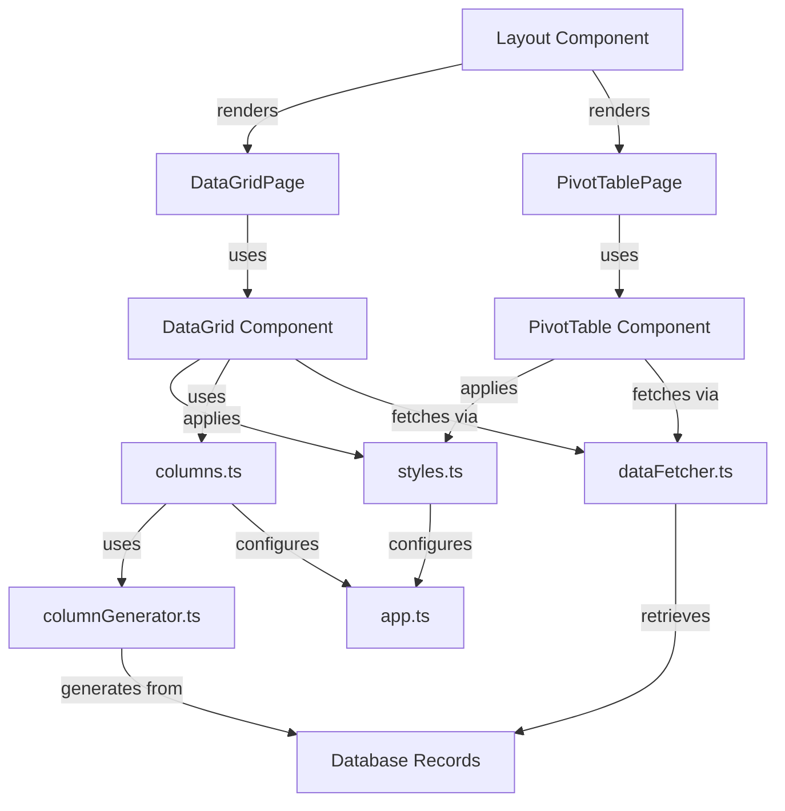

# Next.js Database Records Viewer Specification

## Summary

Create a Next.js application to view database records with comprehensive data visualization capabilities. The application will display database records through two distinct interfaces: a data grid for detailed record viewing and a pivot table for analytical insights. The design prioritizes simplicity and concept validation with minimal complexity.

## Requirements

1. ⬛ Data Visualization Requirements

   1. ⬛ R1: Application must display database records in a data grid format
   2. ⬛ R2: Application must provide pivot table view for analytical insights
   3. ⬛ R3: Data grid must accommodate all record types with unified column structure
   4. ⬛ R4: Application must support sorting and filtering on all columns

2. ⬛ Technical Requirements

   1. ⬛ R5: Application must be built using Next.js framework
   2. ⬛ R6: Styling must use Tailwind CSS applied through JavaScript objects
   3. ⬛ R7: Data grid must use MUI's Advanced Data Grid component
   4. ⬛ R8: Pivot table must use a dedicated pivot table library

3. ⬛ Architecture Requirements
   1. ⬛ R9: Application must have separate files for styles, configuration, and columns
   2. ⬛ R10: Application must consist of exactly 2 pages (Data Grid and Pivot Table)
   3. ⬛ R11: Code must follow DRY principles with reusable components

## Task List

1. ⬛ Project Setup

   1. ⬛ T1: Initialize Next.js project with TypeScript
   2. ⬛ T2: Install and configure Tailwind CSS
   3. ⬛ T3: Install MUI Advanced Data Grid
   4. ⬛ T4: Install pivot table library (react-pivottable)
   5. ⬛ T5: Setup project structure with separate config files

2. ⬛ Data Layer Implementation

   1. ⬛ T6: Create data types and interfaces for database records
   2. ⬛ T7: Implement data fetching utilities
   3. ⬛ T8: Create unified column schema for all record types
   4. ⬛ T9: Implement data transformation utilities

3. ⬛ Configuration Files

   1. ⬛ T10: Create styles configuration file with Tailwind objects
   2. ⬛ T11: Create columns configuration file for data grid
   3. ⬛ T12: Create application configuration file

4. ⬛ Data Grid Page

   1. ⬛ T13: Create data grid page component
   2. ⬛ T14: Implement MUI Advanced Data Grid integration
   3. ⬛ T15: Add column sorting functionality
   4. ⬛ T16: Add column filtering functionality
   5. ⬛ T17: Apply Tailwind styles through JavaScript objects

5. ⬛ Pivot Table Page

   1. ⬛ T18: Create pivot table page component
   2. ⬛ T19: Integrate pivot table library
   3. ⬛ T20: Configure pivot table with database records
   4. ⬛ T21: Apply consistent styling with data grid page

6. ⬛ Navigation and Layout
   1. ⬛ T22: Create main layout component
   2. ⬛ T23: Implement navigation between pages
   3. ⬛ T24: Add responsive design considerations

## Risks

- Risk 1: Column alignment issues when displaying heterogeneous record types with different properties - Mitigation: Create comprehensive column schema that accommodates all possible properties
- Risk 2: Performance degradation with large datasets in data grid - Mitigation: Implement pagination and virtualization features of MUI Advanced Data Grid
- Risk 3: Styling conflicts between Tailwind CSS and MUI components - Mitigation: Use Tailwind through JavaScript objects to maintain specificity control

## Decision Points

- Decision 1: Selected MUI Advanced Data Grid over basic data grid for enhanced sorting, filtering, and performance capabilities
- Decision 2: Chose react-pivottable library for pivot table functionality due to React compatibility and feature completeness
- Decision 3: Applied Tailwind styles through JavaScript objects to maintain component-level style encapsulation and avoid CSS conflicts

## File and Function Structure

```
src/
├── pages/
│   ├── index.tsx
│   │   └── DataGridPage()
│   ├── pivot.tsx
│   │   └── PivotTablePage()
│   └── _app.tsx
├── components/
│   ├── Layout.tsx
│   │   └── Layout()
│   ├── DataGrid.tsx
│   │   └── DataGrid()
│   │   └── setupColumns()
│   │   └── handleSort()
│   │   └── handleFilter()
│   └── PivotTable.tsx
│       └── PivotTable()
│       └── transformDataForPivot()
├── config/
│   ├── styles.ts
│   │   └── dataGridStyles
│   │   └── pivotTableStyles
│   │   └── layoutStyles
│   ├── columns.ts
│   │   └── columnDefinitions
│   │   └── generateUnifiedColumns()
│   └── app.ts
│       └── appConfig
│       └── dataSourceConfig
├── utils/
│   ├── dataFetcher.ts
│   │   └── fetchDatabaseRecords()
│   │   └── transformRecords()
│   └── columnGenerator.ts
│       └── generateColumnsFromData()
│       └── mergeColumnSchemas()
└── types/
    ├── database.ts
    └── components.ts
```

## Flowchart



## Sample Objects

```javascript
// Database Record Sample
const sampleDatabaseRecord = {
  id: "entity_001",
  type: "component",
  name: "UserAuthComponent",
  description: "Handles user authentication",
  createdAt: "2024-01-15T10:30:00Z",
  tags: ["auth", "security", "user"],
  metadata: {
    version: "1.2.0",
    maintainer: "team-security",
  },
};

// Column Configuration Sample
const sampleColumnConfig = {
  field: "name",
  headerName: "Name",
  width: 200,
  sortable: true,
  filterable: true,
  type: "string",
  renderCell: (params) => <div style={styles.cellContent}>{params.value}</div>,
};

// Style Configuration Sample
const sampleStyleConfig = {
  dataGrid: {
    height: "600px",
    width: "100%",
    backgroundColor: "rgb(255, 255, 255)",
    border: "1px solid rgb(229, 231, 235)",
    borderRadius: "0.5rem",
  },
  header: {
    backgroundColor: "rgb(249, 250, 251)",
    fontWeight: "600",
    color: "rgb(55, 65, 81)",
  },
};
```

## Example Code

```javascript
// DataGrid Component Implementation
function DataGrid({ data, columns, styles }) {
  const handleSortModelChange = (model) => {
    // Sort functionality implementation
  };

  const handleFilterModelChange = (model) => {
    // Filter functionality implementation
  };

  return (
    <div style={styles.container}>
      <DataGridPro
        rows={data}
        columns={columns}
        style={styles.dataGrid}
        onSortModelChange={handleSortModelChange}
        onFilterModelChange={handleFilterModelChange}
        pagination
        pageSize={100}
      />
    </div>
  );
}

// Column Generation Utility
function generateUnifiedColumns(records) {
  const allKeys = new Set();
  records.forEach((record) => {
    Object.keys(record).forEach((key) => allKeys.add(key));
  });

  return Array.from(allKeys).map((key) => ({
    field: key,
    headerName: key.charAt(0).toUpperCase() + key.slice(1),
    width: 150,
    sortable: true,
    filterable: true,
  }));
}
```
