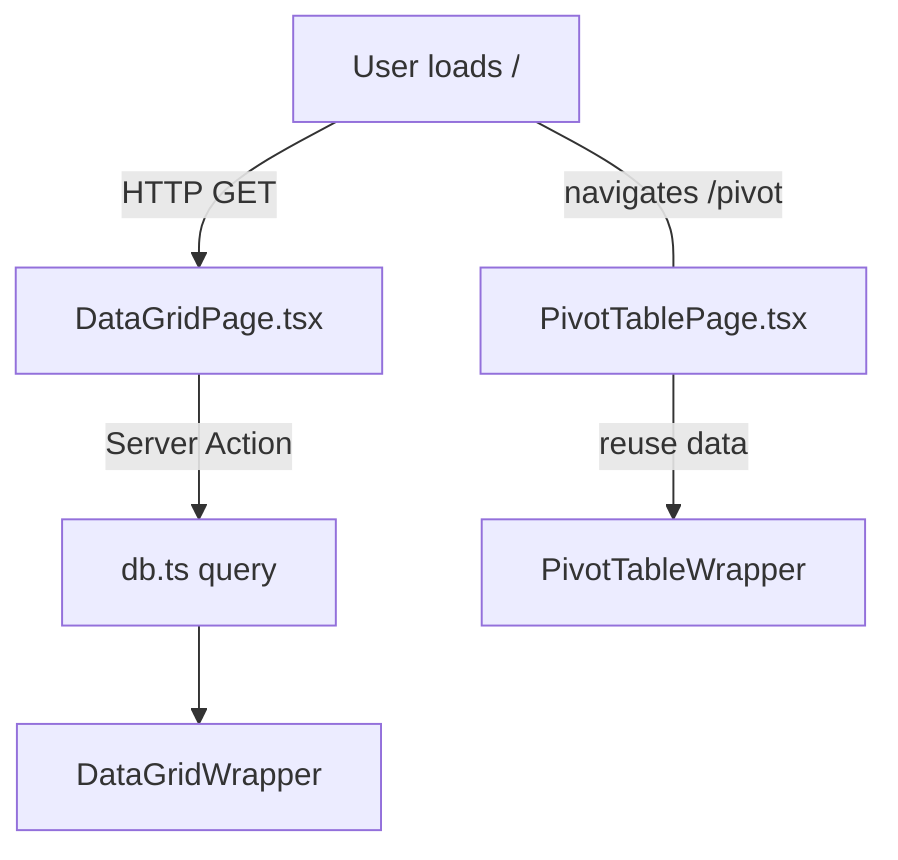

<!-- filename: 001-createNextJsDataViewer-003.md -->

# Next.js Data Viewer Specification

## Summary

A Next.js 14 application that renders database records in a unified MUI Data Grid and an interactive pivot table. TailwindCSS is used with JS‑object style mappings. The goal is to demonstrate multi‑type record visualization with runtime column generation and column‑level sort/filter while keeping the codebase minimal and concept‑focused.

## Core Principles

1. ⬛ Simplicity over completeness
2. ⬛ Include only features necessary to prove the concept
3. ⬛ No mock data – connect to a real database
4. ⬛ Minimal error handling
5. ⬛ No tests

## Requirements

1. ⬛ Functional

   1. ⬛ **R1** – Build with Next.js 14 and TypeScript.
   2. ⬛ **R2** – Integrate TailwindCSS; apply styles through exported JS objects.
   3. ⬛ **R3** – Provide two pages:
      • `/` Data Grid page
      • `/pivot` Pivot Table page
   4. ⬛ **R4** – Data Grid page displays _N_ records from each entity type in one grid.
   5. ⬛ **R5** – Grid columns are dynamically generated at runtime by analyzing all record properties; missing values display "—".
   6. ⬛ **R6** – Column definitions include automatic type detection (string, number, date, boolean) and appropriate renderers.
   7. ⬛ **R7** – Use **@mui/x-data-grid-pro** (Advanced Data Grid) with column sort & filter.
   8. ⬛ **R8** – Separate Data Grid **styles.ts**, **config.ts**, **columns.ts** modules.
   9. ⬛ **R9** – Pivot Table page uses **react‑pivottable** to visualise the same dataset.
   10. ⬛ **R10** – Connect to PostgreSQL via `@vercel/postgres` (or Supabase) – no mocks.

2. ⬛ Non‑Functional

   1. ⬛ **R11** – First contentful paint ≤ 2 s on localhost dev build.
   2. ⬛ **R12** – Use ESLint Airbnb + Prettier; CI not required.
   3. ⬛ **R13** – All code in a single monorepo; no separate packages.

## Task List

2. ⬛ Tasks

   1. ✅ **T1** – Initialise `next-app` with TypeScript template.
   2. ✅ **T2** – Install dependencies: Tailwind, @mui/x-data-grid, react‑pivottable, clsx, better-sqlite3.
   3. ✅ **T3** – Configure Tailwind and create `styles/theme.ts` exporting JS style objects.
   4. ✅ **T4** – Implement `/app/layout.tsx` with navbar links to pages.
   5. ✅ **T5** – Implement `pages/index.tsx` (DataGridPage) with Table001 component.
   6. ✅ **T6** – Create `src/components/Table001Basic/columns.ts` to build dynamic column definitions with type detection.
   7. ✅ **T7** – Create `src/components/Table001Basic/config.ts` for grid options (pagination, density, filter).
   8. ✅ **T8** – Create `src/components/Table001Basic/styles.ts` exporting Tailwind‑based style object.
   9. ✅ **T9** – Fetch Persons data from SQLite database
      1. ✅ Create API route (`/api/persons`)
      2. ✅ Create front end data service (`personService.ts`)
      3. ✅ Create useState in Table001 component
      4. ✅ Implement SQLite database query (`src/lib/db.ts`)
      5. ✅ Console log real data throughout data flow
   10. ✅ **T10** – Validate runtime column generation logic with live DB data.
   11. ✅ **T11** – Create a new table in the datagrid page for Team data
       1. ✅ Create a new route with dummy data
       2. ✅ Create a new service
       3. ✅ Create a new useState
       4. ✅ Create a new folder and component with the same structure as Table001
          1. folder name = Table002Teams
          2. component name Table002

## Risks

- **Dynamic column explosion** for datasets with many properties; mitigate with virtualised grid and horizontal scroll.
- **License cost** of MUI Data Grid Pro; consider community plan for proof‑of‑concept.
- **Pivot performance** on large datasets; may require server‑side aggregation.

## Decision Points

- **Routing paradigm** – App Router vs Pages Router → choose App Router for modern server components.
- **Pivot library** – `react‑pivottable` vs `@mui/x-data-grid-pivot` → select `react‑pivottable` (free & lightweight).
- **Database provider** – Vercel Postgres vs Supabase → TBD after infra discussion.

## File & Function Structure

```
/app
├── layout.tsx               # navigation & Tailwind base
├── page.tsx                 # Data Grid page (alias to data‑grid)
├── pivot/page.tsx           # Pivot Table page
/src
├── datagrid/
│   ├── columns.ts           # generate MUI column defs
│   ├── config.ts            # grid options & default states
│   └── styles.ts            # JS style objects (Tailwind classes)
├── components/
│   ├── DataGridWrapper.tsx
│   └── PivotTableWrapper.tsx
├── lib/
│   ├── db.ts                # PostgreSQL client & queries
│   └── dataAdapter.ts       # transforms raw DB rows
/styles
└── globals.css
tailwind.config.js
next.config.js
package.json
```

## Flowchart



## Sample Objects

```json
{
  "id": "uuid",
  "type": "invoice",
  "customer": "ACME Corp",
  "amount": 1234.56,
  "status": "paid",
  "created_at": "2025-07-01T08:00:00Z"
}
```

## Example Code

```typescript
// src/datagrid/columns.ts
import { GridColDef } from "@mui/x-data-grid-pro";

const detectColumnType = (key: string, values: unknown[]) => {
  const nonNullValues = values.filter((v) => v != null);
  if (nonNullValues.length === 0) return "string";

  const sample = nonNullValues[0];
  if (typeof sample === "number") return "number";
  if (typeof sample === "boolean") return "boolean";
  if (sample instanceof Date || /^\d{4}-\d{2}-\d{2}/.test(String(sample)))
    return "date";
  return "string";
};

export const buildColumns = (rows: Record<string, unknown>[]): GridColDef[] => {
  const keys = Array.from(new Set(rows.flatMap((r) => Object.keys(r))));

  return keys.map<GridColDef>((key) => {
    const values = rows.map((r) => r[key]);
    const type = detectColumnType(key, values);

    return {
      field: key,
      headerName: key.replace(/_/g, " ").toUpperCase(),
      flex: 1,
      sortable: true,
      filterable: true,
      type,
      valueGetter: (params) => params.row[key] ?? "—",
    };
  });
};
```
