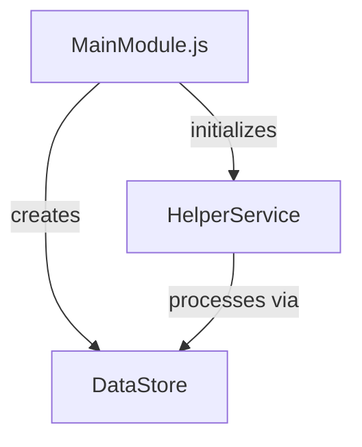

# Feature Specification Building Instructions

Use these outline conventions when creating the doc

```
1. ⬛ Cat Breeds

   1. ✅ Long-haired Cats
      1. ⬛ Persian
      2. ⬛ Maine Coon
      3. ⬛ Ragdoll
   2. ⬛ Short-haired Cats
      1. ⬛ Siamese
      2. ⬛ Russian Blue
      3. ⬛ British Shorthair

2. ⬛ Cat Behavior
```

## Provide a section summarizing the purpose of the feature or plan

## Core Principles

1. The design should:
   1.1. Be as simple as possible
   1.2. Include only the features necessary to prove the concept
   1.3. No mock data
   1.4. Minimal error handling
   1.5. No tests

## Required Elements

Organize the doc into these sections, in this order:

1. Summary
2. Requirements
   1.1. Each should have a unique number (R1, R2, etc.)
   1.2. Include References section if needed
3. Task List. Each task described with:
   2.1. Line item
   2.2. Unique number
   2.3. Unchecked checkbox icon
   2.4. read this doc and follow the conventions: 001-outline-conventions.md
4. List of risks (if any)
5. List of decision points (if any)
6. Text based file/function tree
7. A mermaid flowchart
8. Sample objects
9. Example code

## Example Format

# Feature Name Specification

## Requirements

1. ⬛ Requirements
   1. ⬛ The feature should accomplish X
   2. ⬛ The feature should integrate with Y
   3. ⬛ The feature should respond within Z milliseconds

## Task List

2. ⬛ Task List
   1. ⬛ First task description
   2. ⬛ Second task description
   3. ⬛ Third task description

## Risks

- Risk 1: Description of potential risk and mitigation strategy
- Risk 2: Description of another potential risk

## Decision Points

- Decision 1: Choice made between X and Y approaches because of Z
- Decision 2: Selected technology A over B because of C requirements

## File and Function Structure

src/
├── featureName/
│ ├── featureName.js
│ │ └── function1()
│ │ └── function2()
│ ├── helperModule.js
│ │ └── helperFunction1()
│ │ └── helperFunction2()

## Flowchart



## Sample Objects

```javascript
// Sample object structure
const sampleObject = {
  property1: "value1",
  property2: 123,
  nestedProperty: {
    subProperty: true,
  },
};
```

## Example Code

```javascript
function mainFunction() {
  // Implementation example
}
```
