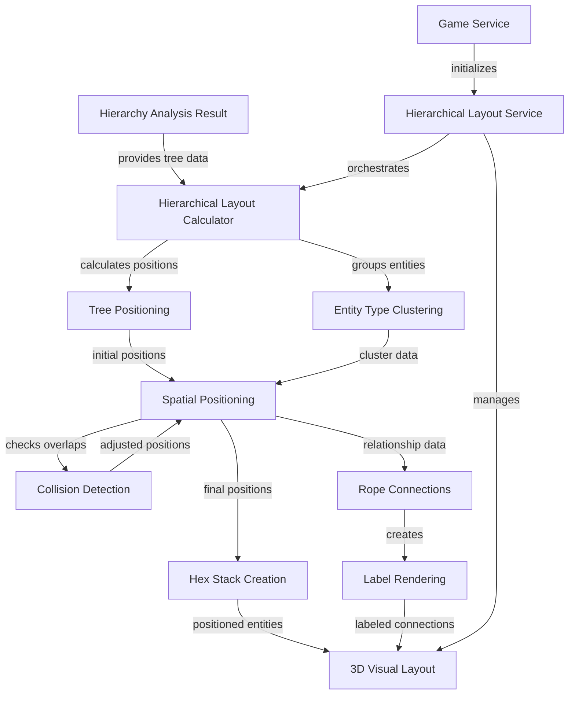

# Hierarchical Graph Layout Specification

## Summary

Create a 3D spatial layout system in Roblox that organizes entities geometrically to reflect their hierarchical connections. The system will use existing visual components (hexes, hex stacks, and ropes) to create an intuitive graph visualization where the physical positioning of entities represents their logical relationships. Parent entities will be positioned above their children, and related entity types will be clustered together to provide clear visual groupings of the hierarchical structure.

## Requirements

1. ⬛ Spatial Layout Requirements

   1. ⬛ R1: The system shall position parent entities above their children in 3D space
   2. ⬛ R2: The system shall cluster related entity types in close proximity
   3. ⬛ R3: The system shall maintain visual separation between different hierarchy trees
   4. ⬛ R4: The system shall exclude orphaned entities from the initial layout

2. ⬛ Visual Component Integration

   1. ⬛ R5: The system shall use existing hex stack components for entity representation
   2. ⬛ R6: The system shall use existing rope components for relationship visualization
   3. ⬛ R7: The system shall maintain existing label rendering on relationship ropes
   4. ⬛ R8: The system shall preserve existing color coding and visual properties

3. ⬛ Layout Algorithm Requirements
   1. ⬛ R9: The system shall calculate positions based on hierarchy analysis results
   2. ⬛ R10: The system shall scale layout dimensions based on tree size and depth
   3. ⬛ R11: The system shall prevent entity overlap through collision detection
   4. ⬛ R12: The system shall center each hierarchy tree around its root entity

## Task List

2. ⬛ Implementation Tasks
   1. ⬛ T1: Create hierarchical layout calculator module
   2. ⬛ T2: Implement tree-based positioning algorithm
   3. ⬛ T3: Create spatial clustering logic for entity types
   4. ⬛ T4: Implement collision avoidance system
   5. ⬛ T5: Create layout service for managing positioned entities
   6. ⬛ T6: Integrate hierarchy analysis results with layout system
   7. ⬛ T7: Update GameService to use hierarchical layout instead of ring layout
   8. ⬛ T8: Implement dynamic spacing based on tree depth and size
   9. ⬛ T9: Create rope connections between hierarchically related entities
   10. ⬛ T10: Test and validate layout with real entity data

## Risks

- **Risk 1: Performance Impact** - Large hierarchy trees may cause performance issues with many 3D objects. Mitigation: Implement level-of-detail system and entity culling for distant objects.
- **Risk 2: Visual Overlap** - Complex hierarchies might create overlapping entities despite collision detection. Mitigation: Implement dynamic spacing adjustment and tree pruning for display.
- **Risk 3: Navigation Complexity** - Deep hierarchies may be difficult to navigate in 3D space. Mitigation: Implement camera controls and tree expansion/collapse features.

## Decision Points

- **Decision 1: Vertical vs Horizontal Layout** - Selected vertical hierarchy (parent above child) over horizontal layout because it matches traditional organizational charts and provides better use of vertical space in Roblox.
- **Decision 2: Tree Separation Strategy** - Chose spatial separation between trees over color-only differentiation to provide clearer visual boundaries between independent hierarchies.
- **Decision 3: Entity Type Clustering** - Selected proximity-based clustering over strict tree structure to maintain logical groupings while preserving hierarchical relationships.

## File and Function Structure

```
src/
├── shared/
│   └── modules/
│       ├── hierarchicalLayoutCalculator.ts
│       │   ├── calculateTreeLayout()
│       │   ├── calculateEntityPosition()
│       │   ├── clusterEntityTypes()
│       │   └── detectCollisions()
│       ├── spatialPositioning.ts
│       │   ├── positionHierarchyTree()
│       │   ├── calculateTreeBounds()
│       │   └── adjustForCollisions()
│       └── layoutConstants.ts
│           ├── TREE_SPACING
│           ├── LEVEL_HEIGHT
│           └── CLUSTER_RADIUS
└── server/
    └── services/
        ├── hierarchicalLayout.service.ts
        │   ├── createHierarchicalLayout()
        │   ├── positionEntitiesInSpace()
        │   ├── createHierarchicalConnectors()
        │   └── updateLayout()
        └── game.service.ts (updated)
            └── createHierarchicalEntityLayout()
```

## Flowchart



## Sample Objects

```typescript
// Hierarchy tree layout configuration
const treeLayoutConfig = {
  treeId: "tree-001",
  rootPosition: [0, 50, 0],
  levelHeight: 15,
  branchSpread: 25,
  maxWidth: 100,
  entitySpacing: 8,
};

// Entity position calculation result
const entityPosition = {
  guid: "entity-123",
  position: [10, 35, -5],
  level: 2,
  treeIndex: 0,
  clusterGroup: "services",
  visualProps: {
    color: [0.2, 0.7, 0.9],
    scale: 1.0,
    highlighted: false,
  },
};

// Layout calculation result
const layoutResult = {
  trees: [
    {
      treeId: "main-app",
      rootEntity: "app-001",
      totalEntities: 23,
      boundingBox: {
        min: [-50, 0, -30],
        max: [50, 60, 30],
      },
      entityPositions: [
        /* EntityPosition[] */
      ],
      connections: [
        /* ConnectionData[] */
      ],
    },
  ],
  totalBounds: {
    min: [-150, 0, -100],
    max: [150, 80, 100],
  },
  orphanedEntities: [
    /* excluded for now */
  ],
};
```

## Example Code

```typescript
// Main layout calculation function
function calculateHierarchicalLayout(
  hierarchyResult: HierarchyAnalysisResult
): LayoutResult {
  const layoutResult: LayoutResult = {
    trees: [],
    totalBounds: { min: [0, 0, 0], max: [0, 0, 0] },
    orphanedEntities: [],
  };

  // Position each hierarchy tree
  hierarchyResult.trees.forEach((tree, index) => {
    const treeLayout = calculateTreeLayout(tree, index);
    const clusteredLayout = clusterEntityTypes(treeLayout);
    const finalLayout = adjustForCollisions(clusteredLayout);

    layoutResult.trees.push(finalLayout);
  });

  // Calculate overall bounds
  layoutResult.totalBounds = calculateOverallBounds(layoutResult.trees);

  return layoutResult;
}

// Tree positioning algorithm
function calculateTreeLayout(
  tree: HierarchyTree,
  treeIndex: number
): TreeLayout {
  const basePosition = calculateTreeBasePosition(treeIndex);
  const positions: EntityPosition[] = [];

  // Traverse tree and assign positions
  traverseTreeForPositioning(
    tree.rootGuid,
    tree.nodes,
    basePosition,
    0,
    positions
  );

  return {
    treeId: tree.rootGuid,
    entityPositions: positions,
    connections: extractConnections(tree.nodes),
  };
}

// Entity positioning within tree
function positionEntityInTree(
  guid: string,
  level: number,
  branchIndex: number,
  basePosition: [number, number, number]
): [number, number, number] {
  const x = basePosition[0] + branchIndex * ENTITY_SPACING;
  const y = basePosition[1] - level * LEVEL_HEIGHT;
  const z = basePosition[2] + Math.random() * CLUSTER_VARIATION;

  return [x, y, z];
}
```
