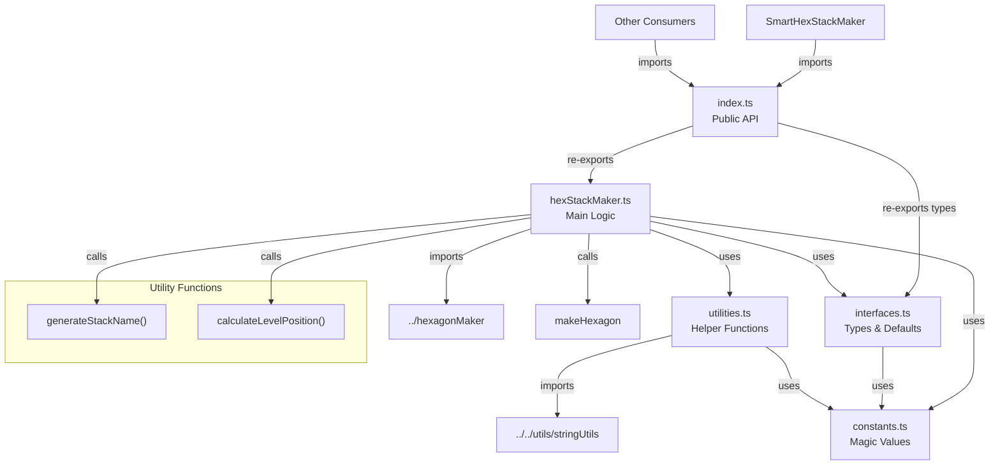

# HexStackMaker Module Restructure Specification

## Summary

This plan outlines the restructuring of the `hexStackMaker.ts` module to match the organized folder structure pattern established by `labelBlockMaker`, `barMaker`, and `hexagonMaker`. The current hexStackMaker is a single file with ~83 lines containing interfaces, utility functions, color constants, and the main stack creation logic. This restructure will improve maintainability, consistency, and modularity across the codebase.

## Requirements

1. ⬛ R1: Match the folder structure pattern established by other modules
2. ⬛ R2: Maintain backward compatibility - external imports must continue to work
3. ⬛ R3: Extract constants into a dedicated constants file
4. ⬛ R4: Separate interfaces and type definitions into interfaces.ts
5. ⬛ R5: Move utility functions to utilities.ts
6. ⬛ R6: Keep main hex stack creation logic in hexStackMaker.ts
7. ⬛ R7: Create an index.ts for clean public API
8. ⬛ R8: Remove duplicate padNumber function and use shared utility

## Task List

1. ⬛ T1: Create folder structure
   1. ⬛ T1.1: Create `src/shared/modules/hexStackMaker/` directory
   2. ⬛ T1.2: Move current `hexStackMaker.ts` into the new folder temporarily

2. ⬛ T2: Extract interfaces and types
   1. ⬛ T2.1: Create `interfaces.ts` file
   2. ⬛ T2.2: Move `HexStackConfig` interface
   3. ⬛ T2.3: Add default configuration values to interfaces.ts

3. ⬛ T3: Create constants file
   1. ⬛ T3.1: Create `constants.ts` file
   2. ⬛ T3.2: Extract magic numbers and values:
      - Default center position `[0, 2, 0]`
      - Default width (10)
      - Default height (0.5)
      - Default count (4)
      - Default color palette (8 colors)
      - Name prefix ("st")
      - Pad length (3)

4. ⬛ T4: Extract utility functions
   1. ⬛ T4.1: Create `utilities.ts` file
   2. ⬛ T4.2: Move `generateStackName` function
   3. ⬛ T4.3: Remove duplicate `padNumber` function
   4. ⬛ T4.4: Import padNumber from shared utils
   5. ⬛ T4.5: Create `calculateLevelPosition` function

5. ⬛ T5: Clean up main hexStackMaker.ts
   1. ⬛ T5.1: Remove moved interfaces and types
   2. ⬛ T5.2: Remove moved utility functions
   3. ⬛ T5.3: Add imports from new files
   4. ⬛ T5.4: Refactor main function to use extracted utilities
   5. ⬛ T5.5: Keep only the main `makeHexStack` function

6. ⬛ T6: Create index.ts
   1. ⬛ T6.1: Create `index.ts` file
   2. ⬛ T6.2: Export `makeHexStack` from hexStackMaker.ts
   3. ⬛ T6.3: Export `HexStackConfig` type from interfaces.ts

7. ⬛ T7: Update external imports
   1. ⬛ T7.1: Find all files importing from hexStackMaker
   2. ⬛ T7.2: Verify imports still work (they should due to index.ts)
   3. ⬛ T7.3: Run build to ensure no breaking changes

8. ⬛ T8: Testing and validation
   1. ⬛ T8.1: Run `npm run build`
   2. ⬛ T8.2: Verify smartHexStackMaker still works (consumer)
   3. ⬛ T8.3: Check for any TypeScript errors
   4. ⬛ T8.4: Test in Roblox Studio to ensure hex stacks render correctly

## Risks

- Risk 1: Breaking existing imports - Mitigated by creating index.ts that maintains the same export interface
- Risk 2: Circular dependencies with hexagonMaker - Mitigated by careful import organization
- Risk 3: Type casting issues with id field - Need to properly handle string to number conversion

## Decision Points

- Decision 1: Remove duplicate padNumber function and use the shared utility from stringUtils
- Decision 2: Extract color palette as a constant rather than inline array
- Decision 3: Create calculateLevelPosition utility for cleaner position calculations
- Decision 4: Keep the type casting workaround for id field until proper fix is implemented

## File and Function Structure

```
src/shared/modules/hexStackMaker/
├── index.ts
│   └── export { makeHexStack }
│   └── export type { HexStackConfig }
├── hexStackMaker.ts
│   └── makeHexStack()
├── interfaces.ts
│   └── interface HexStackConfig
├── constants.ts
│   └── HEX_STACK_CONSTANTS object
└── utilities.ts
    └── generateStackName()
    └── calculateLevelPosition()
```

## Flowchart



## Sample Objects

```typescript
// HEX_STACK_CONSTANTS structure
const HEX_STACK_CONSTANTS = {
  // Default values
  DEFAULT_CENTER_POSITION: [0, 2, 0] as [number, number, number],
  DEFAULT_WIDTH: 10,
  DEFAULT_HEIGHT: 0.5,
  DEFAULT_COUNT: 4,
  
  // Color palette
  DEFAULT_COLOR_PALETTE: [
    [1, 0, 0],       // Red
    [0.8, 0.6, 0.2], // Golden
    [0, 1, 0],       // Green
    [0, 0, 1],       // Blue
    [0.5, 0, 0.5],   // Purple
    [1, 0.5, 0],     // Orange
    [0, 1, 1],       // Cyan
    [1, 0, 0.5],     // Pink
  ] as [number, number, number][],
  
  // Name formatting
  NAME_PREFIX: "st",
  PAD_LENGTH: 3
};

// Example HexStackConfig
const hexStackConfig: HexStackConfig = {
  id: 10,
  centerPosition: [5, 10, -5],
  width: 12,
  height: 0.8,
  count: 6,
  colors: [
    [1, 1, 0],     // Yellow
    [0, 0.5, 1],   // Sky blue
  ],
  stackIndex: 3
};
```

## Example Code

```typescript
// index.ts
export { makeHexStack } from "./hexStackMaker";
export type { HexStackConfig } from "./interfaces";

// Usage remains the same:
import { makeHexStack } from "../../shared/modules/hexStackMaker";

const hexStack = makeHexStack({
  id: 1,
  centerPosition: [0, 5, 0],
  width: 8,
  count: 5,
  stackIndex: 1
});

// utilities.ts example
import { padNumber } from "../../utils/stringUtils";
import { HEX_STACK_CONSTANTS } from "./constants";

export function generateStackName(stackIndex: number): string {
  const stackStr = padNumber(stackIndex, HEX_STACK_CONSTANTS.PAD_LENGTH);
  return `${HEX_STACK_CONSTANTS.NAME_PREFIX}${stackStr}`;
}

export function calculateLevelPosition(
  centerPosition: [number, number, number],
  level: number,
  height: number
): [number, number, number] {
  const levelY = centerPosition[1] + level * height;
  return [centerPosition[0], levelY, centerPosition[2]];
}
```