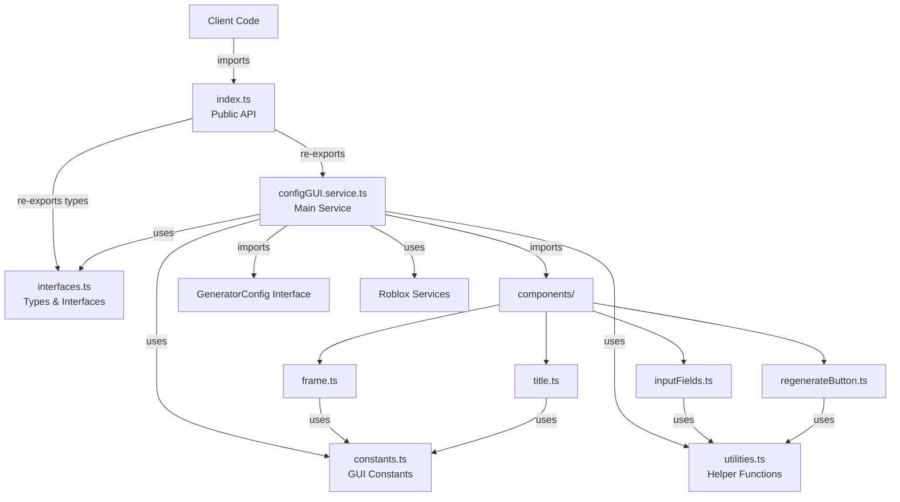

# ConfigGUI Service Module Restructure Specification

## Summary

This plan outlines the restructuring of the `configGUI.service.ts` module to match the organized folder structure pattern established by other modules. The current configGUI service is a single file with ~155 lines containing the main service class, GUI creation logic, validation methods, and event handlers. The service already has two helper modules (`createInputFields` and `createRegenerateButton`), making it partially modularized. This restructure will complete the modularization, improve maintainability, and establish consistency across the codebase.

## Requirements

1. ✅ R1: Match the folder structure pattern established by other modules
2. ✅ R2: Maintain backward compatibility - external imports must continue to work
3. ✅ R3: Extract constants into a dedicated constants file
4. ✅ R4: Separate interfaces and type definitions into interfaces.ts
5. ✅ R5: Move utility functions to utilities.ts
6. ✅ R6: Keep main service logic in configGUI.service.ts
7. ✅ R7: Create an index.ts for clean public API
8. ✅ R8: Consolidate all GUI component creation into a components subfolder

## Task List

1. ✅ T1: Analyze current structure
   1. ✅ T1.1: Identify all files in the configGui folder
   2. ✅ T1.2: Check for external dependencies on the service
   3. ✅ T1.3: Document existing modular structure

2. ✅ T2: Create enhanced folder structure
   1. ✅ T2.1: Keep existing `src/client/services/configGui/` directory
   2. ✅ T2.2: Create `components/` subfolder for GUI components
   3. ✅ T2.3: Move existing component files to components folder

3. ✅ T3: Extract interfaces and types
   1. ✅ T3.1: Create `interfaces.ts` file
   2. ✅ T3.2: Extract ConfigGUIService interface definition
   3. ✅ T3.3: Define component prop interfaces
   4. ✅ T3.4: Add GUI state interfaces

4. ✅ T4: Create constants file
   1. ✅ T4.1: Create `constants.ts` file
   2. ✅ T4.2: Extract magic numbers and values:
      - GUI dimensions (350x285)
      - Position offsets (10, 10)
      - Colors (background, text, error)
      - Font settings
      - Animation timings (0.2, 0.5)
      - Corner radius (8)
      - Title height (30)

5. ✅ T5: Extract utility functions
   1. ✅ T5.1: Create `utilities.ts` file
   2. ✅ T5.2: Move `validateAndUpdateInput` as standalone function
   3. ✅ T5.3: Create `flashColor` utility for visual feedback
   4. ✅ T5.4: Create `createUICorner` utility
   5. ✅ T5.5: Add input validation helpers

6. ✅ T6: Reorganize components
   1. ✅ T6.1: Move `createInputFields.ts` to `components/inputFields.ts`
   2. ✅ T6.2: Move `createRegenerateButton.ts` to `components/regenerateButton.ts`
   3. ✅ T6.3: Create `components/title.ts` for title creation
   4. ✅ T6.4: Create `components/frame.ts` for main frame creation
   5. ✅ T6.5: Update all import paths

7. ⬛ T7: Clean up main service file
   1. ✅ T7.1: Remove extracted methods
   2. ✅ T7.2: Add imports from new files
   3. ✅ T7.3: Refactor to use extracted utilities
   4. ✅ T7.4: Simplify constructor and methods

8. ⬛ T8: Create index.ts
   1. ✅ T8.1: Create `index.ts` file
   2. ✅ T8.2: Export `ConfigGUIService` from configGUI.service.ts
   3. ✅ T8.3: Export necessary types from interfaces.ts

9. ⬛ T9: Update external imports
   1. ✅ T9.1: Find all files importing ConfigGUIService
   2. ✅ T9.2: Update import paths if necessary
   3. ✅ T9.3: Verify imports still work

10. ⬛ T10: Testing and validation
    1. ✅ T10.1: Run `npm run build`
    2. ✅ T10.2: Test GUI creation in Roblox Studio
    3. ✅ T10.3: Verify all inputs work correctly
    4. ✅ T10.4: Test configuration changes trigger callbacks

## Risks

- Risk 1: Breaking existing imports - Mitigated by creating index.ts
- Risk 2: GUI functionality regression - Mitigated by thorough testing in Roblox Studio
- Risk 3: Component interdependencies - Mitigated by careful interface design

## Decision Points

- Decision 1: Keep components in a subfolder for better organization
- Decision 2: Extract all visual constants to make theming easier
- Decision 3: Create separate utilities for animation and validation
- Decision 4: Maintain the existing public API through index.ts

## File and Function Structure

```
src/client/services/configGui/
├── index.ts
│   └── export { ConfigGUIService }
│   └── export type { ConfigGUIServiceOptions }
├── configGUI.service.ts
│   └── class ConfigGUIService
├── interfaces.ts
│   └── interface ConfigGUIServiceOptions
│   └── interface GUIState
│   └── interface ComponentProps
├── constants.ts
│   └── GUI_CONSTANTS object
├── utilities.ts
│   └── validateInput()
│   └── flashColor()
│   └── createUICorner()
└── components/
    ├── frame.ts
    │   └── createMainFrame()
    ├── title.ts
    │   └── createTitle()
    ├── inputFields.ts
    │   └── createInputFields()
    └── regenerateButton.ts
        └── createRegenerateButton()
```

## Flowchart



## Sample Objects

```typescript
// GUI_CONSTANTS structure
const GUI_CONSTANTS = {
  // Dimensions
  FRAME: {
    WIDTH: 350,
    HEIGHT: 285,
    POSITION: { X: 10, Y: 10 },
    CORNER_RADIUS: 8
  },
  
  // Colors
  COLORS: {
    BACKGROUND: new Color3(0.2, 0.2, 0.2),
    TEXT: new Color3(1, 1, 1),
    ERROR: new Color3(1, 0.5, 0.5),
    SUCCESS: new Color3(0.1, 0.4, 0.1),
    BUTTON_HOVER: new Color3(0.1, 0.3, 0.5)
  },
  
  // Typography
  TYPOGRAPHY: {
    TITLE_FONT: Enum.Font.SourceSansBold,
    TITLE_HEIGHT: 30,
    INPUT_FONT: Enum.Font.SourceSans,
    BUTTON_FONT: Enum.Font.SourceSansSemibold
  },
  
  // Animation
  ANIMATION: {
    FLASH_DURATION: 0.5,
    BUTTON_FEEDBACK: 0.2,
    FADE_TIME: 0.3
  },
  
  // Component names
  NAMES: {
    SCREEN_GUI: "ConfigurationGUI",
    MAIN_FRAME: "ConfigFrame",
    TITLE: "Title",
    REGENERATE_BUTTON: "RegenerateButton"
  }
};

// Example interfaces
interface ConfigGUIServiceOptions {
  initialConfig: GeneratorConfig;
  onConfigChange?: (config: GeneratorConfig) => void;
  position?: UDim2;
  theme?: "dark" | "light";
}

interface GUIState {
  isVisible: boolean;
  isDragging: boolean;
  lastValidConfig: GeneratorConfig;
}
```

## Example Code

```typescript
// index.ts
export { ConfigGUIService } from "./configGUI.service";
export type { ConfigGUIServiceOptions } from "./interfaces";

// Usage remains similar:
import { ConfigGUIService } from "client/services/configGui";

const guiService = new ConfigGUIService(initialConfig);
guiService.createGUI((newConfig) => {
  print("Config changed:", newConfig);
});

// utilities.ts example
export function validateInput(
  value: string, 
  min: number, 
  max: number
): { isValid: boolean; value: number } {
  const numValue = tonumber(value);
  if (numValue !== undefined && numValue >= min && numValue <= max) {
    return { isValid: true, value: math.floor(numValue) };
  }
  return { isValid: false, value: min };
}

export function flashColor(
  element: GuiObject,
  flashColor: Color3,
  duration: number
): void {
  const originalColor = element.BackgroundColor3;
  element.BackgroundColor3 = flashColor;
  wait(duration);
  element.BackgroundColor3 = originalColor;
}
```