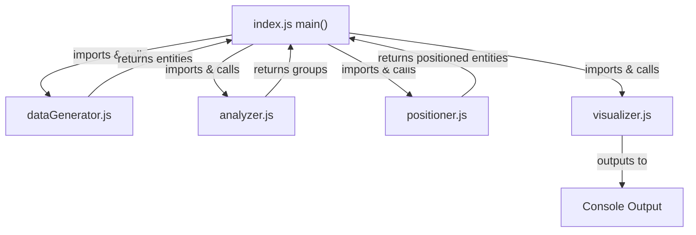

# Simple 2D Hierarchical Graph Console Demo Specification

## Summary

Create a minimal proof of concept that demonstrates hierarchical data analysis and 2D positioning as a Node.js console application. The system will generate fake hierarchical data, analyze it to identify connected groups, position these groups in 2D space, and display the results in table format in the console. This serves as the simplest possible validation of core hierarchical layout concepts.

## Requirements

1. ⬛ Data Generation Requirements
   1. ⬛ R1: The system shall generate fake hierarchical entities with parent-child relationships
   2. ⬛ R2: The system shall create 2 entity types ("Parent", "Child")
   3. ⬛ R3: The system shall generate 2-3 disconnected hierarchy trees
   4. ⬛ R4: The system shall ensure each tree has 2-3 levels of depth

2. ⬛ Analysis Requirements
   1. ⬛ R5: The system shall identify all connected components in the hierarchical data
   2. ⬛ R6: The system shall group entities by their connected relationships
   3. ⬛ R7: The system shall calculate basic metrics for each connected group

3. ⬛ Display Requirements
   1. ⬛ R8: The system shall position entities in 2D coordinates (x, y)
   2. ⬛ R9: The system shall display results in console table format
   3. ⬛ R10: The system shall show entity ID, type, position, and parent information
   4. ⬛ R11: The system shall run as a standalone Node.js script

4. ⬛ Project Structure Requirements
   1. ⬛ R12: The project shall be contained in a separate folder
   2. ⬛ R13: The project shall be broken into separate files to compartmentalize data, visualization, and analysis

5. ⬛ ASCII Output Requirements
   1. ✅ R14: The system shall save an ASCII rendering of the data map to a file
   2. ✅ R15: ASCII output files shall be saved in an output_data folder
   3. ✅ R16: Each output file shall be named using pattern: yyyy-mm-dd-seconds-stub.me

6. ⬛ Next.js Web Interface Requirements
   1. ⬛ R17: The project shall include a Next.js application component
   2. ⬛ R18: The system shall create a new page in the (pages) folder
   3. ⬛ R19: The page shall contain a test data config component with input form
   4. ⬛ R20: The config form shall include number of nodes input field
   5. ⬛ R21: The config form shall include number of connected chains input field
   6. ⬛ R22: The config form shall include depth of longest chain input field
   7. ⬛ R23: The config form shall include a submit button
   8. ⬛ R24: The page shall contain a TreeDisplay component showing results

## Task List

1. ⬛ Implementation Tasks
   1. ✅ T1: Create fake data generator that produces simple hierarchical entities
   2. ✅ T2: Implement basic connection analysis to identify separate trees
   3. ✅ T3: Create simple 2D positioning algorithm
   4. ✅ T4: Build console table display system
   5. ✅ T5: Create main Node.js script that runs the complete demo
   6. ✅ T6: Test with sample data and verify console output
   7. ✅ T7: Create ASCII rendering system for data map visualization
   8. ✅ T8: Implement file output system with timestamp naming
   9. ✅ T9: Run 3 tests to verify ASCII output functionality
   10. ⬛ T10: Create new page in Next.js (pages) folder
   11. ⬛ T11: Build test data config component with input form
   12. ⬛ T12: Implement TreeDisplay component for visualization
   13. ⬛ T13: Integrate hierarchy demo logic with Next.js frontend

## Risks

- Risk 1: Console table formatting may not display clearly for complex hierarchies

## Decision Points

- Decision 1: Use Node.js instead of Roblox for fastest prototyping
- Decision 2: Display in 2D instead of 3D to simplify positioning logic
- Decision 3: Use console.table() for immediate visual feedback

## File and Function Structure

```
hierarchy-demo/
├── package.json
├── index.js
│   └── main()
├── src/
│   ├── dataGenerator.js
│   │   └── generateFakeData()
│   │   └── createEntity()
│   ├── analyzer.js
│   │   └── findConnectedGroups()
│   │   └── calculateGroupMetrics()
│   ├── positioner.js
│   │   └── position2D()
│   │   └── calculatePosition()
│   └── visualizer.js
│       └── displayResults()
│       └── formatTable()
└── README.md
```

## Flowchart



## Sample Objects

```javascript
// Simple entity structure
const entity = {
    id: "entity_1",
    type: "Parent", // or "Child"
    parentId: null, // or parent ID
    children: ["child_1", "child_2"]
};

// Positioned entity for display
const positionedEntity = {
    id: "entity_1",
    type: "Parent",
    parentId: null,
    x: 0,
    y: 0,
    groupId: "group_1"
};
```

## Example Code

```javascript
// index.js
const { generateFakeData } = require('./src/dataGenerator');
const { findConnectedGroups } = require('./src/analyzer');
const { position2D } = require('./src/positioner');
const { displayResults } = require('./src/visualizer');

function main() {
    console.log("=== Hierarchical Graph 2D Demo ===\n");
    
    // Generate fake data
    const entities = generateFakeData();
    console.log("Generated entities:", entities.length);
    
    // Find connected groups
    const groups = findConnectedGroups(entities);
    console.log("Found groups:", groups.length);
    
    // Position in 2D
    const positioned = position2D(groups);
    
    // Display results
    displayResults(positioned);
}

main();

// Run: node index.js
```