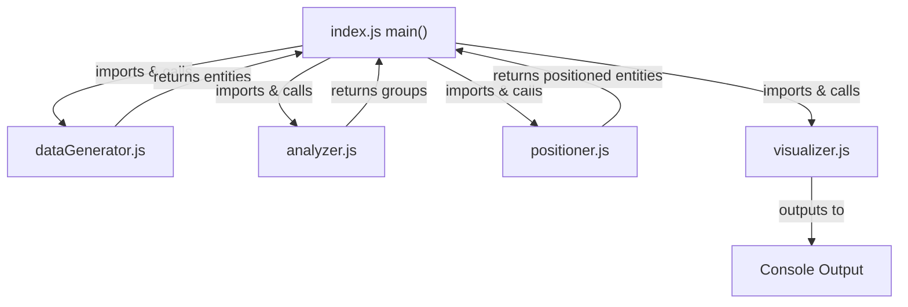

# Simple 2D Hierarchical Graph Console Demo Specification

## Summary

Create a minimal proof of concept that demonstrates hierarchical data analysis and 2D positioning as a Node.js console application. The system will generate fake hierarchical data, analyze it to identify connected groups, position these groups in 2D space, and display the results in table format in the console. This serves as the simplest possible validation of core hierarchical layout concepts.

## Requirements

1. ⬛ Data Generation Requirements

   1. ⬛ R1: The system shall generate fake hierarchical entities with parent-child relationships
   2. ⬛ R2: The system shall create 2 entity types ("Parent", "Child")
   3. ⬛ R3: The system shall generate 2-3 disconnected hierarchy trees
   4. ⬛ R4: The system shall ensure each tree has 2-3 levels of depth

2. ⬛ Analysis Requirements

   1. ⬛ R5: The system shall identify all connected components in the hierarchical data
   2. ⬛ R6: The system shall group entities by their connected relationships
   3. ⬛ R7: The system shall calculate basic metrics for each connected group

3. ⬛ Display Requirements

   1. ⬛ R8: The system shall position entities in 2D coordinates (x, y)
   2. ⬛ R9: The system shall display results in console table format
   3. ⬛ R10: The system shall show entity ID, type, position, and parent information
   4. ⬛ R11: The system shall run as a standalone Node.js script

4. ⬛ Project Structure Requirements

   1. ⬛ R12: The project shall be contained in a separate folder
   2. ⬛ R13: The project shall be broken into separate files to compartmentalize data, visualization, and analysis

5. ⬛ ASCII Output Requirements

   1. ✅ R14: The system shall save an ASCII rendering of the data map to a file
   2. ✅ R15: ASCII output files shall be saved in an output_data folder
   3. ✅ R16: Each output file shall be named using pattern: yyyy-mm-dd-seconds-stub.me

6. ⬛ Next.js Web Interface Requirements

   1. ✅ R17: The project shall include a Next.js application component
   2. ✅ R18: The system shall create a new page in the (pages) folder
   3. ✅ R19: The page shall contain a test data config component with input form
   4. ✅ R20: The config form shall include number of nodes input field
   5. ✅ R21: The config form shall include number of connected chains input field
   6. ✅ R22: The config form shall include depth of longest chain input field
   7. ✅ R23: The config form shall include a submit button
   8. ✅ R24: The page shall contain a TreeDisplay component showing results

7. ⬛ Advanced Graph Visualization Requirements

   1. ✅ R25: The system shall add a new output panel called "Graphs"
   2. ✅ R26: The Graphs panel shall display 3 graph visualizations side by side
   3. ✅ R27: The first graph shall use React Flow library
   4. ✅ R28: The second graph shall use Cytoscape.js library
   5. ✅ R29: The third graph shall use D3.js library
   6. ✅ R30: The system shall implement high-quality separation of concerns
   7. ✅ R31: The system shall create data transformation adapters for each graph library
   8. ✅ R32: Graph data transformers shall be easily extensible for new formats

8. ⬛ User Experience Enhancement Requirements

   1. ✅ R33: The system shall execute default hierarchy generation when page loads
   2. ✅ R34: The Graphs tab shall be selected by default on page load

9. ⬛ Advanced Configuration & UI Requirements

   1. ✅ R35: The system shall support advanced data complexity parameters
   2. ✅ R36: The config form shall include total nodes parameter (1-1000)
   3. ✅ R37: The config form shall include maximum tree depth parameter (1-15)
   4. ✅ R38: The config form shall include branching factor range (min/max)
   5. ✅ R39: The config form shall include cross-tree connections percentage
   6. ✅ R40: The config form shall include entity types count parameter
   7. ✅ R41: The input panel shall be positioned on the left side
   8. ✅ R42: The input panel shall use a more compact design
   9. ✅ R43: The system shall remove comparison tips from graphs panel
   10. ✅ R44: The system shall remove individual graph descriptions
   11. ✅ R45: The system shall remove graph visualization titles
   12. ✅ R46: The system shall implement a three-column layout:
       1. ✅ Column 1: Configuration box
       2. ✅ Column 2: Main output area with summary data above large graph
       3. ✅ Column 3: Three small graphs stacked vertically
   13. ✅ R47: The system shall implement graph switching functionality:

       1. ✅ When user clicks a small graph, it becomes the large graph in column 2

   14. ✅ R48: The system shall implement responsive layout:

       1. ✅ The page width shall expand to 80vh
       2. ✅ Column 2 (main output area) shall occupy 80% of page width

   15. ✅ R49: The system shall implement a suggestions table:

       1. ✅ Add table row above main output area
       2. ✅ Use MUI Advanced Data Grid for table display
       3. ✅ Table columns shall match configuration properties
       4. ✅ First column shall be a clickable configuration index
       5. ✅ Clicking index shall update graph config and display
       6. ✅ Include 10 rows of interesting preset configurations

   16. ⬛ R50: The system shall implement table display refinements:

       1. ⬛ Split configuration column into separate title and description columns
       2. ⬛ Use compact density mode for MUI Data Grid
       3. ⬛ Optimize column widths for maximum data visibility

   17. ⬛ R51: The system shall implement configuration form refinements:
       1. ⬛ Display each input field on a new row
       2. ⬛ Remove all side-by-side input layouts
       3. ⬛ Maintain consistent vertical spacing between inputs

## Task List

1. ⬛ Implementation Tasks
   1. ✅ T1: Create fake data generator that produces simple hierarchical entities
   2. ✅ T2: Implement basic connection analysis to identify separate trees
   3. ✅ T3: Create simple 2D positioning algorithm
   4. ✅ T4: Build console table display system
   5. ✅ T5: Create main Node.js script that runs the complete demo
   6. ✅ T6: Test with sample data and verify console output
   7. ✅ T7: Create ASCII rendering system for data map visualization
   8. ✅ T8: Implement file output system with timestamp naming
   9. ✅ T9: Run 3 tests to verify ASCII output functionality
   10. ✅ T10: Create new page in Next.js (pages) folder
   11. ✅ T11: Build test data config component with input form
   12. ✅ T12: Implement TreeDisplay component for visualization
   13. ✅ T13: Integrate hierarchy demo logic with Next.js frontend
   14. ✅ T14: Install graph visualization libraries (React Flow, Cytoscape.js, D3.js)
   15. ✅ T15: Create data transformation layer with adapter pattern
   16. ✅ T16: Implement React Flow graph component
   17. ✅ T17: Implement Cytoscape.js graph component
   18. ✅ T18: Implement D3.js graph component
   19. ✅ T19: Create Graphs tab panel in TreeDisplay component
   20. ✅ T20: Integrate all three graph visualizations with responsive layout
   21. ✅ T21: Implement default hierarchy generation on page load
   22. ✅ T22: Set Graphs tab as default selected tab
   23. ✅ T23: Implement advanced data complexity parameters
   24. ✅ T24: Update API to support advanced configuration options
   25. ✅ T25: Redesign input panel with compact layout and advanced controls
   26. ✅ T26: Restructure page layout to position input panel on left
   27. ✅ T27: Remove comparison tips and descriptions from graphs panel
   28. ✅ T28: Implement three-column layout (R46)
   29. ✅ T29: Implement graph switching functionality (R47)
   30. ✅ T30: Implement responsive layout with expanded width (R48)
   31. ✅ T31: Create suggestions table with MUI Advanced Data Grid (R49)
   32. ✅ T32: Generate 10 interesting preset configurations (R49)
   33. ✅ T33: Implement configuration index click handling (R49)
   34. ⬛ T34: Split configuration table columns and optimize display (R50)
   35. ⬛ T35: Refactor configuration form layout for vertical inputs (R51)

## Risks

- Risk 1: Console table formatting may not display clearly for complex hierarchies

## Decision Points

- Decision 1: Use Node.js instead of Roblox for fastest prototyping
- Decision 2: Display in 2D instead of 3D to simplify positioning logic
- Decision 3: Use console.table() for immediate visual feedback

## File and Function Structure

```
hierarchy-demo/
├── package.json
├── index.js
│   └── main()
├── src/
│   ├── dataGenerator.js
│   │   └── generateFakeData()
│   │   └── createEntity()
│   ├── analyzer.js
│   │   └── findConnectedGroups()
│   │   └── calculateGroupMetrics()
│   ├── positioner.js
│   │   └── position2D()
│   │   └── calculatePosition()
│   └── visualizer.js
│       └── displayResults()
│       └── formatTable()
└── README.md
```

## Flowchart



## Sample Objects

```javascript
// Simple entity structure
const entity = {
  id: "entity_1",
  type: "Parent", // or "Child"
  parentId: null, // or parent ID
  children: ["child_1", "child_2"],
};

// Positioned entity for display
const positionedEntity = {
  id: "entity_1",
  type: "Parent",
  parentId: null,
  x: 0,
  y: 0,
  groupId: "group_1",
};
```

## Example Code

```javascript
// index.js
const { generateFakeData } = require("./src/dataGenerator");
const { findConnectedGroups } = require("./src/analyzer");
const { position2D } = require("./src/positioner");
const { displayResults } = require("./src/visualizer");

function main() {
  console.log("=== Hierarchical Graph 2D Demo ===\n");

  // Generate fake data
  const entities = generateFakeData();
  console.log("Generated entities:", entities.length);

  // Find connected groups
  const groups = findConnectedGroups(entities);
  console.log("Found groups:", groups.length);

  // Position in 2D
  const positioned = position2D(groups);

  // Display results
  displayResults(positioned);
}

main();

// Run: node index.js
```
