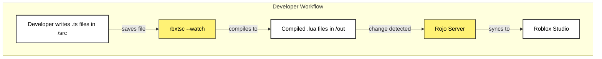

# Roblox-TS Project Setup Specification

## 1. Summary

This document outlines the plan for establishing a new development environment using `roblox-ts`. The goal is to enable writing code in TypeScript and have it automatically compile to Lua and sync with a running Roblox Studio session. This setup improves code quality, maintainability, and developer experience through strong typing and modern tooling.

## 2. Requirements

1.  ⬛ **R1:** The environment must be initialized with `roblox-ts`.
2.  ⬛ **R2:** A Rojo project file must be configured to map compiled Lua files to the Roblox DataModel.
3.  ⬛ **R3:** The workflow must support automatic compilation of TypeScript to Lua upon file changes.
4.  ⬛ **R4:** The workflow must support automatic synchronization of compiled Lua files into Roblox Studio.

## 3. Task List

1.  ✅ **Setup Project Directory**
    1.  ✅ Initialize a Node.js project (`npm init -y`).
    2.  ✅ Install `roblox-ts` as a development dependency (`npm install -D roblox-ts`).
    3.  ✅ Initialize the `roblox-ts` project (`npx rbxtsc init`).
2.  ✅ **Configure Rojo for Studio Sync**
    1.  ✅ Install the Rojo VSCodium/VS Code extension.
    2.  ✅ Install the Rojo plugin within Roblox Studio.
    3.  ✅ Create a `default.project.json` file to define the mapping from the `out` directory to Roblox Studio's `ReplicatedStorage` and `ServerScriptService`.
3.  ✅ **Establish Development Workflow**

    1.  ✅ Add `watch` and `build` scripts to `package.json`.
    2.  ✅ Start the Rojo server from VS Code.
    3.  ✅ Connect Roblox Studio to the Rojo server via the plugin.
    4.  ✅ Run the `watch` script (`npm run watch`) to begin auto-compilation.

4.  ✅ **Implement Common Project Structure**
    1.  ✅ Create a `client`, `server`, and `shared` directory structure.
    2.  ✅ Create an `include` directory for runtime types.
    3.  ✅ Create `rbxts.json` for roblox-ts specific configuration.
5.  ✅ **Create Falling Blocks Game**
    1.  ✅ Create a `part` service to handle part creation.
    2.  ✅ Create a `game` service to manage the main game loop.
    3.  ✅ Implement the game loop to spawn a falling blue block every 3 seconds.

## 4. Risks

- **Risk 1:** Rojo connection instability. The connection between VS Code and Roblox Studio can sometimes fail, requiring a restart of the Rojo server or Studio.
- **Risk 2:** Version conflicts between `roblox-ts`, Node.js, and Rojo. Using the latest stable versions is recommended to mitigate this.

## 5. Decision Points

- **Decision 1:** Using `default.project.json` over `rojo.json`. The `roblox-ts` default initializer sets up a `default.project.json`, which is the standard for `roblox-ts` projects. We will adhere to this convention.

## 6. File and Function Structure

```
my-game/
├─ src/                       # TypeScript you actually write
│  ├─ client/                 # code that only runs on the player
│  ├─ server/                 # code that only runs on the server
│  └─ shared/                 # modules used by both client & server
│
├─ include/                   # roblox-ts runtime types (replicated)
├─ node_modules/              # @rbxts packages installed with npm / pnpm
│
├─ out/                       # Luau generated by `rbxtsc` (ignored in git)
│  ├─ client/   → StarterPlayer.StarterPlayerScripts.TS
│  ├─ server/   → ServerScriptService.TS
│  └─ shared/   → ReplicatedStorage.TS
│
├─ default.project.json       # Rojo map that sends the *out/* folders above
├─ tsconfig.json              # plain TypeScript options
├─ rbxts.json                 # roblox-ts options (outDir, typeStrict, etc.)
├─ package.json               # scripts: build, watch, lint, etc.
├─ wally.toml / aftman.toml    # (optional) package-manager lock-file
└─ .vscode/ (.eslint*, .prettier*) – editor & lint settings
```

## 7. Flowchart



## 8. Sample Objects

### tsconfig.json

```json
{
  "compilerOptions": {
    "allowSyntheticDefaultImports": true,
    "declaration": true,
    "module": "commonjs",
    "moduleResolution": "node",
    "noImplicitAny": true,
    "noImplicitReturns": true,
    "noImplicitThis": true,
    "noUnusedLocals": true,
    "outDir": "out",
    "sourceMap": true,
    "strict": true,
    "target": "es2017",
    "typeRoots": ["node_modules/@rbxts"],
    "baseUrl": "src"
  }
}
```

### default.project.json

```json
{
  "name": "roblox-ts-project",
  "tree": {
    "$className": "DataModel",
    "ReplicatedStorage": {
      "$path": "out/shared"
    },
    "ServerScriptService": {
      "$path": "out/server"
    },
    "StarterPlayer": {
      "StarterPlayerScripts": {
        "$path": "out/client"
      }
    }
  }
}
```

## 9. Example Code

### src/server/main.ts

```typescript
import { Players } from "@rbxts/services";

const onPlayerAdded = ({ player }: { player: Player }): void => {
  print(`Welcome, ${player.Name}!`);
};

Players.PlayerAdded.Connect((player) => onPlayerAdded({ player }));
```
